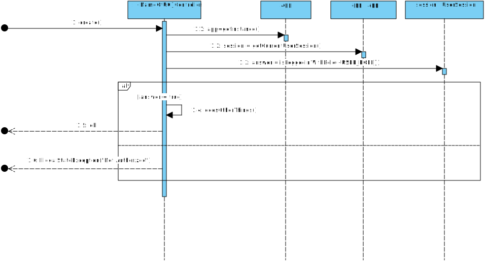

# README #

This repository contains the integrative project developed in the ambit of LAPR2 course, ISEP 2021.

This application is intended to manage and overview the vaccination process performed by 
multiple vaccinations centers as well as many health care professionals, from the creation of 
centers and the vaccination process, to the viewing of statistics. 

It also contains multiple brute-force and sorting algorithms, used to analyse the performance of a center, with their complexity analised using discrete mathematics theorems.

In particular, it has:

* [The team members and task assignment during Sprints](docs/README.md)
* A template to capture and systematize evidence of applying properly the Software Development Process, namely regarding the activities of Engineering Requirements, OO Analysis and Design

### Application Overview

The following sequence diagram graphically represents the intended flow for the application where there is a clear separation (decoupling) between the domain classes and the user interaction classes (_user interface_). This decoupling is performed by classes with the suffix _Controller_.

 

The execution of some functionalities by users must be preceded and verified by an authorization mechanism based on users' roles.
This verification can be carried out as follows:

Users' authentication and authorization processes are reutilizing an external component called **_AuthLib_**.
Documentation regarding this component is available [here](docs/Auth/README.md).

