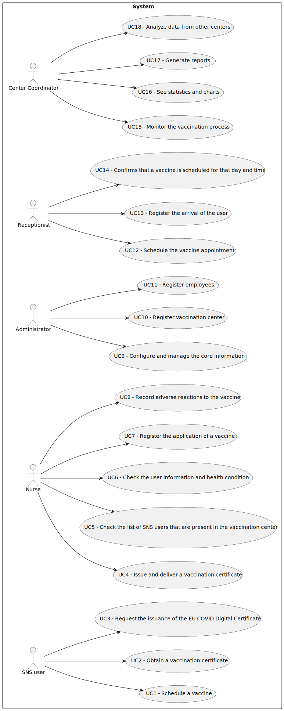

# Use Case Diagram (UCD)

**In the scope of this project, there is a direct relationship of _1 to 1_ between Use Cases (UC) and User Stories (US).**

However, be aware, this is a pedagogical simplification. On further projects and curricular units might also exist _1 to N **and/or** N to 1 relationships between US and UC.

**Insert below the Use Case Diagram in a SVG format**

**For each UC/US, it must be provided evidences of applying main activities of the software development process (requirements, analysis, design, tests and code). Gather those evidences on a separate file for each UC/US and set up a link as suggested below.**

# Use Cases / User Stories
| UC/US  | Actor        | Description                                                                |                   
|:----|:--------|:------------------------------------------------------------------------|
| **US 001** | SNS User | [Schedule a vaccine](US001.md)   |
| **US 002** | SNS User |[Obtain a vaccination certificate](US002.md)  |
| **US 003** | SNS User |[Request the issuance of the EU COVID Digital Certificate](US003.md)  |
| **US 004** | Nurse |[Issue and deliver a vaccination certificate](US004.md)|
| **US 005** | Nurse |[Check the list of SNS users that are present in the vaccination center](US005.md)|
| **US 006** | Nurse |[Check the user information and health condition ](US006.md)|
| **US 007** | Nurse |[Register the application of a vaccine](US007.md)|
| **US 008** | Nurse |[Record adverse reactions to the vaccine](US008.md)|
| **US 009** | Administrator |[Configure and manage the core information](US009.md)|
| **US 010** | Administrator |[Register vaccination center](US010.md)|
| **US 011** | Administrator |[Register employees](US011.md)|
| **US 012** | Receptionist |[Schedule the vaccine appointment](US011.md)|
| **US 013** | Receptionist |[Register the arrival of the user](US012.md)|
| **US 014** | Receptionist  |[Confirms that a vaccine is scheduled for that day and time](US013.md)|
| **US 015** | Center Coordinator |[Monitor the vaccination process](US014.md)|
| **US 016** | Center Coordinator |[See statistics and charts](US015.md)|
| **US 017** | Center Coordinator |[Generate reports](US016.md)|
| **US 018** | Center Coordinator |[Analyze data from other centers](US017.md)|

