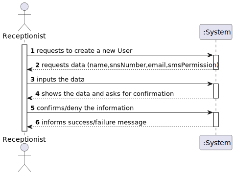

# US 03 - Register SNS user

## 1. Requirements Engineering

### 1.1. User Story Description

*As a receptionist, I want to register a SNS user*

### 1.2. Customer Specifications and Clarifications 

**From the specifications document:**

> - The SNS user is characterized by a SNS user number. "The user should introduce his/her SNS user number"

> - "The SNS user may also authorize the DGS to send a SMS message"

**From the customer clarifications:**

> - **Question:**
	"For the SNS user account, is a username necessary, or does the SNS number function as a username?"
>- **Answer:**
	Login: is the user e-mail; 
	Password: the password should be randomly generated. In the project description we get “All those who wish to use the application must be authenticated with a password holding seven alphanumeric characters, including three capital letters and two digits.”

 

### 1.3. Acceptance Criteria

- *The SNS user must become a system user. The "auth" component avaiable on the repository must be reused (without modifications).*

### 1.4. Found out Dependencies

- *We can find an dependency with US10 since the receptionist needs to be registered in the system in order to use it to register the SNS user*

### 1.5 Input and Output Data

> - *Input data:*
 
	SNS user number
 
	User e-mail
	
> - *Output data:*
 
	Message of success/failure 

### 1.6. System Sequence Diagram (SSD)

### 1.7 Other Relevant Remarks

*The user should tell if allows or not to receive SMS's from the application* 

## 2. OO Analysis

### 2.1. Relevant Domain Model Excerpt 

### 2.2. Other Remarks

*The password should be generated holding seven alphanumeric characters, including three capital letters and two digits.* 

## 3. Design - User Story Realization 

### 3.1. Rationale

**The rationale grounds on the SSD interactions and the identified input/output data.**

| Interaction ID | Question: Which class is responsible for... | Answer  | Justification (with patterns)  |
|:-------------  |:--------------------- |:------------|:---------------------------- |
| Step 1: requests to create a new User	 | ... instantiating a new user ?		| SnsUserMapper | Creator Patter: Rule 4 ("B has the data used to initialize A).                              |
| | ... interacting with the actor ? | RegisterSnsUserUi | Pure Fabrication: there is no reason to assign this responsibility to any existing class in the Domain Model. |
| | ... coordinating the US? | RegisterSnsUserController | Controller. | 
| Step 2: requests data (snsNumber,email,smsPermission) 		 |	n/a		|         |                              |
| Step 3: inputs the data 	|...saving the inputted data?|   SnsUser         |   IE: object created has its own data.                           |
| |...transfer the data typed in the UI to the domain? | SnsUserDto | DTO: When there is so much data to transfer, it is better to opt by using a DTO in order to reduce coupling between UI and domain.
||... knows UserStore?| Company | IE: Company knows the UserStore to which it is delegating some tasks
| Step 4: shows the data and asks for confirmation 		 | ... showing the data ?							 |   RegisterSnsUserUi          |   IE: responsible for user Interaction.                             |
| Step 5: confirms/deny the information  		 |	... validating all data (local validation)?	| SnsUser| IE: owns its data.|
| |... validating all data (global validation)? | SnsUserStore| IE: knows all the users.
| | ... saving the created user? | SnsUserStore | IE: knows all the users.
| |... validate the exclusivity of the users's email? | AuthFacade |IE: knows all the registered users
| |... generating the password? | PasswordGenerator | Pure Fabrication |
| Step 6: informs success/failure message  		 |	... informing operation success?|   RegisterSnsUserUi          |      IE: responsible for user Interaction.                        |              
|

### Systematization ##

According to the taken rationale, the conceptual classes promoted to software classes are: 

 * Company
 * SnsUser

Other software classes (i.e. Pure Fabrication) identified: 
 * RegisterSnsUserUi
 * RegisterSnsUserController
 * SnsUserMapper
 * SnsUserDto
 * SnsUserStore
 * AuthFacade
 * PasswordGenerator

## 3.2. Sequence Diagram (SD)

## 3.3. Class Diagram (CD)

# 4. Tests 

**Test 1:** Verify all the parameters inputted that are necessary to register the ne SNS user. 

	@Test
    public void testUserCreation(){

        assertThrows(IllegalArgumentException.class,() -> {
            new SnsUser("",1,"test@gmail.com",1);
        });

        assertThrows(IllegalArgumentException.class,() -> {
            new SnsUser("Diogo",-1,"test@gmail.com",1);
        });

        assertThrows(IllegalArgumentException.class,() -> {
            new SnsUser("Diogo",1,"test",1);
        });

        assertThrows(IllegalArgumentException.class,() -> {
            new SnsUser("Diogo",1,"test@gmail.com",2);
        });

        assertThrows(IllegalArgumentException.class,() -> {
            SnsUser snsUser = new SnsUser("Diogo",1,"test@gmail.com",0);
            snsUser.setSmsPermission(2);
        });

    }

**Test 2:** Veify that the password is generated randomly and fulffiling all the requirements

	@Test

    public void testPwdGenerator(){

        String pwd = PasswordGenerator.pwdGenerator(7,3,2);
        int capitalCount = 0;
        int digitCount = 0;
        int alphaCount = 0;

        String capital = "QWERTYUIOPASDFGHJKLZXCVBNM";
        String alphabet = "qwertyuiopasdfghjklzxcvbnm";
        String numbers = "0123456789";

        for (int i = 0; i < pwd.length(); i++) {

            for (int j = 0; j < capital.length(); j++) {
                if(pwd.charAt(i) == capital.charAt(j)){
                    capitalCount ++;
                }
                if(pwd.charAt(i) == alphabet.charAt(j)){
                    alphaCount ++;
                }
            }

            for (int j = 0; j < numbers.length(); j++) {
                if(pwd.charAt(i) == numbers.charAt(j)){
                    digitCount ++;
                }
            }
        }

        assertEquals(capitalCount,3);
        assertEquals(alphaCount,2);
        assertEquals(digitCount,2);
    }

# 5. Construction (Implementation)

## Class SnsUserDto

	private final String name;
    private final int snsNumber;
    private final String email;
    private final int smsPermission;

    /**
     * Constructor of the class
     *
     * @param name Name of the SNS user
     * @param snsNumber SNS number of the user
     * @param email E-mail of the SNS user
     * @param smsPermission Permission to receive SMS from the company
     */
    public SnsUserDto(String name, int snsNumber, String email, int smsPermission) {
        this.name = name;
        this.snsNumber = snsNumber;
        this.email = email;
        this.smsPermission = smsPermission;
    }

    /**
     * Method to get the SNS user name
     *
     * @return SNS user name
     */

    public String getName() {
        return name;
    }

    /**
     * Method to get the SNS user number
     *
     * @return SNS user number
	     */

    public int getSnsNumber() {
        return snsNumber;
    }

    /**
     * Method to get the SNS user e-mail
     *
     * @return SNS user e-mail
     */

    public String getEmail() {
        return email;
    }

    /**
     * Method to get the SNS user permission of SMS
     *
     * @return SNS user permission of SMS
     */

    public int getSmsPermission() {
        return smsPermission;
    }

## Class RegisterSnsUserController

	private final SnsUserStore snsUserStore;
    private SnsUser snsUser;

    /**
     * Constructor of the class
     */

    public RegisterSnsUserController() {

        this.snsUserStore = App.getInstance().getCompany().getSnsUserStore();
    }

    /**
     * Method to create a new Sns User
     * @param dto Object that contains all the information of a SNS User
     */

    public void createSnsUser(SnsUserDto dto){

        this.snsUser = snsUserStore.createSnsUser(dto);

    }

    /**
     * Method to register the SNS User in the system and in the store
     * @return boolean of success/failure
     */
    public boolean registerSnsUser(){

        return snsUserStore.registerSnsUser(this.snsUser);
    }
		
	

# 6. Integration and Demo 

* A new option on the Receotionist menu options was added.

* For demo purposes some tasks are bootstrapped while system starts.

# 7. Observations

There are some aspects that the client didn't answer, like the rules for the SNS user number.

