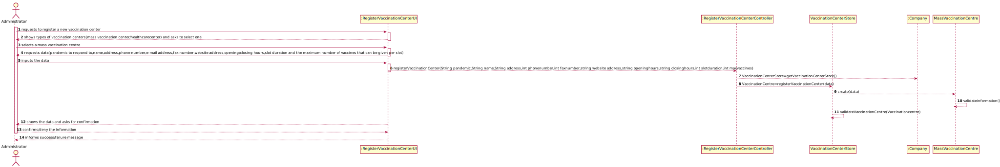
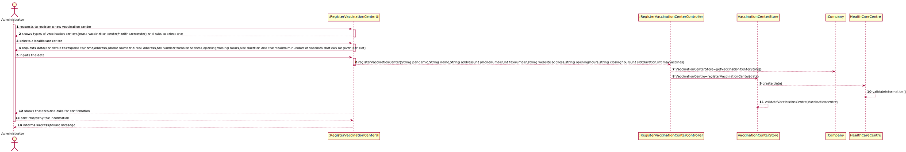

# US 9 - To register a vaccination center

## 1. Requirements Engineering

### 1.1. User Story Description

As an administrator, I want to register a vaccination center to respond to a certain pandemic.

### 1.2. Customer Specifications and Clarifications

**From the specifications document:**

>	Each center is characterized by being a facilitie specifically created to administer vaccines of a single type as response to an ongoing disease outbreak.

**From the client clarifications:**

> **Question:** Since the main difference between the two types of vaccination center (HealthCare Center and Community Mass Vaccination Center) is that the community mass vaccination centers are facilities specifically created to administer vaccines of a single type as response to an ongoing disease outbreak, should the system ask for the specific type of the vaccine on the creation of a Community Mass Vaccination Center?

> ________________________
-
>**Question:** Vaccination centers have opening and closing hours, how would you like to set up these?
### 1.3. Acceptance Criteria
No Acceptance Criteria specified.

### 1.4. Found out Dependencies
n/a

### 1.5 Input and Output Data

**Input Data:**
* Ongoing pandemic selected
* name
* address
* phone number
* e-mail address
* fax number
* website address
* opening/closing hours
* slot duration
* the maximum number of vaccines that can be given per slot.

**Output Data:**
* Message of success/failure of the registration

### 1.6. System Sequence Diagram (SSD)

### 1.7 Other Relevant Remarks
n/a

## 2. OO Analysis

### 2.1. Relevant Domain Model Excerpt

### 2.2. Other Remarks

n/a

## 3. Design - User Story Realization

### 3.1. Rationale

**SSD - Alternative 1 is adopted.**

| Interaction ID                                                                                                                                                                                                                  | Question: Which class is responsible for...   | Answer                              | Justification (with patterns)                                                                                 |
|:--------------------------------------------------------------------------------------------------------------------------------------------------------------------------------------------------------------------------------|:----------------------------------------------|:------------------------------------|:--------------------------------------------------------------------------------------------------------------|
| Step 1: requests to register a new vaccination center	                                                                                                                                                                          | 	... instantiating a new vaccination center   | Company                             | Pure Fabrication: there is no reason to assign this responsibility to any existing class in the Domain Model. |
| 			  		                                                                                                                                                                                                                         | 	... interacting with the actor?              | RegisterVaccinationCenterUI         | Controller                                                                                                    |
| 			  		                                                                                                                                                                                                                         | 	... coordinating the US?                     | RegisterVaccinationCenterController | Creator (Rule 1): in the DM Organization has a Task.                                                          |
| Step 2: shows types of vaccination centers(mass vaccination center/healthcarecenter) and asks to select one		  		                                                                                                               | ... n/a                                       |                                     |                                                                                                               |
| Step 4: selects a type			  		                                                                                                                                                                                                   | n/a                                           |                                     |                                                                                                               |
| Step 5: requests data(name,address,phone number,e-mail address,fax number,website address,opening/closing hours,slot duration and the maximum number of vaccines that can be given per slot)		                                  | n/a					                                      |                                     |                                                                                                               |
| Step 6: inputs the data		  		                                                                                                                                                                                                   | ...saving the inputted data?							           | VaccinationCenter                   | Object Created has its own data.                                                                              |
| 		                                                                                                                                                                                                                              | ... knows VaccinationStore? 							           | Company                             | IE: Company knows the UserStore to which it is delegating some tasks                                          |
| Step 8: shows the data and asks for confirmation                                                                                                                                                                                | 	...showing the data?                         | RegisterVaccinationCenterUI         | IE: responsible for user Interaction.                                                                         |
| Step 9: confirms/deny the information 		                                                                                                                                                                                        | 	....validating all data (local validation)?  | VaccinationCenter                   | IE: owns its data.                                                                                            |
| 		                                                                                                                                                                                                                              | 	....validating all data (global validation)? | VaccinationCenterStore              | IE: knows all the vaccinationcenters.                                                                         |

### Systematization ##

According to the taken rationale, the conceptual classes promoted to software classes are:

* VaccinationCenter
* MassVaccinationCenter
* HealthCareCenter

Other software classes (i.e. Pure Fabrication) identified:

* RegisterVaccinationCenterUI
* RegisterVaccinationCenterController
* VaccinationCenterStore

## 3.2. Sequence Diagram (SD)

**Alternative 1**

**Alternative 2**

## 3.3. Class Diagram (CD)

# 4. Tests

*In this section, it is suggested to systematize how the tests were designed to allow a correct measurement of requirements fulfilling.*

**_DO NOT COPY ALL DEVELOPED TESTS HERE_**

**Test 1:** Check that it is not possible to create an instance of the Example class with null values.

	@Test(expected = IllegalArgumentException.class)
		public void ensureNullIsNotAllowed() {
		Exemplo instance = new Exemplo(null, null);
	}

*It is also recommended to organize this content by subsections.*

# 5. Construction (Implementation)
## Class VaccinationCenter

	public class VaccinationCenter {
    private final String pandemic;
    private final String name;
    private final String address;
    private final int phonenumber;
    private final String emailadd;
    private final int fax_number;
    private final String website;
    private final Hour opening_hours;
    private final Hour closing_hours;
    private final int slot_duration;
    private final int vaccines_per_slot;

    public VaccinationCenter(String pandemic, String name, String address, int phonenumber, String emailadd, int fax_number, String website, Hour opening_hours, Hour closing_hours, int slot_duration, int vaccines_per_slot) {
        validationpandemic(pandemic);
        validationName(name);
        validationaddress(address);
        validationphonenumber(phonenumber);
        validationemailadd(emailadd);
        validationfaxnumber(fax_number);
        validationWebsite(website);
        validationOpeningHours(opening_hours);
        validationClosingHours(closing_hours);
        validationDifferenceofHours(opening_hours,closing_hours);
        validationSlotDuration(slot_duration);
        validationMaxVaccinesGivenPerSlot(vaccines_per_slot);

        this.pandemic=pandemic;
        this.name = name;
        this.address = address;
        this.phonenumber=phonenumber;
        this.emailadd=emailadd;
        this.fax_number=fax_number;
        this.website=website;
        this.opening_hours=opening_hours;
        this.closing_hours=closing_hours;
        this.slot_duration=slot_duration;
        this.vaccines_per_slot=vaccines_per_slot;
    }

    private void validationpandemic(String pandemic){
        if(pandemic == null )
            throw new IllegalArgumentException("Pandemic  can't  be in blank");
    }
    private void validationName(String name){
        if(name == null )
            throw new IllegalArgumentException("Name  can't  be in blank");
    }
    private void validationaddress(String address){
        if(address == null )
            throw new IllegalArgumentException("Adress can't be in blanck");
    }
    private void validationemailadd(String emailadd){
        if(emailadd == null)
            throw new IllegalArgumentException("E-mail can't be in blanck");
    }
    private void validationphonenumber(int phonenumber){
        if(phonenumber < 100000000 || phonenumber > 999999999)
            throw new IllegalArgumentException("The Phone Number must have 9 digits");
    }
    private void validationfaxnumber(int faxnumber){
        if(faxnumber < 100000000 || faxnumber > 999999999)
            throw new IllegalArgumentException("The Fax Number must have 9 digits");
    }
    private void  validationWebsite(String websiteAddress){
        if(websiteAddress == null )
            throw new IllegalArgumentException("Website Address cannot be blank");
        else if(!websiteAddress.contains("@") || !websiteAddress.contains("."))
            throw new IllegalArgumentException("Website Address must have an '@' and '.'");
    }
    private void validationSlotDuration(int slotDuration){
        if(slotDuration <1)
            throw new IllegalArgumentException("Slot Duration has to be a positive integer");
    }
    private void validationMaxVaccinesGivenPerSlot(int maximumVaccinesGivenPerSlot){
        if(maximumVaccinesGivenPerSlot <1)
            throw new IllegalArgumentException("Max Vaccines Given Per Slot number must be a a positive integer");
    }
    private void validationOpeningHours(Hour opening_Hours){
        if(opening_Hours == null)
            throw new IllegalArgumentException("Opening Hours cannot be null");
    }
    private void validationClosingHours(Hour closing_hours){
        if(closing_hours == null)
            throw new IllegalArgumentException("Closing Hours cannot be null");
    }
    private void validationDifferenceofHours(Hour openingHours, Hour closingHours){
        if(openingHours.compareTo(closingHours) < 0)
            throw new IllegalArgumentException("Opening Hours cannot be after Closing Hours");
        else if(openingHours.compareTo(closingHours) == 0)
            throw new IllegalArgumentException("Opening Hours cannot be the same as Closing Hours");
    }
}

## Class RegisterVaccinationCenterUI

	public class RegisterVaccinationCenterUI implements Runnable {
    private final RegisterVaccinationCenterController controller;
    /**
     * Constructor of the ui class
     */

    public RegisterVaccinationCenterUI() {
        this.controller = new RegisterVaccinationCenterController();
    }
    /**
     * Run method to run the ui necessary to register a new Vaccination Center in the system.
     */
    @Override
    public void run() {
        int type = 10;
        System.out.println("-----------REGISTRATION OF A NEW VACCINATION CENTER----------");
        System.out.println();
        System.out.println("What type of vaccination center do you want to register?");
        try {
            do {
                type = Utils.readIntegerFromConsole("Type:\n 0-A Community MassVaccination Center\n1-A HealthcareCenter?");
            } while (type < 0 || type > 1);
        } catch (InputMismatchException e) {
            System.out.println("Invalid category");
        }
        final String pandemic;
        final String name;
        final String address;
        final int phonenumber;
        final String emailadd;
        final int fax_number;
        final String website;
        final String openinghours;
        final String closinghours;
        final int slot_duration;
        final int vaccines_per_slot;
        System.out.println("Now write the Necessary Data");
        pandemic = Utils.readLineFromConsole("Pandemic to respond to");
        name = Utils.readLineFromConsole("Name:");
        address = Utils.readLineFromConsole("Address:");
        phonenumber = Utils.readIntegerFromConsole("Phone Number:");
        emailadd = Utils.readLineFromConsole("Email Address:");
        fax_number = Utils.readIntegerFromConsole("Fax Number:");
        website = Utils.readLineFromConsole("Website Address:");
        openinghours = Utils.readLineFromConsole("Opening hours:");
        closinghours = Utils.readLineFromConsole("Closing hours:");
        assert openinghours != null;
        String[] time = openinghours.split(":");
        int openinghour = Integer.parseInt(time[0]);
        int openingminutes = Integer.parseInt(time[1]);
        Hour opening_hours = new Hour(openinghour, openingminutes);
        assert closinghours != null;
        String[] time2 = openinghours.split(":");
        int closinghour = Integer.parseInt(time2[0]);
        int closingminutes = Integer.parseInt(time2[1]);
        Hour closing_hours = new Hour(closinghour, closingminutes);
        slot_duration = Utils.readIntegerFromConsole("Slot Duration:");
        vaccines_per_slot = Utils.readIntegerFromConsole("Maximum Number of Vaccines that can be given per slot");
        //VaccinationCenterDTO dto= new VaccinationCenterDTO( pandemic,  name,  address, phonenumber,  emailadd, fax_number, website,  opening_hours, closing_hours, slot_duration, vaccines_per_slot);
        if (type == 0) {
            VaccineType type1=creationofVaccineType();
            VaccineBrands brands=creationofListOfVaccineBrand();
            controller.createCommunityMassVaccinationCenter(pandemic, name, address, phonenumber, emailadd, fax_number, website, opening_hours, closing_hours, slot_duration, vaccines_per_slot,type1,brands);
            String string = String.format("Confirm the inputted data (y - yes/ n - no) \n%d\n%s\n%s\n%s\n%d\n%s\n%d\n%s\n%s\n%s\n%d\n%s", type, pandemic, name, address, phonenumber, emailadd, fax_number, website, opening_hours, closing_hours, slot_duration, vaccines_per_slot);
            boolean confirmar = Utils.confirm(string);
            if (confirmar) {
                if (controller.registerVaccinationCenter()) {
                    System.out.println("Vaccination Center registered successfully");
                } else {
                    System.out.println("There is already a User with the same e-mail in the system");
                    System.out.println("Operation failed");
                }
            }
        } else {
            try {
                VaccineTypeList types=creationofListOfVaccineType();
                VaccineBrands brands=creationofListOfVaccineBrand();
                controller.createHealthCareCenter(pandemic, name, address, phonenumber, emailadd, fax_number, website, opening_hours, closing_hours, slot_duration, vaccines_per_slot,types,brands);
                String string = String.format("Confirm the inputted data (y - yes/ n - no) \n%d\n%s\n%s\n%s\n%d\n%s\n%d\n%s\n%s\n%s\n%d\n%s", type, pandemic, name, address, phonenumber, emailadd, fax_number, website, opening_hours, closing_hours, slot_duration, vaccines_per_slot);
                boolean confirmar = Utils.confirm(string);
                if (confirmar) {
                    if (controller.registerVaccinationCenter()) {
                        System.out.println("Vaccination Center registered successfully");
                    } else {
                        System.out.println("There is already a User with the same e-mail in the system");
                        System.out.println("Operation failed");
                    }
                }
            } catch (IllegalArgumentException e) {
                System.out.println(e.getMessage());
                System.out.println("Operation failed");
            }
        }
    }

    /**
     * creationofVaccineType method to create a vaccine type
     */

    public VaccineType creationofVaccineType(){
        String line = Utils.readLineFromConsole("Please write down the type in the format: description,code,techonlogy");
        assert line != null;
        String [] array= line.split(",");
        VaccineType type = new VaccineType(array[0],array[1],array[2]);
        return type;
    }

    /**
     * creationofListOfVaccineBrand method to create the list of the vaccine brands
     */
        public VaccineBrands creationofListOfVaccineBrand() {
            System.out.println(" Vaccine Brands List:");
            VaccineBrands brands = new VaccineBrands();
            int quantityofvaccines = Utils.readIntegerFromConsole("How many Vaccine Brand will the Vaccine Center work with?");
            int i=0;
            while(i<quantityofvaccines){
                String line = Utils.readLineFromConsole("Write down the vaccine brand in the format: company1,disease1");
                assert line != null;
                String [] array= line.split(",");
                brands.adicionarVaccineBrand(array[0],array[1]);
                i++;
            }
            return brands;
        }

    /**
     * creationofListOfVaccineType method to create the list of vaccine types
     */

        public VaccineTypeList creationofListOfVaccineType(){
            System.out.println("Vaccine Types List:");
            VaccineTypeList listOfVaccineType = new VaccineTypeList();
            int quantity = Utils.readIntegerFromConsole("How many Vaccine Types will the Vaccine Center work with?");
            int i=0;
            while(i<quantity){
                String line = Utils.readLineFromConsole("Write down in the format:technology,code,description");
                assert line != null;
                String [] array= line.split(",");
                listOfVaccineType.addVaccineType(array[0],array[1],array[2]);
                i++;
            }
            return listOfVaccineType;
        }
    }

# 6. Integration and Demo

# 7. Observations
There are some aspects that the client didn't answer like if the administrator should select the type of vaccination center.
