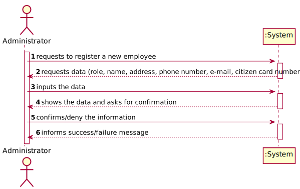

# US 10 - Register an employee, as an administratror

## 1. Requirements Engineering

*In this section, it is suggested to capture the requirement description and specifications as provided by the client as well as any further clarification on it. It is also suggested to capture the requirements acceptance criteria and existing dependencies to other requirements. At last, identify the involved input and output data and depicted an Actor-System interaction in order to fulfill the requirement.*

### 1.1. User Story Description
*As an administratror, I want to register an employee*

### 1.2. Customer Specifications and Clarifications 
**From the specification document:**

> - An Administrator is responsible for properly configuring, managing and registing the core information (centers, SNS users, center coordinators, recepcionists and nurses)

**From the customer clarifications**

> - **Question:**
	"Besides a password and a user name, what other (if any) information should the Admin use to register a new employee? Are any of them optional?"

> - **Answer:**
	Every Employee has only one role (Coordinator, Receptionist, Nurse).
	Employee attributes: Id (automatic), Name, address, phone number, e-mail and Citizen Card number.
	All attributes are mandatory.

 

### 1.3. Acceptance Criteria

*Each user must have a single role defined in the system. The "auth" component available on the repository must be reused (without modifications).

### 1.4. Found out Dependencies

*There are depencies between US10 and the following ones: US9, US11, US12, US13, because all of them use same verification and register method and can only be executed by an administrator.*

### 1.5 Input and Output Data

> - *Input data:*
 
	Role
 
	Name
 
	Address
 
	Phone number
 
	E-mail
 
	Citizen Card number

> - *Output data:*
 
	Message of sucess/failure of the registration

### 1.6. System Sequence Diagram (SSD)

### 1.7 Other Relevant Remarks

*The registrations must be made inside the application* 

## 2. OO Analysis

### 2.1. Relevant Domain Model Excerpt  

### 2.2. Other Remarks

*The id is given automatically by the application*

## 3. Design - User Story Realization 

### 3.1. Rationale

**The rationale grounds on the SSD interactions and the identified input/output data.**

| Interaction ID | Question: Which class is responsible for... | Answer      | Justification (with patterns)|
|:-------------  |:--------------------------------------------|:------------|:-----------------------------|
|  Step 1: Request to register a new employee| ... instantiating a new user?| EmployeeList| Creator Patter: Rule 4 ("B has the data used to initialize A)   |
|                                            |  ... interacting with the administrator?| RegisterEmployeeUi| Pure Fabrication: there is no reason to assign this responsability to any class in the Domain Model.
|                                            |  ... coordinating the US? | RegisterEmployeeController | Controller
| Step 2: requests data(role, Name, address, phone number, e-mail and Citizen Card number) | n/a			    			                   |             |                              |
| Step 3: inputs the data | ... saving the input?| Employee| IE: object created has is own data|
|| ... the data collected in UI is transfered to the domain| EmployeeDto| DTO: When there is so much data to transfer, it is better to opt by using a DTO in order to reduce coupling between UI and domain.
|| ... knows UserStore? | Company | IE: Company knows the UserStore to which it is delegating some tasks
| Step 4: presents the input and ask for confirmation 		 | ... presenting the data |RegisterEmployeeUi| IE: responsible for user interaction                              |
| Step 5: validation of the information | ... validating locally all the data | Employee| IE: owns its data|
||validating globally the data | EmployeeStore| IE: knows all the users
||saving the created employees| EmployeeStore| IE: knows all the users
||validate the exclusivity of the user's role| AuthFacade | IE: knows all the registered users 
| Step 6: informs the result of the operation  		 | ... informing operation sucess							                   | RegisterEmployeeUi             |IE:responsible for user Interaction                              |              

### Systematization ##

According to the taken rationale, the conceptual classes promoted to software classes are: 

 * Employee
 * Company

Other software classes (i.e. Pure Fabrication) identified: 
 * EmployeeList
 * RegisterEmployeeUi
 * RegisterEmployeeController
 * EmployeeDto
 * EmployeeStore
 

## 3.2. Sequence Diagram (SD)

## 3.3. Class Diagram (CD)

# 4. Tests 

**Test 1** Verify all the data inputed that are necessary to register a new employee 

	@Test
    public void testUserCreation(){

        assertThrows(IllegalArgumentException.class,() -> {
            new employee("","Nuno","Rua Teste",910000000,"test@gmail.com",122222222);
        });

        assertThrows(IllegalArgumentException.class,() -> {
            new employee("Nurse","Nuno","",910000000,"test@gmail.com",122222222);
        });

        assertThrows(IllegalArgumentException.class,() -> {
            new employee("Recepcionist","Nuno","Rua Teste",,"test@gmail.com",122222222);
        });

        assertThrows(IllegalArgumentException.class,() -> {
            new employee("Coordinator","Nuno","Rua Teste",910000000,"",122222222);
        });

        assertThrows(IllegalArgumentException.class,() -> {
            new employee("Nurse","Nuno","Rua Teste",910000000,"test@gmail.com",);
        });

		assertThrows(IllegalArgumentException.class,() -> {
            new employee("Nurse","","Rua Teste",910000000,"test@gmail.com",);
        });

# 5. Construction (Implementation)

## Class EmployeeDto

	private final String role;
	private final String name;
    private final String address;
	private final int phoneNumber;
    private final String email;
    private final int citizenCardNumber;

    /**
     * Constructor of the class
     *
	 * @param role the role of the new employee
     * @param name Name of the employee
     * @param adress adress of the employee
	 * @param phoneNumber the phone number of the employee
     * @param email E-mail of the employee
     * @param citizenCardNumber number o the citizen card of the new employee
     */
    public EmployeeDto(String role, String name,String address, int phoneNumber, String email, int citizenCardNumber) {
        this.role = role;
		this.name = name;
        this.address = address;
		this.phoneNumber = phoneNumber
        this.email = email;
        this.citizenCardNumber = citizenCardNumber;
    }

    /**
     * Method to get the employee role
     *
     * @return employee role
     */

    public String getRole() {
        return role;
    }
	
	/**
     * Method to get the employee user name
     *
     * @return employee name
     */

    public String getName() {
        return name;
    }

    /**
     * Method to get the employee user address
     *
     * @return employee address
     */

    public String getAddress() {
        return address;
    }

    /**
     * Method to get the employee phone number
     *
     * @return employee phone number
     */

    public String getPhoneNumber() {
        return phoneNumber;
    }

	/**
     * Method to get the employee email
     *
     * @return employee email
     */

    public String getEmail() {
        return email;
    }

	/**
     * Method to get the employee citizenCardNumber
     *
     * @return employee citizenCardNumber
     */

    public String getCitizenCardNumber() {
        return citizenCardNumber;
    }

#### Class RegisterEmployeeController

	private final EmployeeStore EmployeeStore;
    private Employee employee;

    /**
     * Constructor of the class
     */

    public RegisterEmployeeController() {

        this.employeeStore = App.getInstance().getCompany().getEmployeeStore();
    }

    /**
     * Method to create a new Employee
     * @param dto Object that contains all the information of a Employee
     */

    public void registerEmployee(EmployeeDto dto){

        this.employee = employee.createEmployee(dto);

    }

    /**
     * Method to register the Employee in the system and in the store
     * @return boolean of success/failure
     */
    public boolean registerEmployee(){

        return snsUserStore.registerSnsUser(this.snsUser);
    }

# 6. Integration and Demo 

* For building purposes some tasks are bootstrapped while the system starts.

# 7. Observations

* The client didn't answer the specifications for the id of an employee.

