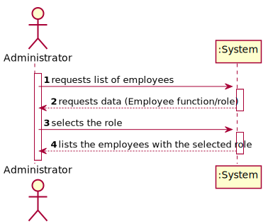
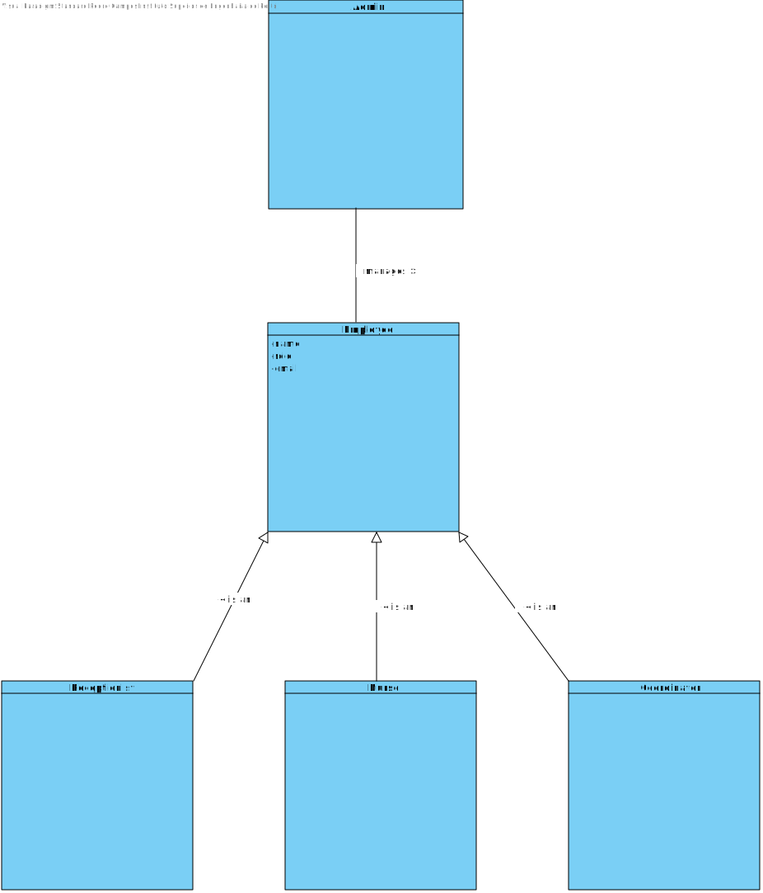
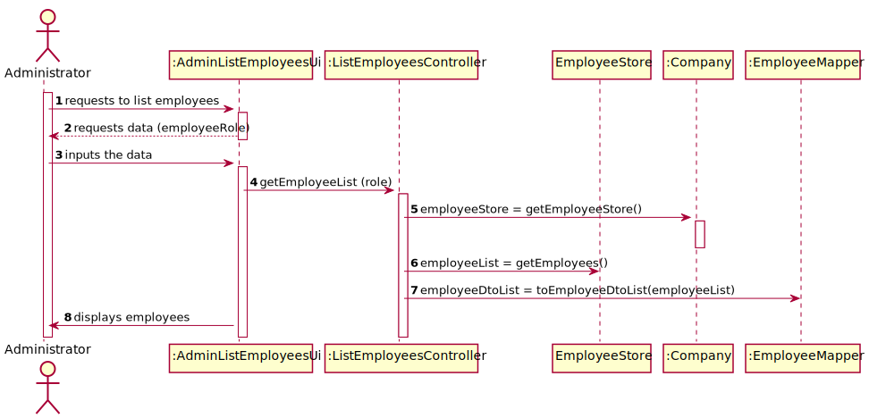
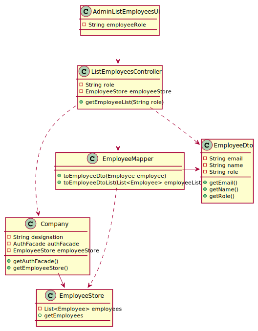

# US 11 - List Employees

## 1. Requirements Engineering

### 1.1. User Story Description

*As an administrator, I want to get a list of Employees with a given function/role.*

### 1.2. Customer Specifications and Clarifications 

**From the specifications document:**

> ------------------

**From the customer clarifications:**

> - **Question:**
    > "Regarding US011, is there any requirement or input that the Administrator must insert to get the list of the employees? What are the criteria that those employees need to meet to appear on that list? Does the list of employees have any relevance on the functionality of the application? Should we assume SNSUsers must also appear on that list?"
>- **Answer:**
>  I just answered a question that will clarify your doubts. Moreover, the SNS user is not an Employee.

> - **Question:**
    > "Should we give the user the possibility of listing employees from more than 1 role?"
>- **Answer:**
> The Administrator should select a given role and all employees associated with the selected role should be listed.
> - **Question:**
    > Should the list be sorted in any specific way(for example alphabetical name order) or should we give the option to sort by other characteristics?"
>- **Answer:**
   > For now I just want to get a list of employees without considering the order of presentation.

 

### 1.3. Acceptance Criteria

*No Acceptance Criteria was specified.*

### 1.4. Found out Dependencies

- *We can find an dependency with US10 since the employees need to be registered in the system in order to be listed by the Administrator.*

### 1.5 Input and Output Data

> - *Input data:*
     
    Employee function/role (selected)

> - *Output data:*
     
    List of employees

### 1.6. System Sequence Diagram (SSD)

### 1.7 Other Relevant Remarks

*To use this function, there needs to be atleast one employee registered in the System.*

## 2. OO Analysis

### 2.1. Relevant Domain Model Excerpt 
*In this section, it is suggested to present an excerpt of the domain model that is seen as relevant to fulfill this requirement.* 

### 2.2. Other Remarks

*The employees are to be listed in no particular order.* 

## 3. Design - User Story Realization 

### 3.1. Rationale

**The rationale grounds on the SSD interactions and the identified input/output data.**

| Interaction ID | Question: Which class is responsible for... | Answer  | Justification (with patterns)  |
|:-------------  |:--------------------- |:------------|:---------------------------- |
| Step 1: Requests to list employees 		 |	...interacting with the actor? | AdminListEmployeesUi        |Pure Fabrication: there is no reason to assign this responsibility to any existing class in the Domain Model. |
| | ... coordinating the US? | ListEmployeeController | Controller. | 
| Step 2: Requests data (employeeRole)	 |	n/a						 |             |                              |
| Step 3: inputs the data	 | ...retrieving employeeList	| ListEmployeeController            | Controller  |
| | ... knowing EmployeeStore? | Company | IE: Company knows the EmployeeStore to which it is delegating some tasks. |
| | ... coordinating the US? | ListEmployeeController | Controller. |
| Step 4: displays employees | ... showing the data? 	| AdminListEmployeesUi  |IE: responsible for user Interaction.|

### Systematization ##

According to the taken rationale, the conceptual classes promoted to software classes are:

* Company
* Employee

Other software classes (i.e. Pure Fabrication) identified: 
* AdminListEmployeesUi
* ListEmployeeController
* EmployeeMapper
* EmployeeDto
* EmployeeStore

## 3.2. Sequence Diagram (SD)

## 3.3. Class Diagram (CD)

# 4. Tests 

**Test 1:** Check that the filtration of employees by role is done successfully.

	@Test
    public void testGetEmployeeList(){

        ListEmployeeController listEmployeeController = new ListEmployeeController();
        RegisterEmployeeController registerEmployeeController = new RegisterEmployeeController();

        EmployeeDto coordinator = new EmployeeDto("pedro@isep.pt", "Pedro", "COORDINATOR", 911111111, 15555555, "Praceta Isep, n.º45");
        EmployeeDto coordinator2 = new EmployeeDto("antonio@isep.pt", "Antonio", "COORDINATOR", 922222222, 111111111, "Praceta Isep, n.º46");
        EmployeeDto nurse = new EmployeeDto("miguel@isep.pt", "Miguel", "NURSE", 933333333, 22222222, "Praceta Isep, n.º47");

        registerEmployeeController.createEmployee(coordinator);
        registerEmployeeController.registerEmployee();
        registerEmployeeController.createEmployee(coordinator2);
        registerEmployeeController.registerEmployee();
        registerEmployeeController.createEmployee(nurse);
        registerEmployeeController.registerEmployee();

        List<EmployeeDto> coordinatorList = listEmployeeController.getEmployeeList("COORDINATOR");
        List<EmployeeDto> expectedList = new ArrayList<EmployeeDto>();
        expectedList.add(coordinator);
        expectedList.add(coordinator2);

        assertEquals(coordinatorList, expectedList);

    }

# 5. Construction (Implementation)

## Class ListEmployeeController
    
    package app.controller;
    import app.domain.model.data.employees.Employee;
    import app.domain.model.dto.employees.EmployeeDto;
    import app.domain.model.mapper.employees.EmployeeMapper;
    import app.domain.store.employees.EmployeeStore;
    import app.domain.store.SnsUserStore;
    import java.util.ArrayList;
    import java.util.List;

    public class ListEmployeeController {

    /**
     * Controller class of us11
     *
     * @author Pedro Campos <1211511@isep.ipp.pt>
     */

    private String role;
    private final EmployeeStore employeeStore;

    /**
     * Constructor of the class
     */
    
    public ListEmployeeController() {

        this.employeeStore = App.getInstance().getCompany().getEmployeeStore();

    }

    /**
     * Method to retrieve the list of employees with a certain role
     * @param role String with the selected role
     * @return employeeRoleDtoList
     */

    public List<EmployeeDto> getEmployeeList (String role){

        List<Employee> employeeList = employeeStore.getEmployees();
        List<EmployeeDto> employeeDtoList = EmployeeMapper.toEmployeeDtoList(employeeList);
        List<EmployeeDto> employeeRoleDtoList = new ArrayList<EmployeeDto>();

        for (int i = 0; i < employeeDtoList.size(); i++) {
            String employeeRole = employeeDtoList.get(i).getRole();
            if (employeeRole.equals(role)){
                employeeRoleDtoList.add(employeeDtoList.get(i));
            }

        }
        return employeeRoleDtoList;

    }

    }

## Class EmployeeDto
    
        package app.domain.model.dto;

    /**
    * Class to carry all the information of a certain Employee
    * 
    * @author Pedro Campos <1211511@isep.ipp.pt>
    * @author Nuno Cunha <1211689@isep.ipp.pt>
      */

    public class EmployeeDto {

    private String role;
    private String name;
    private int phoneNumber;
    private String email;
    private int citizenCardNumber;
    private String address;

    /**
     * Constructor of Employee class
     * @param email E-mail of the employee
     * @param name Name of the employee
     * @param role role of the employee
     * @param citizenCardNumber number of citizenship of employee
     * @param phoneNumber phone number of an employee
     * @param address address of the employee
     */
    public EmployeeDto(String email, String name, String role, int phoneNumber, int citizenCardNumber, String address) {
        this.email = email;
        this.name = name;
        this.role = role;
        this.phoneNumber = phoneNumber;
        this.citizenCardNumber = citizenCardNumber;
        this.address = address;
    }

    /**
     * Method to get the email name
     *
     * @return employee email
     */
    public String getEmail() {
        return email;
    }
    /**
     * Method to get the employee name
     *
     * @return employee name
     */
    public String getName() {
        return name;
    }

    /**
     * Method to get the employee role
     *
     * @return employee role
     */
    public String getRole() {
        return role;
    }

    /**
     * Method to get the employee phone number
     *
     * @return employee phone number
     */
    public int getPhoneNumber() {
        return phoneNumber;
    }

    /**
     * Method to get the employee citizen card number
     *
     * @return employee citizen card number
     */
    public int getCitizenCardNumber() {
        return citizenCardNumber;
    }

    /**
     * Method to get the employee address
     *
     * @return employee citizen address
     */
    public String getAddress() {
        return address;
    }
    }

## Class EmployeeMapper
    
    package app.domain.model.mapper;
    import app.domain.model.data.employees.Employee;
    import app.domain.model.data.snsuser.SnsUser;
    import app.domain.model.dto.employees.EmployeeDto;
    import app.domain.model.dto.snsuser.SnsUserDto;

    import java.util.ArrayList;
    import java.util.List;

    /**
    * Class that deals with the dto objects that carry the information
    * of Employees
    * 
    * @author Pedro Campos <1211511@isep.ipp.pt>
     */

    public class EmployeeMapper {

    /**
     * Method to transform an Employee into an EmployeeDto carrying the information of the employeee
     *
     * @param employee Object that carries all the information of a Employee
     *
     * @return EmployeeDto
     */
    public static EmployeeDto toEmployeeDto(Employee employee){
        return new EmployeeDto(employee.getEmail(),employee.getName(), employee.getRole(),employee.getCitizenCardNumber(), employee.getPhoneNumber(), employee.getAddress());
    }

    /**
     * Method to transform an Employee List to an EmployeeDto list
     * @param employeeList list of employees
     * @return employeeDtoList
     */
    public static List<EmployeeDto> toEmployeeDtoList(List<Employee> employeeList){
        List<EmployeeDto> employeeDtoList = new ArrayList<EmployeeDto>(employeeList.size());
        for (int i = 0; i < employeeList.size(); i++) {
            EmployeeDto employeeDto = EmployeeMapper.toEmployeeDto(employeeList.get(i));
            employeeDtoList.add(employeeDto);

        }
        return employeeDtoList;
    }

    /**
     * Method to transform a dto carrying the information of an employee into a Employee object
     *
     * @param dto Object that carries all the information of an Employee
     *
     * @return employee
     */
    public static Employee toEmployee (EmployeeDto dto){
        return new Employee(dto.getEmail(), dto.getName(), dto.getRole(), dto.getPhoneNumber(), dto.getCitizenCardNumber(), dto.getAddress());
    }
    }

# 6. Integration and Demo 

*A new option on the Admin menu ui was added.*

# 7. Observations

*The showcase of available employee roles could have been more dinamic, incase more roles need to be added to the system in the future*

