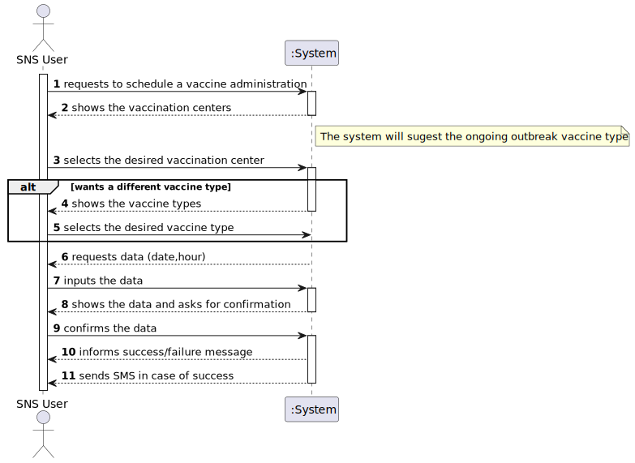
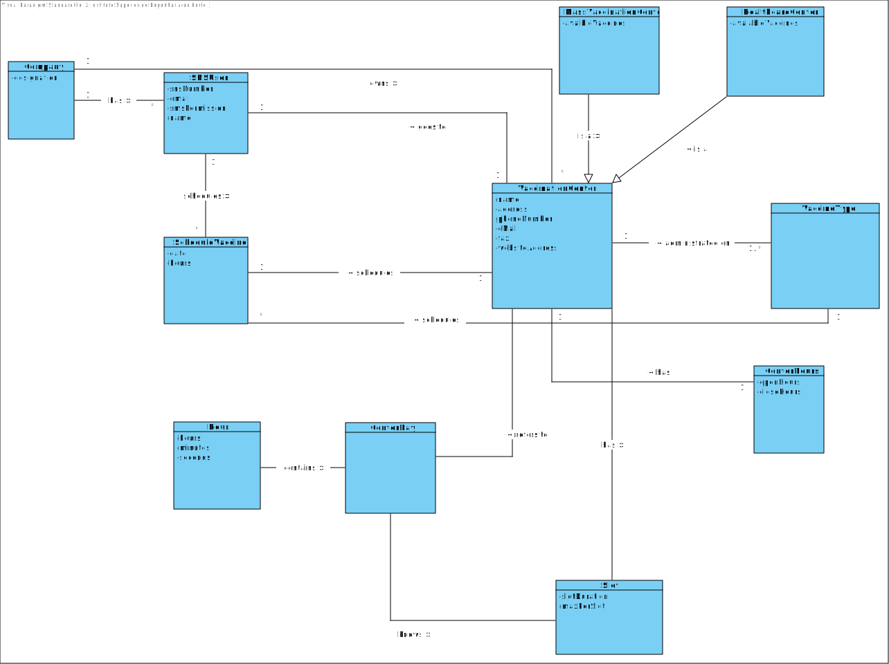
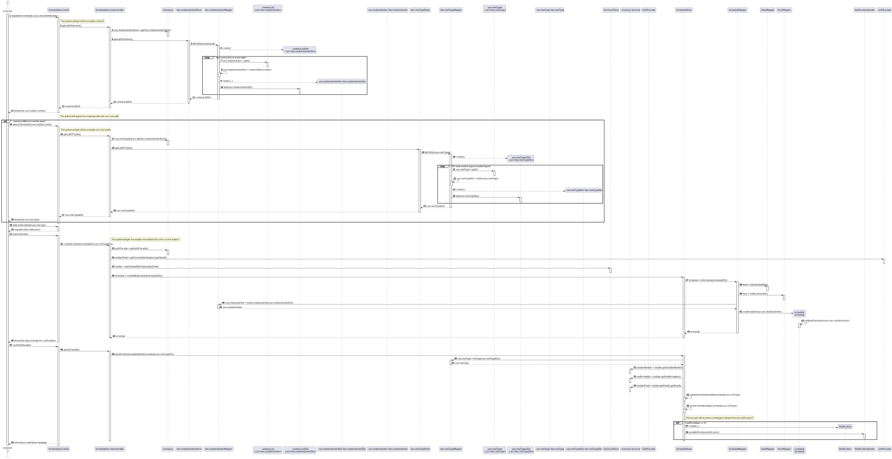
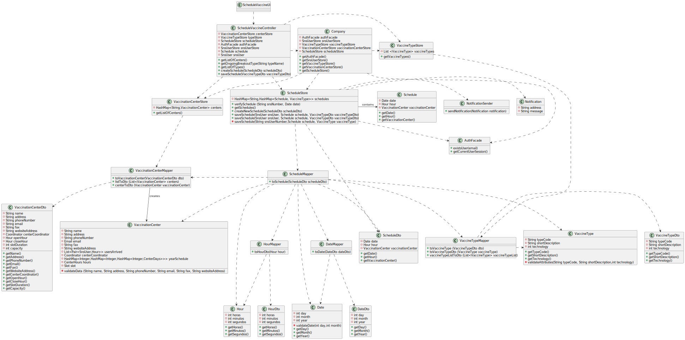

# US 01 - Schedule a vaccine as a SNS User

## 1. Requirements Engineering

### 1.1. User Story Description

*As a SNS user, I intend to use the application to schedule a vaccine.*

### 1.2. Customer Specifications and Clarifications 

**From the specifications document:**

> - "The user should introduce his/her SNS user number, select the vaccination center, the date, and the time (s)he wants to be vaccinated as well as the type of vaccine to be administered (by default, the system suggests the one related to the ongoing outbreak)."

> - "Then, the application should check the vaccination center capacity for that day/time and, if possible, confirm that the vaccination is scheduled and inform the user that (s)he should be at the selected vaccination center at the scheduled day and time."

> - "If the user authorizes the sending of the SMS, the application should send an SMS message when the vaccination event is scheduled and registered in the system."

**From the customer clarifications:**

> - **Question:**
	"How should we verify that a vaccination center is already registered in the system? Which attribute should the system use to verify this (ex. name, phone number)"
>- **Answer:**
	"To schedule a vaccination, a user (US1) or a receptionist (US2) should select a vaccination center from a list.”
 

> - **Question:**
	"We are unsure if it's in this user stories that's asked to implement the "send a SMS message with information about the scheduled appointment" found on the Project Description available in moodle. Could you clarify?"
>- **Answer:**
	"In a previous clarification that I made on this forum, I said: "[The user should receive a] SMS Message to warn of a scheduling [and the message] should include: Date, Time and vaccination center". Teams must record the answers!
    A file named SMS.txt should be used to receive/record the SMS messages. We will not use a real word service to send SMSs.”
 

> - **Question:**
	"To make the development of each US more clear, could you clarify the differences between the two US?"
>- **Answer:**
	"In US1 the actor is the SNS user, in US2 the actor is the receptionist. In US1 the SNS user is already logged in the system and information that is required and that exists in the system should be automatically obtained..”
 

> - **Question:**
	"Does the user have to enter the date and time they want or does the system have to show the available dates and times for the user to select?"
>- **Answer:**
	"In this sprint the actor should introduce (using the keyboard) the date and time (s)he wants to be vaccinated.”
 

### 1.3. Acceptance Criteria

- *A SNS user cannot schedule the same vaccine more than
once.*
- *The system will sugest the oungoing outbreak vaccine type*
- *A SNS user should choose the vaccination center from a list of the existing vaccination centers*
- *A SNS user should choose the vaccine type from a list of the existing vaccine types*
- *A SNS user must receive a SMS with the schedule if allowed notifications*
- *The SNS user information must be automatically obtain*
- *Date and time must be an input from the user*

### 1.4. Found out Dependencies

- *There is a dependency with the us03 since the SNS user must be a user of the system*
- *Has a dependency with the us 09 because we will need the vaccination center registered in the system to select it*
- *The last dependency is with us 12 since we will also need to select a given vaccine type to be scheduled*

### 1.5 Input, Selected, Sent & Output Data

> - *Input data:*
 
	Date
 
	Hours

> - *Selected data:*
 
	Vaccination center
 
	Vaccine type 

> - *Sent data:*
 
	SMS 

> - *Output data:*
 
	Message of success/failure 

### 1.6. System Sequence Diagram (SSD)

### 1.7 Other Relevant Remarks

*The SMS messages sent to the users must be saved in a file named SMS.txt* 

## 2. OO Analysis

### 2.1. Relevant Domain Model Excerpt 

### 2.2. Other Remarks

*Company indirectly will know all the schedules*

## 3. Design - User Story Realization 

### 3.1. Rationale

**The rationale grounds on the SSD interactions and the identified input/output data.**

| Interaction ID | Question: Which class is responsible for... | Answer  | Justification (with patterns)  |
|:-------------  |:--------------------- |:------------|:---------------------------- |
| Step 1: requests to schedule a vaccine administration	 | ... instantiating a new schedule ?| ScheduleMapper | Creator Patter: Rule 4 ("B has the data used to initialize A).                              |
| | ... interacting with the actor ? | ScheduleVaccineUi | Pure Fabrication: there is no reason to assign this responsibility to any existing class in the Domain Model. |
| | ... coordinating the US? | ScheduleVaccineController | Controller. | 
| Step 2: shows the vaccination centers		 |	...knowing the vaccination centers?		|  VaccinationCenterStore       | IE: stores all the vaccination centers                           |
| |... knowing vaccinationCenterStore ? | Company | IE: Company knows the VaccinationCenterStore to which it is delegating some tasks
| |... converting the list of vaccination centers into a list of dto's | VaccinationCenterMapper | Creator Patter: Rule 4 ("B has the data used to initialize A). 
| | ...showing all the vaccination centers to the sns user | ScheduleVaccineUi| IE: responsible for user Interaction. |
| Step 3: selects the desired vaccination center 	| ... saving the selected vaccination center  | Schedule | 	IE: object created has its own data.| 
| Step 4: shows the vaccine types		 | ...knowing the vaccine types? | VacinneTypeStore | IE: stores all the vaccine types|
| |... knowing VacinneTypeStore ? | Company | IE: Company knows the VacinneTypeStore to which it is delegating some tasks
| |... converting the list of vaccine types into a list of dto's | VaccineTypeMapper | Creator Patter: Rule 4 ("B has the data used to initialize A).      
| |...showing all the vaccine types to the sns user | ScheduleVaccineUi |	IE: responsible for user Interaction.
| Step 5: selects the desired vaccine type |	... saving the selected vaccine type| Schedule| IE: object created has its own data.| 
| Step 6: requests data (date,hour) | n/a | |
| Step 7: inputs the data | ... saving the inputted data? | Schedule | IE: object created has its own data.| 
|                         | ...transfering the data typed in the UI to the domain? | ScheduleDto | DTO: When there is so much data to transfer, it is better to opt by using a DTO in order to reduce coupling between UI and domain.
|                         | ... knowing ScheduleStore ? | Company | IE: Company knows the ScheduleStore to which it is delegating some tasks
| |... getting SnsUser information ? | SnsUser | IE: knows own data |
| |... getting SnsUser ? | SnsUserStore | IE: knows all the snsUsers|
| |... knowing SnsUser email? | AuthFacade | IE: knows the current session|
| |... knowing AuthFacade? | Company | IE: Company knows the AuthFacade to which it is delegating some tasks
| Step 8: shows the data and asks for confirmation | ... showing the data to the sns user? | ScheduleVaccineUi| IE: responsible for user Interaction. |
| Step 9: confirms/deny the data | ... validating all data (local validation)? | Schedule |IE: owns its data.
|                                | ... validating all data (global validation)?| ScheduleStore| IE: knows all the schedules
|                                | 	... saving the created schedule? | ScheduleStore | IE: knows all the schedules
| Step 10: informs success/failure message | ... informing operation success or failure? |  ScheduleVaccineUi |	IE: responsible for user Interaction.
| Step 11: sends Notification in case of success| ... knowing the address to send the notification? | SnsUser | IE: knows own data
|                                      | ... sending the notification ? | Notification | IE: knows the message data 

### Systematization ##

According to the taken rationale, the conceptual classes promoted to software classes are: 

 * Company
 * Schedule
 * Notification
 * VaccinationCenter 
 * VaccineType
 * SnsUser

Other software classes (i.e. Pure Fabrication) identified: 
 * ScheduleMapper
 * ScheduleVaccineUi
 * ScheduleController
 * VaccinationCenterStore
 * VaccinationCenterMapper
 * VaccineTypeStore
 * VaccineTypeMapper
 * ScheduleDto
 * ScheduleStore
 * AuthFacade

## 3.2. Sequence Diagram (SD)

## 3.3. Class Diagram (CD)

# 4. Tests 

**Test 1:** Test the schedule class . 

	@@Test
    public void testGetAndSet(){

        Schedule schedule = new Schedule(new Date(12,1,2003) , new Hour(12,30) , new VaccinationCenter("C.V.Margem Sul","Margem Sul 23","123456789","vamargemsul@gmail.com","900-300-5555","vamargemsul.com.pt",new Coordinator("coordinator@gmail.com","Anthony Liberty","COORDINATOR",960000400,14665868,"Sesame Street", "C.V.Margem Sul"),new Hour(9,0,0),new Hour(18,0,0),30,5));

        assertEquals(new Date(12,1,2003), schedule.getDate());
        schedule.setDate(new Date(11,11,2003));
        assertEquals(new Date(11,11,2003), schedule.getDate());

        assertEquals(new Hour(12,30),schedule.getHour());
        schedule.setHour(new Hour(12,45));
        assertEquals(new Hour(12,45),schedule.getHour());

        assertEquals(new VaccinationCenter("C.V.Margem Sul","Margem Sul 23","123456789","vamargemsul@gmail.com","900-300-5555","vamargemsul.com.pt",new Coordinator("coordinator@gmail.com","Anthony Liberty","COORDINATOR",960000400,14665868,"Sesame Street", "C.V.Margem Sul"),new Hour(9,0,0),new Hour(18,0,0),30,5), schedule.getVaccinationCenter());
        schedule.setVaccinationCenter(new VaccinationCenter("C.V.Margem Norte","Margem Norte 23","123456799","vamargemsul@gmail.com","900-300-5555","vamargemsul.com.pt",new Coordinator("coordinator@gmail.com","Anthony Liberty","COORDINATOR",960000400,14665868,"Sesame Street", "C.V.Margem Sul"),new Hour(9,0,0),new Hour(18,0,0),30,5));
        assertEquals(new VaccinationCenter("C.V.Margem Norte","Margem Norte 23","123456799","vamargemsul@gmail.com","900-300-5555","vamargemsul.com.pt",new Coordinator("coordinator@gmail.com","Anthony Liberty","COORDINATOR",960000400,14665868,"Sesame Street", "C.V.Margem Sul"),new Hour(9,0,0),new Hour(18,0,0),30,5), schedule.getVaccinationCenter());
    }

  

**Test 2:** Test the date that the user will input to verify if is a valid one 

@Test
    public void validateDataTest(){

        assertThrows(Exception.class,() -> {
            Date date1 = new Date(32,1,2022);
        });

        assertThrows(Exception.class,() -> {
            Date date2 = new Date(31,13,2022);
        });
    }

    @Test
    public void testGet(){

        Date date = new Date(31,1,2022);
        assertEquals(31,date.getDay());
        assertEquals(1,date.getMonth());
        assertEquals(2022,date.getYear());

    }

# 5. Construction (Implementation)

## Class Schedule

	private Date date;
    private Hour hour;
    private VaccinationCenter vaccinationCenter;

    /**
     * Constructor of the class
     * @param date date desired
     * @param hour hour desired
     * @param vaccinationCenter vaccination center desired
     *
     * @author Nuno Cunha <1211689@isep.ipp.pt>
     */
    public Schedule(Date date, Hour hour, VaccinationCenter vaccinationCenter) {
        this.date = date;
        this.hour = hour;
        this.vaccinationCenter = vaccinationCenter;
    }

    public void validateInformation (Date date, Hour hour , VaccinationCenter vaccinationCenter){

    }

    /**
     * Method to get the date
     * @return date
     *
     * @author Nuno Cunha <1211689@isep.ipp.pt>
     */
    public Date getDate() {
        return date;
    }

    /**
     * Method to set the date
     * @param date date
     * @return date
     *
     * @author Nuno Cunha <1211689@isep.ipp.pt>
     */
    public void setDate(Date date) {
        this.date = date;
    }

    /**
     * Method to get the hour
     * @return hour
     *
     * @author Nuno Cunha <1211689@isep.ipp.pt>
     */
    public Hour getHour() {
        return hour;
    }

    /**
     * Method to set the hour
     * @param hour hour
     * @return hour
     *
     * @author Nuno Cunha <1211689@isep.ipp.pt>
     */
    public void setHour(Hour hour) {
        this.hour = hour;
    }

    /**
     * Method to get the vaccination center
     * @return vaccination center
     *
     * @author Nuno Cunha <1211689@isep.ipp.pt>
     */
    public VaccinationCenter getVaccinationCenter() {
        return vaccinationCenter;
    }

    /**
     * Method to set the vaccination center
     * @param vaccinationCenter vaccination center
     * @return vaccination center
     *
     * @author Nuno Cunha <1211689@isep.ipp.pt>
     */
    public void setVaccinationCenter(VaccinationCenter vaccinationCenter) {
        this.vaccinationCenter = vaccinationCenter;
    }

    /**
     * Method to string to the object from schedule vaccine class
     * @return schedule vaccine string
     *
     * @author Nuno Cunha <1211689@isep.ipp.pt>
     */
    @Override
    public String toString() {
        return "ScheduleVaccine{" +
                "date=" + date +
                ", hour=" + hour +
                ", vaccinationCenter='" + vaccinationCenter + '\'' +
                '}';
    }

    /**
     * Method equals from the object of the class schedule vaccine
     * @param o object
     * @return boolean with the equality or not
     *
     * @author Nuno Cunha <1211689@isep.ipp.pt>
     */
    @Override
    public boolean equals(Object o) {
        if (this == o) return true;
        if (o == null || getClass() != o.getClass()) return false;
        Schedule that = (Schedule) o;
        return date == that.date && hour == that.hour && vaccinationCenter.equals(that.vaccinationCenter);
    }

    /**
     * Method to obtain the hash code of an object from the class schedule vaccine
     *
     * @return object's hash code
     *
     * @author Nuno Cunha <1211689@isep.ipp.pt>
     */
    @Override
    public int hashCode() {
        return Objects.hash(date, hour, vaccinationCenter);
    }

## Class ScheduleVaccineController

	 private final VaccinationCenterStore centerStore;
    private final VaccineTypeStore typeStore;
    private final ScheduleStore scheduleStore;
    private final AuthFacade authFacade;
    private final SnsUserStore snsUserStore;
    private Schedule schedule;
    private SnsUser snsUser;

    public ScheduleVaccineController() {
        centerStore = App.getInstance().getCompany().getVaccinationCenterStore();
        typeStore = App.getInstance().getCompany().getVaccineTypeStore();
        scheduleStore = App.getInstance().getCompany().getScheduleStore();
        authFacade = App.getInstance().getCompany().getAuthFacade();
        snsUserStore = App.getInstance().getCompany().getSnsUserStore();
    }

    public List<VaccinationCenterDto> getListOfCenters (){
        return centerStore.getListOfCenters();
    }

    public VaccineTypeDto getOngoingBreakoutType (String typeName){
        return typeStore.getOngoingOutbreakType(typeName);
    }

    public List<VaccineTypeDto> getListOfTypes(){
        return typeStore.getVaccineTypes();
    }

    public void createSchedule(ScheduleDto scheduleDto){

        String snsUserEmail = authFacade.getCurrentUserSession().getUserId().getEmail();
        snsUser = snsUserStore.getSnsUserByEmail(snsUserEmail);
        schedule = scheduleStore.createNewSchedule(scheduleDto);

    }

    public void saveSchedule(VaccineTypeDto vaccineTypeDto){
        scheduleStore.saveSchedule(snsUser,schedule,vaccineTypeDto);
    }

		
	

# 6. Integration and Demo 

* A new option on the Sns User Ui menu options was added.
* The SMS notification was saved in a txt file
* For demo purposes some tasks are bootstrapped while system starts.

# 7. Observations

n/a

