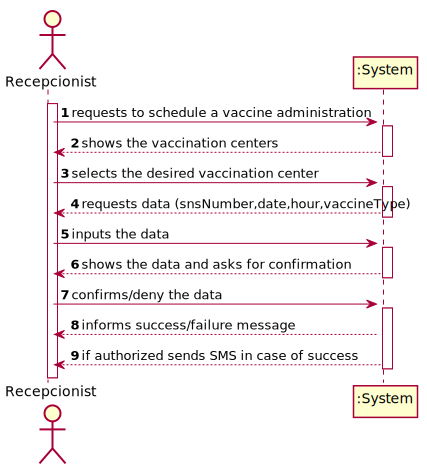
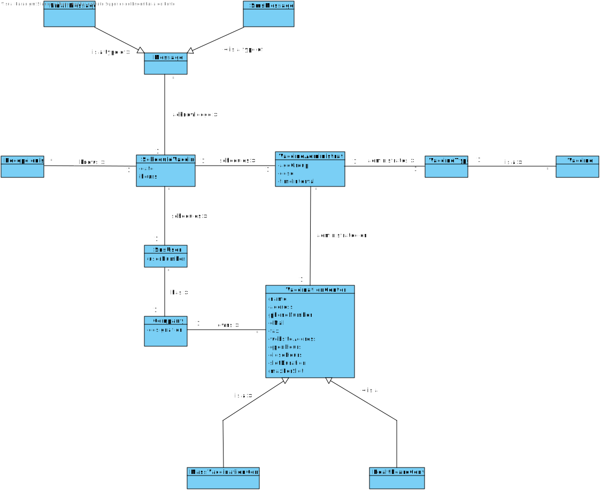
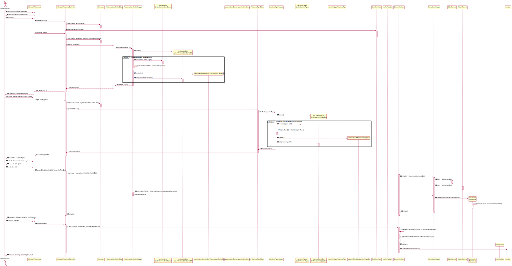
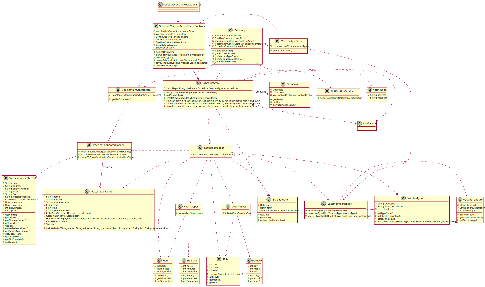

# US 2 - As a recepcionist, at one vaccination center, I want to schedule a vaccination

## 1. Requirements Engineering 

### 1.1 User Story Description 
*As a recepcionist at one vaccination center, I want to schedule a vaccination*

### 1.2. Customer Specifications and Clarifications 
**From the specification document:**
> - The recepcionist should ask the SNS user his/her SNS user number,to select the vaccination center, the date, and the time (s)he wants to be vaccinated as well as the type of vaccine to be administered (by default, the system suggests the one related to the ongoing outbreak). Then, the application should check the vaccination center capacity for that day/time and, if possible, confirm that the vaccination is scheduled and inform the user that (s)he should be at the selected vaccination center at the scheduled day and time. The Recepcionist should ask the SNS user if he authorize the DGS to send a SMS message with information about the scheduled appointment.

**From the costumer clarifications**
> - **Question**
    Does a recepcionist has the ability to schedule an appointment in different vaccination centres or only on their own?
> - **Answer**
    A recepcionist has the ability to schedule a vaccine in any vaccination center and should ask the SNS user to indicate/select the preferred vaccination center.

> - **Question**
    "We are unsure if it's in this user stories that's asked to implement the "send a SMS message with information about the scheduled appointment" found on the Project Description available in moodle. Could you clarify?"
> - **Answer**
    SMS Message to warn of a scheduling [and the message] should include: Date, Time and vaccination center". Teams must record the answers!
    A file named SMS.txt should be used to receive/record the SMS messages. We will not use a real word service to send SMSs.

> - **Question**
    "When a receptionist schedules a vaccination for an SNS user, should they be presented with a list of available vaccines (brands, that meet acceptance criteria) from which to choose? Or should the application suggest only one?"
> - **Answer**
    The receptionist do not select the vaccine brand. When the user is at the vaccination center to take the vaccine, the nurse selects the vaccine.

 

### 1.3 Acceptance Criteria
> - *The algorithm should check if the SNS User is within the age and time since the last vaccine.*
> - *It's nos possible to an SNS User to schedule the same vaccine more than once.*
> - *The algorithm should check if the SNS User is within the age and time since the last vaccine*

### 1.4 Found out Dependencies 
*There are dependencies between US2 and US1 because the final purpose is the same and the information necessary is the same, but in this case the process is made by an recepcionist and in the US1 the process is made by the SNS user.*

### 1.5 Input and Output Data
> - *Input data:*
 
    SNS User Number
 
    Date
 
    Hours
 
    Vaccine type

> - *Selected Data*
 
    Desired Vaccination Center

> - *Sent data*
 
    SMS (if authorized)

> - *Output data:*
 
    Message of sucess/failure

### 1.6 System Sequence Diagram (SSD)

### 1.7 Other Relevants Remarks
*The user should receive the SMS confirmation if he/she allowed before*

## 2. OO Analysis 

### 2.1 Relevant Domain Model Excerpt

### 2.2 Other Remarks 
*The password of each user should hold 7 alphanumeric characters, which three are capital letters and other two are digits.*

## 3. Design - User Story Realization 

### 3.1. Rationale 

**The rationale grounds on the SSD interactions and the identified input/output data.**

| Interaction ID | Question: Which class is responsible for... | Answer  | Justification (with patterns)  |
|:-------------  |:--------------------- |:------------|:---------------------------- |
Step 1:Request to schedule a vaccine| ... scheduling a new vaccine administration?| Schedule | IE: owns its data.
|| ...interacting with the user? | ScheduleVaccineRecepcionistUI | Pure Fabrication: there is no reason to assign this responsibility to any existing class in the Domain Model.
|| ... coordinating the US?| ScheduleVaccineRecepcionistController | Controller.
|Step 2: Show the vaccination centers | ...has the vaccination centers? | VaccinationCenterStore | IE: knows all the users.
|| ... showing the vaccination centers? |ScheduleVaccineRecepcionistUI| IE: knows all the users.
|Step 3: request data...| n/a ||||
|Step 4: inputs the data| ...saving the inputted data?| Schedule| IE: owns its data.
|| ... transfer the data typed in the UI to the Domain| ScheduleDto | DTO: When there is so much data to transfer, it is better to opt by using a DTO in order to reduce coupling between UI and domain.
||... knows vaccinationScheduleStore? | Company | IE: Company knows the VaccinationScheduleStore to which it is delegating some tasks
| Step 5: Shows the data and asks for confirmation| ... showing the data?| ScheduleVaccineRecepcionistUI| IE: responsible for user Interaction.
|Step 6: confirms/deny the information|	... validating all data (local validation)?| Schedule |IE: owns its data.
|| ... validating all data (global validation)?| ScheduleStore| 	IE: knows all the users.
||... saving the created schedules?|ScheduleStore| 	IE: knows all the vaccine schedules.
||... validating the opening and closing hours? | VaccinationCenter | IE: knows all the available hours 
||... validating the availability at a certain hour?| Slot | IE: knows all slots available at a certain hour
||...validating the desired day | ScheduleStore | IE: knows all the available days 
|Step 6: informs success/failure| ... informing operation success?|ScheduleVaccineRecepcionistUI | IE: responsible for user Interaction.|

### Systematization ###

According to the taken rationale, the conceptual classes promoted to software classes are: 
* Company
* Schedule
* VaccinationCenter

Other software classes (i.e. Pure Fabrication) identified:
* ScheduleVaccineRecepcionistController
* ScheduleVaccineRecepcionistUi
* ScheduleStore
* ScheduleDto
* Hour
* Date
* SnsUserDto
* VaccinationCenterStore
* SnsUserStore

## 3.2. Sequence Diagram (SD)

## 3.3. Class Diagram (CD)

# 4. Tests

**Test 1:** Verify if all the parameters inputted that are necessary to register the vaccination center.

     @Test
    public void validateDataTest(){

        assertThrows(Exception.class,() -> {
            Date date1 = new Date(32,1,2022);
        });

        assertThrows(Exception.class,() -> {
            Date date2 = new Date(31,13,2022);
        });
    }

**Test 2:** Verify the creation of an center coordinator which is mandatory to register a vaccination center a parameter to schedule a vaccine.

    @Test
    public void testThrows (){
        Coordinator coordinator = new Coordinator("coordinator@gmail.com","Anthony Liberty","COORDINATOR",960000400,14665868,"Sesame Street", "C.V.Margem Sul");

        //test name when blank || null || empty
        assertThrows(IllegalArgumentException.class,() -> {
            VaccinationCenter center = new VaccinationCenter("","Margem Sul 23","123456789","vamargemsul@gmail.com","900-300-5555","vamargemsul.com.pt",coordinator,new Hour(9,0,0),new Hour(18,0,0),30,5);

        });

        //test address when blank || null || empty
        assertThrows(IllegalArgumentException.class,() -> {
            VaccinationCenter center = new VaccinationCenter("Margem sul center","","123456789","vamargemsul@gmail.com","900-300-5555","vamargemsul.com.pt",coordinator,new Hour(9,0,0),new Hour(18,0,0),30,5);

        });

        //test phone number when blank || null || empty
        assertThrows(IllegalArgumentException.class,() -> {
            VaccinationCenter center = new VaccinationCenter("Margem sul center","Rua da margem sul","","vamargemsul@gmail.com","900-300-5555","vamargemsul.com.pt",coordinator,new Hour(9,0,0),new Hour(18,0,0),30,5);

        });

        //test phone number when not following the rules
        assertThrows(IllegalArgumentException.class,() -> {
            VaccinationCenter center = new VaccinationCenter("Margem sul center","Rua da margem sul","1234","vamargemsul@gmail.com","900-300-5555","vamargemsul.com.pt",coordinator,new Hour(9,0,0),new Hour(18,0,0),30,5);

        });

        //test email when blank || null || empty
        assertThrows(IllegalArgumentException.class,() -> {
            VaccinationCenter center = new VaccinationCenter("Margem sul center","Rua da margem sul","123456789","","900-300-5555","vamargemsul.com.pt",coordinator,new Hour(9,0,0),new Hour(18,0,0),30,5);

        });

        //test email when not following the rules
        assertThrows(IllegalArgumentException.class,() -> {
            VaccinationCenter center = new VaccinationCenter("Margem sul center","Rua da margem sul","123456789","diogo.pt","900-300-5555","vamargemsul.com.pt",coordinator,new Hour(9,0,0),new Hour(18,0,0),30,5);

        });

        //test fax when blank || null || empty
        assertThrows(IllegalArgumentException.class,() -> {
            VaccinationCenter center = new VaccinationCenter("Margem sul center","Rua da margem sul","123456789","diogo@gmail.pt","","vamargemsul.com.pt",coordinator,new Hour(9,0,0),new Hour(18,0,0),30,5);

        });

        //test fax when not following the rules
        assertThrows(IllegalArgumentException.class,() -> {
            VaccinationCenter center = new VaccinationCenter("Margem sul center","Rua da margem sul","123456789","diogo@gmail.pt","123-432-21","vamargemsul.com.pt",coordinator,new Hour(9,0,0),new Hour(18,0,0),30,5);

        });

        //test website when blank || null || empty
        assertThrows(IllegalArgumentException.class,() -> {
            VaccinationCenter center = new VaccinationCenter("Margem sul center","Rua da margem sul","123456789","diogo@gmail.pt","123-432-2132","",coordinator,new Hour(9,0,0),new Hour(18,0,0),30,5);

        });

        //test website when not following the rules
        assertThrows(IllegalArgumentException.class,() -> {
            VaccinationCenter center = new VaccinationCenter("Margem sul center","Rua da margem sul","123456789","diogo@gmail.pt","123-432-2132","testwebsite",coordinator,new Hour(9,0,0),new Hour(18,0,0),30,5);

        });

    }

# 5. Construction (Implementation)

## Class Date

    public class Date {

    private final int day;
    private final int month;
    private final int year;
    private final HashMap<Integer,Integer> months;

    /**
     * Constructor of the class
     * @param day
     * @param month
     * @param year
     *
     * @author Nuno Cunha <1211689@isep.ipp.pt>
     */
    public Date(int day, int month, int year) {
        months = generateMonths(Year.isLeap(year));
        validateDate(day,month);
        this.day = day;
        this.month = month;
        this.year = year;

    }

    /**
     * Method to generate all days inside a given month
     * @param leap boolean to tell if the year is leap or not
     * @return map with all the days of the given months
     *
     * @author Diogo Teixeira <1200904@isep.ipp.pt>
     */
    public static HashMap<Integer,Integer> generateMonths (boolean leap){

        HashMap<Integer,Integer> months = new HashMap<>();
        int [] month = {1,2,3,4,5,6,7,8,9,10,11,12};

        List<Integer> month31 = new ArrayList<>(){{
            add(1);
            add(3);
            add(5);
            add(7);
            add(8);
            add(10);
            add(12);
        }
        };
        List<Integer> month30 = new ArrayList<>(){{
            add(4);
            add(6);
            add(9);
            add(11);
        }
        };
        if(leap){
            for (Integer s : month) {
                if (month31.contains(s)) {
                    months.put(s, 31);

                } else if (month30.contains(s)) {
                    months.put(s, 30);
                } else {
                    months.put(s, 29);
                }
            }
        } else {
            for (Integer s : month) {
                if (month31.contains(s)) {
                    months.put(s, 31);

                } else if (month30.contains(s)) {
                    months.put(s, 30);
                } else {
                    months.put(s, 28);
                }
            }
        }
        return months;
    }

    /**
     * Method to validate the date inputted
     * @param day
     * @param month
     *
     * @author Diogo Teixeira <1200904@isep.ipp.pt>
     */
    private void validateDate(int day,int month){

        if (month > 12 || month < 0){
            throw new IllegalArgumentException("Month incorrect.");
        }

        if(day > months.get(month)){
            throw new IllegalArgumentException("Invalid day");
        }
    }

    /**
     * Method to get the day
     * @return day
     *
     * @author Nuno Cunha <1211689@isep.ipp.pt>
     */
    public int getDay() {
        return day;
    }

    /**
     * Method to get the month
     * @return day
     *
     * @author Nuno Cunha <1211689@isep.ipp.pt>
     */
    public int getMonth() {
        return month;
    }

    /**
     * Method to get the year
     * @return day
     *
     * @author Nuno Cunha <1211689@isep.ipp.pt>
     */
    public int getYear() {
        return year;
    }

    /**
     * Method equals of the class date
     * @param o object
     * @return boolrsn with the result
     *
     * @author Nuno Cunha <1211689@isep.ipp.pt>
     */
    @Override
    public boolean equals(Object o) {
        if (this == o) return true;
        if (o == null || getClass() != o.getClass()) return false;
        Date date = (Date) o;
        return day == date.day && month == date.month && year == date.year && Objects.equals(months, date.months);
    }

    /**
     * Method to obtain the hashcode of the class date
     *
     * @return hashcode
     *
     * @author Nuno Cunha <1211689@isep.ipp.pt>
     */
    @Override
    public int hashCode() {
        return Objects.hash(day, month, year, months);
    }
}

## Class Schedule 

    public class Schedule {

    private Date date;
    private Hour hour;
    private VaccinationCenter vaccinationCenter;

    /**
     * Constructor of the class
     * @param date date desired
     * @param hour hour desired
     * @param vaccinationCenter vaccination center desired
     *
     * @author Nuno Cunha <1211689@isep.ipp.pt>
     */
    public Schedule(Date date, Hour hour, VaccinationCenter vaccinationCenter) {
        this.date = date;
        this.hour = hour;
        this.vaccinationCenter = vaccinationCenter;
    }

    /**
     * Method to get the date
     * @return date
     *
     * @author Nuno Cunha <1211689@isep.ipp.pt>
     */
    public Date getDate() {
        return date;
    }

    /**
     * Method to set the date
     * @param date date
     * @return date
     *
     * @author Nuno Cunha <1211689@isep.ipp.pt>
     */
    public void setDate(Date date) {
        this.date = date;
    }

    /**
     * Method to get the hour
     * @return hour
     *
     * @author Nuno Cunha <1211689@isep.ipp.pt>
     */
    public Hour getHour() {
        return hour;
    }

    /**
     * Method to set the hour
     * @param hour hour
     * @return hour
     *
     * @author Nuno Cunha <1211689@isep.ipp.pt>
     */
    public void setHour(Hour hour) {
        this.hour = hour;
    }

    /**
     * Method to get the vaccination center
     * @return vaccination center
     *
     * @author Nuno Cunha <1211689@isep.ipp.pt>
     */
    public VaccinationCenter getVaccinationCenter() {
        return vaccinationCenter;
    }

    /**
     * Method to set the vaccination center
     * @param vaccinationCenter vaccination center
     * @return vaccination center
     *
     * @author Nuno Cunha <1211689@isep.ipp.pt>
     */
    public void setVaccinationCenter(VaccinationCenter vaccinationCenter) {
        this.vaccinationCenter = vaccinationCenter;
    }

    /**
     * Method to string to the object from schedule vaccine class
     * @return schedule vaccine string
     *
     * @author Nuno Cunha <1211689@isep.ipp.pt>
     */
    @Override
    public String toString() {
        return "ScheduleVaccine{" +
                "date=" + date +
                ", hour=" + hour +
                ", vaccinationCenter='" + vaccinationCenter + '\'' +
                '}';
    }

    /**
     * Method equals from the object of the class schedule vaccine
     * @param o object
     * @return boolean with the equality or not
     *
     * @author Nuno Cunha <1211689@isep.ipp.pt>
     */
    @Override
    public boolean equals(Object o) {
        if (this == o) return true;
        if (o == null || getClass() != o.getClass()) return false;
        Schedule that = (Schedule) o;
        return date == that.date && hour == that.hour && vaccinationCenter.equals(that.vaccinationCenter);
    }

    /**
     * Method to obtain the hash code of an object from the class schedule vaccine
     *
     * @return object's hash code
     *
     * @author Nuno Cunha <1211689@isep.ipp.pt>
     */
    @Override
    public int hashCode() {
        return Objects.hash(date, hour, vaccinationCenter);
    }
}

# 6. Integration and Demo 
* A recepcionist has now another function in the his/hers menu.
* Some tasks are bootstrapped for demo purposes 

# 7. Observations 
