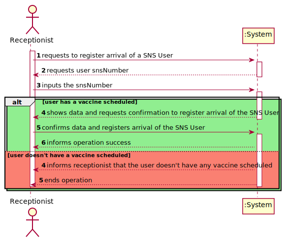
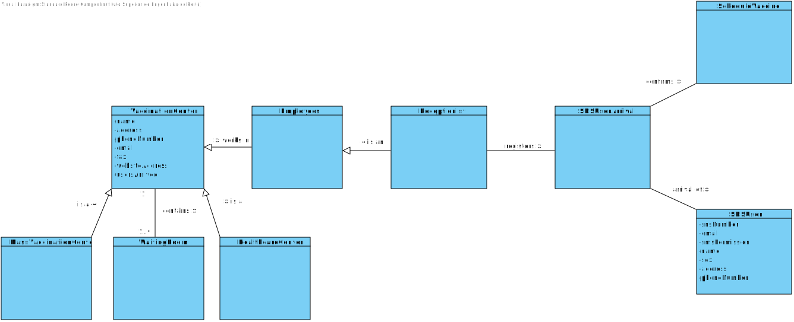
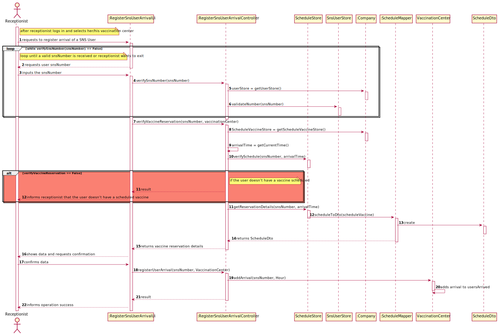
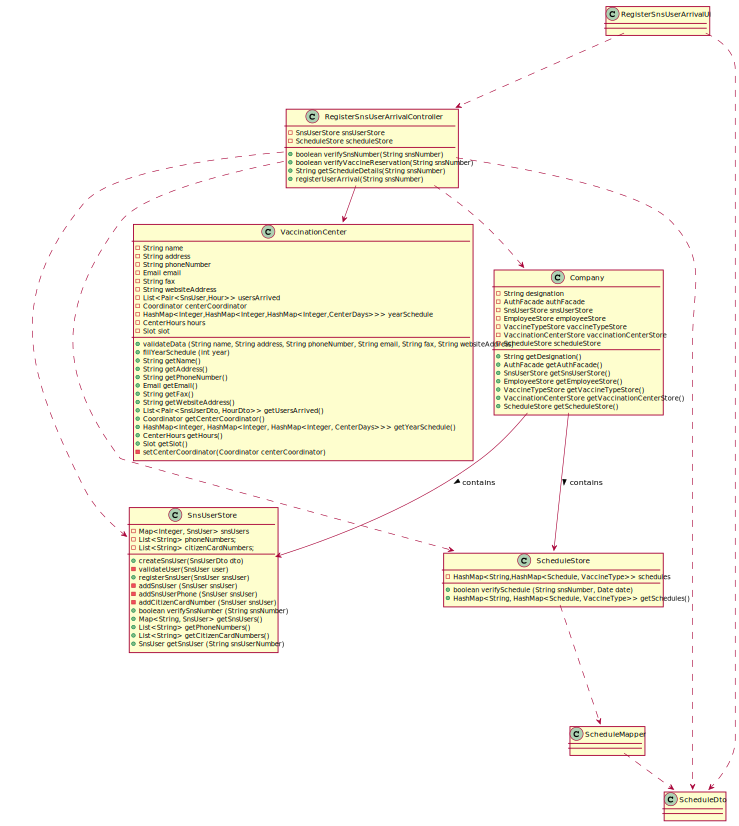

# US 04 - Register the arrival of a SNS user to take the vaccine, as a receptionist

## 1. Requirements Engineering

### 1.1. User Story Description

*As a receptionist at a vaccination center, I want to register the arrival of a SNS user
to take the vaccine.*

### 1.2. Customer Specifications and Clarifications

**From the specifications document:**

> When the SNS user arrives at the vaccination center, a receptionist registers the arrival of the user to
take the respective vaccine. 

> The receptionist asks the SNS user for his/her SNS user number and
confirms that he/she has the vaccine scheduled for the that day and time. 

>If the information is
correct, the receptionist acknowledges the system that the user is ready to take the vaccine. Then,
the receptionist should send the SNS user to a waiting room where (s)he should wait for his/her
time.

**From the customer clarifications**

> - **Question:**
    "Regarding US04, what are the attributes needed in order to register the arrival of a SNS user to a vaccination center"
> - **Answer:**
    The time of arrival should be registered.

 

> - **Question:**
    "Regarding US04, a receptionist register the arrival of a SNS user immediately when he arrives at the vaccination center or only after the receptionist confirms that the respective user has a vaccine schedule for that day and time."
> - **Answer:**
    The receptionist registers the arrival of a SNS user only after confirming that the user has a vaccine scheduled for that day and time.

 

> - **Question:**
    "When the SNS user number is introduce by the receptionist and the system has no appointment for that SNS user number, how should the system proceed?"
> - **Answer:**
    The application should present a message saying that the SNS user did not scheduled a vaccination.

 

> - **Question:**
    "Regarding US04, i would like to know what's the capacity of the waiting room."
> - **Answer:**
    The waiting room will not be registered or defined in the system. The waiting room of each vaccination center has the capacity to receive all users who take the vaccine on given slot.

 

> - **Question:**
    "The nurse must have the possibility to choose which center she wants to register the SNS user's arrival every time she uses this feature, or should we make the nurse pick a center after they log in?"
> - **Answer:**
    To start using the application, the nurse should first select the vaccination center where she is working.

 

> - **Question:**
    ""
> - **Answer:**
    .

 

### 1.3. Acceptance Criteria

* **Acceptance Criteria 1:** No duplicate entries should be possible for the same SNS user on the same day or vaccine period.*
* **Acceptance Criteria 2:** For the SNS User arrival to be registered, first he/she needs to have a vaccination scheduled in the system.

### 1.4. Found out Dependencies

- *We can find a dependency with US01 or US02 since there needs to be a vaccine scheduled in order for the receptionist to register the arrival of a SNS user to take the vaccine.*
- *We can find a dependency with US03 since the user needs to be registered in the system in order for his/her arrival to be registered.*
- *We can find a dependency with US10 since you need to be registered as Receptionist in order to register the arrival of a user.*
- *We can find a dependency with US09 since the vaccination center where the user is going to take the vaccine must be registered in the system.*
- 

### 1.5 Input and Output Data
 
**Input data:**

* Typed data:
  * SNS User number

**Output data:**

* Message informing if the SNS User has a vaccine scheduled
* (In)Success of the operation

### 1.6. System Sequence Diagram (SSD)

*Insert here a SSD depicting the envisioned Actor-System interactions and throughout which data is inputted and outputted to fulfill the requirement. All interactions must be numbered.*

### 1.7 Other Relevant Remarks

*If the SNS user has no vaccine scheduled for that time, the system should inform the receptionist.*

## 2. OO Analysis

### 2.1. Relevant Domain Model Excerpt
*In this section, it is suggested to present an excerpt of the domain model that is seen as relevant to fulfill this requirement.*

### 2.2. Other Remarks

*Use this section to capture some aditional notes/remarks that must be taken into consideration into the design activity. In some case, it might be usefull to add other analysis artifacts (e.g. activity or state diagrams).*

## 3. Design - User Story Realization

### 3.1. Rationale

**The rationale grounds on the SSD interactions and the identified input/output data.**

| Interaction ID | Question: Which class is responsible for... | Answer      | Justification (with patterns)|
|:-------------  |:--------------------------------------------|:------------|:-----------------------------|
| Step 1: requests to register arrival of a SNS User| ... interacting with the actor ?| RegisterSNSUserArrivalUi| Pure Fabrication: there is no reason to assign this responsibility to any existing class in the Domain Model.                               |
| | ... coordinating the US? | RegisterSNSUserArrivalController | Controller. | 
| Step 2: requests user snsNumber| n/a					                   |             |                              |
| Step 3: inputs the snsNumber| ...verifying the inputted data?| SnsUserStore|IE: knows all the SNS users|
| | ...verifying the schedule associated with the inputted data?| ScheduledVaccineStore|IE: knows all the scheduled vaccines|
| | ...knowing ScheduleVaccineStore?| Company |IE: Company knows the ScheduleVaccineStore to which it is delegating some tasks|
| Step 4: shows data and requests confirmation to register arrival of the SNS User| ...showing the data?          |RegisterSNSUserArrivalUi| IE: responsible for user Interaction.                             |
| |...transferring the data from domain to the UI | ScheduledVaccineDto | DTO: When there is so much data to transfer, it is better to opt by using a DTO in order to reduce coupling between UI and domain.
| Step 5: confirms data and registers arrival of the SNS User| ... registering arrival of the SNS User?| VaccinationCenter|IE: Knows all users that arrived
| Step 6: informs operation success|... informing operation success |RegisterSNSUserArrivalUi| IE: responsible for user Interaction. |             
| Step 7: informs receptionist that the user doesn't have any vaccine scheduled|...informing operation failure? |RegisterSNSUserArrivalUi| IE: responsible for user Interaction.          |
| Step 8: ends operation|				n/a			                   |             |                              |

### Systematization ##

According to the taken rationale, the conceptual classes promoted to software classes are:

* Company
* VaccinationCenter
* ScheduleVaccine

Other software classes (i.e. Pure Fabrication) identified:

* RegisterSnsUserArrivalUi
* RegisterSnsUserArrivalController
* ScheduleVaccineDto
* ScheduleVaccineMapper
* ScheduleVaccineStore

## 3.2. Sequence Diagram (SD)

*In this section, it is suggested to present an UML dynamic view stating the sequence of domain related software objects' interactions that allows to fulfill the requirement.*

## 3.3. Class Diagram (CD)

*In this section, it is suggested to present an UML static view representing the main domain related software classes that are involved in fulfilling the requirement as well as and their relations, attributes and methods.*

# 4. Tests

**Test 1:** Check if verifySnsNumberTest() works when a snsNumber isn't registered in the system

    @Test
    @DisplayName("Should return false when the user sns number is not registered in the system")
    public void verifySnsNumberTestFalse() {

        RegisterSnsUserArrivalController controller = new RegisterSnsUserArrivalController();

        assertFalse(controller.verifySnsNumber("12132131"));

    }

**Test 2:** Check if verifyVaccineReservationTest() works when a snsNumber is registered in the system

	@Test
    @DisplayName("Should return true when the user sns number is registered in the system")
    public void verifySnsNumberTestTrue() {

        RegisterSnsUserArrivalController controller = new RegisterSnsUserArrivalController();
        RegisterSnsUserController snsUserController = new RegisterSnsUserController();

        SnsUserDto dto = new SnsUserDto("Diogo","Rua de cima","Male","960168874","diogocostat@gmail.com","19/12/2002","167898423","16658688",1);

        //snsUserController.createSnsUser(dto);
        //snsUserController.registerSnsUser();

        assertTrue(controller.verifySnsNumber("167898423"));

    }

**Test 3:** Check if verifyVaccineReservation() works when the user doesn't have a vaccine scheduled in the system

    @Test
    @DisplayName("Should return false when the user doesn't have a vaccine scheduled in the system")
    public void verifyVaccineReservationTestFalse(){

        RegisterSnsUserArrivalController controller = new RegisterSnsUserArrivalController();
        RegisterSnsUserController snsUserController = new RegisterSnsUserController();

        Coordinator coordinator = new Coordinator("coordinator@gmail.com","Anthony Liberty","COORDINATOR",960000400,14665868,"Sesame Street", "C.V.Margem Sul");
        VaccinationCenter vaccinationCenter = new VaccinationCenter("HealthCare Lisboa","Margem Sul 23","123456789","lisboa@gmail.com","900-300-5555","vamargemsul.com.pt",coordinator,new Hour(9,0,0),new Hour(18,0,0),30,5);

        //SnsUserDto dto = new SnsUserDto("Diogo","Rua de cima","Male","960168874","diogocostat@gmail.com","19/12/2002","167898423","16658688",1);

        //snsUserController.createSnsUser(dto);
        //snsUserController.registerSnsUser();

        assertFalse(controller.verifyVaccineReservation("167898423", vaccinationCenter));

    }

**Test 4:** Check if verifyVaccineReservation() works when the user has a vaccine scheduled in the system

    @Test
    @DisplayName("Should return true when the user has a vaccine scheduled in the system")
    public void verifyVaccineReservationTestTrue(){

        List<VaccineType> avaiableTypes2 = new ArrayList<>(){{
            add(new VaccineType("AF23P","Covid-19 vaccine",3));
            add(new VaccineType("AF24T","MonkeyPox vaccine",2));

        }};

        RegisterSnsUserArrivalController controller = new RegisterSnsUserArrivalController();
        RegisterSnsUserController snsUserController = new RegisterSnsUserController();
        ScheduleVaccineRecepcionistController scheduleVaccineRecepcionistController = new ScheduleVaccineRecepcionistController();
        ScheduleStore scheduleStore = new ScheduleStore();
        Coordinator coordinator = new Coordinator("coordinator@gmail.com","Anthony Liberty","COORDINATOR",960000400,14665868,"Sesame Street", "C.V.Margem Sul");
        VaccinationCenter vaccinationCenter = new HealthCareCenter("HealthCare Lisboa","Margem Sul 23","123456789","lisboa@gmail.com","900-300-5555","vamargemsul.com.pt",coordinator,new Hour(9,0,0),new Hour(18,0,0),30,5,avaiableTypes2,1);
        //SnsUserDto dto = new SnsUserDto("Diogo","Rua de cima","Male","960168874","diogocostat@gmail.com","19/12/2002","167898423","16658688",1);
        //snsUserController.createSnsUser(dto);
        //snsUserController.registerSnsUser();
        //SnsUser snsUser = SnsUserMapper.toSnsUser(dto);
        //VaccineTypeDto vaccineTypeDto = scheduleVaccineController.getOngoingBreakoutType(ongoing)
        VaccineTypeDto vaccineTypeDto = new VaccineTypeDto("12345", "Covid-19", 2);

        VaccinationCenterDto vaccinationCenterDto = VaccinationCenterMapper.centerToDto(vaccinationCenter);

        ScheduleDto scheduleDto = new ScheduleDto(new DateDto(01,06,2022),new HourDto(12,30,0),vaccinationCenterDto);
        scheduleVaccineRecepcionistController.createSchedule(scheduleDto);
        scheduleVaccineRecepcionistController.saveSchedule(vaccineTypeDto, "167898423");

        assertTrue(controller.verifyVaccineReservation("167898423", vaccinationCenter));

    }

**Test 5:** Check if registerUserArrival() correctly adds the user to the usersArrived list

    @Test
    @DisplayName("Should return true if it correctly registers the user.")
    public void registerUserArrivalTest(){

        List<VaccineType> avaiableTypes2 = new ArrayList<>(){{
            add(new VaccineType("AF23P","Covid-19 vaccine",3));
            add(new VaccineType("AF24T","MonkeyPox vaccine",2));

        }};

        RegisterSnsUserArrivalController controller = new RegisterSnsUserArrivalController();
        RegisterSnsUserController snsUserController = new RegisterSnsUserController();
        SnsUserStore snsUserStore = new SnsUserStore();

        Coordinator coordinator = new Coordinator("coordinator@gmail.com","Anthony Liberty","COORDINATOR",960000400,14665868,"Sesame Street", "C.V.Margem Sul");
        VaccinationCenter vaccinationCenter = new HealthCareCenter("HealthCare Lisboa","Margem Sul 23","123456789","lisboa@gmail.com","900-300-5555","vamargemsul.com.pt",coordinator,new Hour(9,0,0),new Hour(18,0,0),30,5,avaiableTypes2,1);
        SnsUserDto dto = new SnsUserDto("Diogo","Rua de cima","Male","960168874","diogocostat@gmail.com","19/12/2002","167898423","16658688",1);
        snsUserController.createSnsUser(dto);
        snsUserController.registerSnsUser();

        controller.registerUserArrival("167898423", vaccinationCenter);

        List<Pair<SnsUserDto, HourDto>> usersArrived  = vaccinationCenter.getUsersArrived();
        List<Pair<SnsUserDto, HourDto>> usersArrivedExpected = new ArrayList<Pair<SnsUserDto, HourDto>>();

        Hour arrivalTime = Hour.tempoAtual();
        HourDto arrivalTimeDto = HourMapper.toHourDto(arrivalTime);

        SnsUser snsUser = snsUserStore.getSnsUser("167898423");
        //SnsUserDto snsUserDto = SnsUserMapper.toSnsUserDto(snsUser);

        usersArrivedExpected.add(new Pair<SnsUserDto, HourDto>(dto, arrivalTimeDto));

        assertEquals(usersArrived.get(0).getFirst().getEmail(), usersArrivedExpected.get(0).getFirst().getEmail());

    }

**Test 6:** Check if getVaccinationCenter() correctly gets the right vaccinationCenter by name

    @Test
    @DisplayName("Should return true if it gets the same vaccination center")
    public void getVaccinaationCenterTest(){

        List<VaccineType> avaiableTypes2 = new ArrayList<>(){{
            add(new VaccineType("AF23P","Covid-19 vaccine",3));
            add(new VaccineType("AF24T","MonkeyPox vaccine",2));

        }};

        RegisterSnsUserArrivalController controller = new RegisterSnsUserArrivalController();

        Coordinator coordinator = new Coordinator("coordinator@gmail.com","Anthony Liberty","COORDINATOR",960000400,14665868,"Sesame Street", "C.V.Margem Sul");
        VaccinationCenter vaccinationCenter = new HealthCareCenter("HealthCare Lisboa","Margem Sul 23","123456789","lisboa@gmail.com","900-300-5555","vamargemsul.com.pt",coordinator,new Hour(9,0,0),new Hour(18,0,0),30,5,avaiableTypes2,1);
        SnsUserDto dto = new SnsUserDto("Diogo","Rua de cima","Male","960168874","diogocostat@gmail.com","19/12/2002","167898423","16658688",1);

        VaccinationCenter vaccinationCenterExpected = controller.getVaccinationCenter("HealthCare Lisboa");

        assertEquals(vaccinationCenterExpected.getEmail(), vaccinationCenter.getEmail());
        assertEquals(vaccinationCenterExpected.getPhoneNumber(), vaccinationCenter.getPhoneNumber());
        assertEquals(vaccinationCenterExpected.getUsersArrived(), vaccinationCenter.getUsersArrived());
        assertEquals(vaccinationCenterExpected.getWebsiteAddress(), vaccinationCenter.getWebsiteAddress());
        assertEquals(vaccinationCenterExpected.getName(), vaccinationCenter.getName());
        assertEquals(vaccinationCenterExpected.getAddress(), vaccinationCenter.getAddress());

    }

**Test 6:** Check if addArrival() correctly adds the user to the vaccinationCenter arrivalList

    @Test
    public void addArrivalTest(){

        List<VaccineType> avaiableTypes2 = new ArrayList<>(){{
            add(new VaccineType("AF23P","Covid-19 vaccine",3));
            add(new VaccineType("AF24T","MonkeyPox vaccine",2));

        }};

        Hour arrivalTime = Hour.tempoAtual();
        HourDto arrivalTimeDto = HourMapper.toHourDto(arrivalTime);

        Coordinator coordinator = new Coordinator("coordinator@gmail.com","Anthony Liberty","COORDINATOR",960000400,14665868,"Sesame Street", "C.V.Margem Sul");
        VaccinationCenter vaccinationCenter = new HealthCareCenter("HealthCare Lisboa","Margem Sul 23","123456789","lisboa@gmail.com","900-300-5555","vamargemsul.com.pt",coordinator,new Hour(9,0,0),new Hour(18,0,0),30,5,avaiableTypes2,1);
        SnsUserDto dto = new SnsUserDto("Diogo","Rua de cima","Male","960168874","diogocostat@gmail.com","19/12/2002","167898423","16658688",1);
        SnsUser snsUser = SnsUserMapper.toSnsUser(dto);

        vaccinationCenter.addArrival(snsUser, arrivalTime);

        List<Pair<SnsUserDto, HourDto>> usersArrived  = vaccinationCenter.getUsersArrived();
        List<Pair<SnsUserDto, HourDto>> usersArrivedExpected = new ArrayList<Pair<SnsUserDto, HourDto>>();

        usersArrivedExpected.add(new Pair<SnsUserDto, HourDto>(dto, arrivalTimeDto));

        assertEquals(usersArrived.get(0).getFirst().getEmail(), usersArrivedExpected.get(0).getFirst().getEmail());
        assertEquals(usersArrived.get(0).getFirst().getName(), usersArrivedExpected.get(0).getFirst().getName());

    }

# 5. Construction (Implementation)

## class RegisterSnsUserArrivalController
    
    private int snsNumber;
    private final SnsUserStore snsUserStore;
    private final ScheduleStore scheduleStore;
    private final VaccinationCenterStore vaccinationCenterStore;

    /**
     * Constructor of the class
     */

    public RegisterSnsUserArrivalController() {

        this.snsUserStore = App.getInstance().getCompany().getSnsUserStore();
        this.scheduleStore = App.getInstance().getCompany().getScheduleStore();
        this.vaccinationCenterStore = App.getInstance().getCompany().getVaccinationCenterStore();
    }

    /**
     * Method to get a vaccinationCenterObject by name
     * @param vaccinationCenterName
     * @return vaccinataionCenter Object
     */
    public VaccinationCenter getVaccinationCenter(String vaccinationCenterName){

        VaccinationCenter vaccinationCenter = vaccinationCenterStore.findVaccinationCenter(vaccinationCenterName);

        return vaccinationCenter;

    }

    /**
     * Method to verify if a snsNumber is registered in the system
     * @param snsNumber String with the selected snsNumber
     * @return boolean representing if it's in the system or not
     */

    public boolean verifySnsNumber(String snsNumber){

        boolean isValidNumber;

        try {
            isValidNumber = snsUserStore.verifySnsNumber(snsNumber);
        } catch (IllegalArgumentException e){

            isValidNumber = false;

        }

        return isValidNumber;
    }

    /**
     * Method to verify if a snsNumber has a vaccine scheduled for the current date
     * @param snsNumber String with the selected snsNumber
     * @return boolean representing if the user has a vaccine scheduled or not
     */

    public boolean verifyVaccineReservation(String snsNumber, VaccinationCenter vaccinationCenter){

        LocalDateTime now = LocalDateTime.now();

        Date arrivalDate = new Date(now.getDayOfMonth(), now.getMonthValue(), now.getYear());
        Hour arrivalTime = Hour.tempoAtual();

        boolean isValidReservation = scheduleStore.verifySchedule(snsNumber, arrivalDate, vaccinationCenter);

        return isValidReservation;

    }

    /**
     * Method to obtain details of a scheduled vaccine
     * @param snsNumber String with the selected snsNumber
     * @return String with the schedule details, containing hour, date, vaccine type, etc
     */

    public String getScheduleDetails(String snsNumber){

        HashMap<String, HashMap<Schedule, VaccineType>> scheduleList = scheduleStore.getSchedules();
        String reservationDetails = "a";

        return reservationDetails;
    }

    /**
     * Method to register the arrival of a snsUser
     * @param snsNumber String with the selected snsNumber
     * @return void
     */

    public void registerUserArrival(String snsNumber, VaccinationCenter vaccinationCenter){

        SnsUser snsUser = snsUserStore.getSnsUser(snsNumber);
        Hour arrivalTime = Hour.tempoAtual();

        vaccinationCenter.addArrival(snsUser, arrivalTime);

    }

## Class VaccinationCenter       (Where the list of arrived users is contained)

    private String name; //mandatory and unique
    private String address; //mandatory
    private String phoneNumber; //mandatory and unique
    private Email email; //mandatory and unique
    private String fax; //mandatory
    private String websiteAddress; //mandatory
    private List<Pair<SnsUser,Hour>> usersArrived; //updated in us 04
    private Coordinator centerCoordinator; //mandatory
    private HashMap<Integer,HashMap<Integer,HashMap<Integer,CenterDays>>> yearSchedule; //set by default with the current year
    private CenterHours hours; //mandatory
    private Slot slot; //mandatory

     /**
     * Constructor of the class
     * @param name name of the vaccination center
     * @param address address of the vaccination center
     * @param phoneNumber phone number of the vaccination center
     * @param email email of the vaccination center
     * @param fax fax of the vaccination center
     * @param websiteAddress website of the vaccination center
     * @param centerCoordinator coordinator of the vaccination center
     * @param openHour opening hours of the vaccination center
     * @param closeHour closing hours of the vaccination center
     * @param slotDuration slot duration of the vaccination center
     * @param capacity capacity of the vaccination center
     */
    public VaccinationCenter(String name, String address, String phoneNumber, String email, String fax, String websiteAddress, Coordinator centerCoordinator, Hour openHour, Hour closeHour, int slotDuration, int capacity) {
        validateData(name,address,phoneNumber,email,fax,websiteAddress);
        this.name = name;
        this.address = address;
        this.phoneNumber = phoneNumber;
        this.email = new Email(email);
        this.fax = fax;
        this.websiteAddress = websiteAddress;
        this.usersArrived = new ArrayList<>();
        this.centerCoordinator = centerCoordinator;
        this.yearSchedule = new HashMap<>();
        this.hours = new CenterHours(openHour,closeHour);
        this.slot = new Slot(slotDuration,capacity);
        fillYearSchedule(Calendar.getInstance().get(Calendar.YEAR));
    }

    /**
     * Method to validate all the parameters of the constructor
     * @param name name of the vaccination center
     * @param address address of the vaccination center
     * @param phoneNumber phone number of the vaccination center
     * @param email email of the vaccination center
     * @param fax fax of the vaccination center
     * @param websiteAddress website of the vaccination center
     */
    private void validateData (String name, String address, String phoneNumber, String email, String fax, String websiteAddress){
        Pattern pattern = Pattern.compile("(http:\\/\\/|https:\\/\\/)?(www.)?([a-zA-Z0-9]+).[a-zA-Z0-9]*.[\u200C\u200Ba-z]{3}\\.([a-z]+)?");

        if(name == null || name.isEmpty() || name.isBlank()){
            throw new IllegalArgumentException("Name is madatory");
        }

        if(address == null || address.isEmpty() || address.isBlank()){
            throw new IllegalArgumentException("Address is mandatory");
        }

        if (phoneNumber == null || phoneNumber.isBlank() || phoneNumber.isEmpty()){
            throw new IllegalArgumentException("Phone number is mandatory");
        }else if(phoneNumber.length() != 9){
            throw new IllegalArgumentException("Phone number must have 9 digits");
        }

        if(email == null || email.isEmpty() || email.isBlank()){
            throw new IllegalArgumentException("E-mail is mandatory");
        }else{
            try{
                new Email(email);
            }catch (IllegalArgumentException e){
                throw new IllegalArgumentException("Invalid e-mail type");
            }
        }

        if (fax == null || fax.isEmpty() || fax.isBlank() ){
            throw new IllegalArgumentException("Fax is mandatory");
        }else if(fax.length() != 12){
            throw new IllegalArgumentException("Fax must have 12 digits");
        }

        if (websiteAddress == null || websiteAddress.isEmpty() || websiteAddress.isBlank() ){
            throw new IllegalArgumentException("Phone number is mandatory");
        }else if(!pattern.matcher(websiteAddress).matches()){
            throw new IllegalArgumentException("Phone number must have 9 digits");
        }

    }

    /**
     * Method to fill with the given slots all the days of a given year
     * @param year year
     */
    public void fillYearSchedule (int year){

        boolean leap = Year.isLeap(year);

        //month, days of the month
        HashMap<Integer,Integer> monthDays = Date.generateMonths(leap);

        //month, day,centerday
        HashMap<Integer,HashMap<Integer,CenterDays>> months = new HashMap<>();

        for (int i = 1; i <= 12; i++) {

            int day = 1;
            //day, centerday
            HashMap<Integer,CenterDays> daysOfMonth = new HashMap<>();
            int j = monthDays.get(i);
            while(day != monthDays.get(i) + 1){

                daysOfMonth.put(day,new CenterDays(this.slot,this.hours));

                day ++;

            }

            months.put(i,daysOfMonth);
        }

        this.yearSchedule.put(year,months);

    }

    /**
     * Get method to obtain the vaccination center name
     * @return vaccination center name
     */
    public String getName() {
        return name;
    }

    /**
     * Get method to obtain the vaccination center address
     * @return vaccination center address
     */
    public String getAddress() {
        return address;
    }

    /**
     * Get method to obtain the vaccination center phone number
     * @return vaccination center phone number
     */
    public String getPhoneNumber() {
        return phoneNumber;
    }

    /**
     * Get method to obtain the vaccination center email
     * @return vaccination center email
     */
    public Email getEmail() {
        return email;
    }

    /**
     * Get method to obtain the vaccination center fax
     * @return vaccination center fax
     */
    public String getFax() {
        return fax;
    }

    /**
     * Get method to obtain the vaccination center website address
     * @return vaccination center website address
     */
    public String getWebsiteAddress() {
        return websiteAddress;
    }

    /**
     * Get method to obtain the vaccination center users that arrived
     * @return vaccination center users that arrived
     */
    public List<Pair<SnsUserDto, HourDto>> getUsersArrived() {
        usersArrived.sort(new Comparator<Pair<SnsUser, Hour>>() {
            @Override
            public int compare(Pair<SnsUser, Hour> o1, Pair<SnsUser, Hour> o2) {
                return o1.getSecond().compareTo(o2.getSecond());
            }
        });

        return VaccinationCenterMapper.usersArrivaltoDto(usersArrived);
    }

    /**
     * Get method to obtain the vaccination center coordinator
     * @return vaccination center coordinator
     */
    public Coordinator getCenterCoordinator() {
        return centerCoordinator;
    }

    /**
     * Get method to obtain the vaccination center year schedule
     * @return vaccination center year schedule
     */
    public HashMap<Integer, HashMap<Integer, HashMap<Integer, CenterDays>>> getYearSchedule() {
        return yearSchedule;
    }

    /**
     * Get method to obtain the vaccination center hours
     * @return vaccination center hours
     */
    public CenterHours getHours() {
        return hours;
    }

    /**
     * Get method to obtain the vaccination center slot
     * @return vaccination center slot
     */
    public Slot getSlot() {
        return slot;
    }

    /**
     * Set method to set the center coordinator
     * @param centerCoordinator center coordinator
     */
    public void setCenterCoordinator(Coordinator centerCoordinator) {
        this.centerCoordinator = centerCoordinator;
    }

    /**
     * Method to add a user to the arrival list
     * @param user snsUser
     * @param hour arrivalHour
     */
    public void addArrival(SnsUser user, Hour hour){

        this.usersArrived.add(new Pair<SnsUser, Hour>(user, hour));
    }

    /**
     * Equals method
     * @param o object to compare
     * @return equal or not
     */
    @Override
    public boolean equals(Object o) {
        if (this == o) return true;
        if (o == null || getClass() != o.getClass()) return false;
        VaccinationCenter center = (VaccinationCenter) o;
        return phoneNumber == center.phoneNumber && Objects.equals(name, center.name) && Objects.equals(email, center.email);
    }

    /**
     * Hashcode method
     * @return hashcode
     */
    @Override
    public int hashCode() {
        return Objects.hash(name, phoneNumber, email);
    }

    /**
     * to string method
     * @return vaccination center as string
     */
    @Override
    public String toString() {
        return "VaccinationCenter: " + name + "\n" +
                "Address: " + address + "\n" +
                "Phone Number: " + phoneNumber + "\n" +
                "E-mail: " + email + "\n" +
                "Fax: " + fax + "\n" +
                "Website: " + websiteAddress + "\n" +
                "Center Coordinator: " + centerCoordinator + "\n" +
                hours + slot ;
    }

# 6. Integration and Demo

* A new option on the Receptionist menu options was added.
* For demo purposes some tasks are bootstrapped while system starts.

# 7. Observations

In this implementation, in accordance with the client, the user arriving late or too early to his vaccine schedule isn't
taken into consideration, so we only consider the arrival day.

