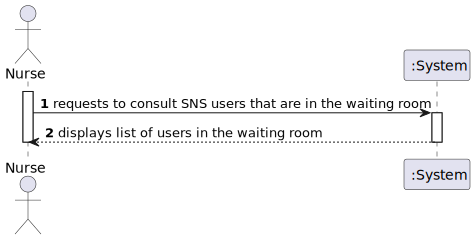
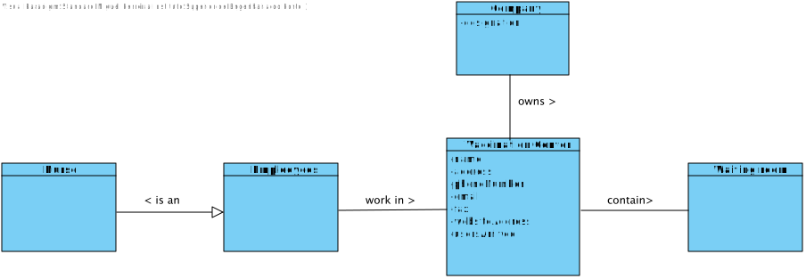
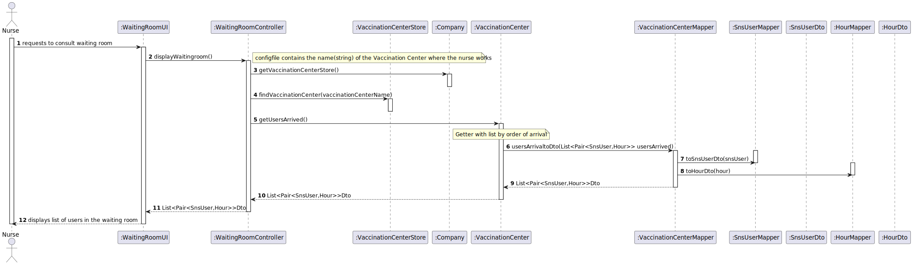
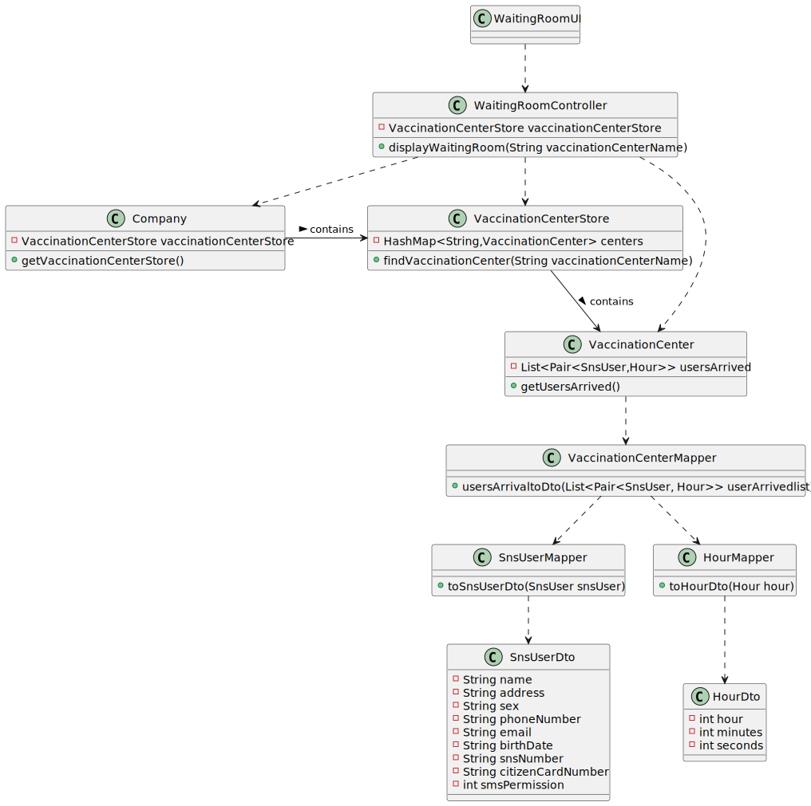

# US 005 - Consult the users in the waiting room

## 1. Requirements Engineering

### 1.1. User Story Description

As a nurse, I intend to consult the users in the waiting room of a vaccination center.

### 1.2. Customer Specifications and Clarifications

**From the specifications document:**

>	Access to the waiting room list is exclusive to the nurses of the respective vaccinacion center.

**From the client clarifications:**

> **Question:** Regarding US05, the listing is supposed to be for the day itself or for a specific day?
>
> **Answer:** The list should show the users in the waiting room of a vaccination center.

-

> **Question:** I would like to know which are the attributes of the waiting room.
>
> **Answer:** The waiting room will not be registered or defined in the system. The waiting room of each vaccination center has the capacity to receive all users who take the vaccine on given slot.
-

> **Question:** We need to know if the nurse have to chose the vaccination center before executing the list or if that information comes from employee file?
>
> **Answer:** When the nurse starts to use the application, firstly, the nurse should select the vaccination center where she his working. The nurse wants to check the list of SNS users that are waiting in the vaccination center where she his working.
-

> **Question:** Regarding the US05. In the PI description it is said that, by now, the nurses and the receptionists will work at any center. Will this information remain the same on this Sprint, or will they work at a specific center?
>
> **Answer:** Nurses and receptionists can work in any vaccination center.

### 1.3. Acceptance Criteria

* **AC1:** SNS Users list should be presented by order of arrival.

### 1.4. Found out Dependencies

* There is a dependency to US4 since a list of SNS users that have arrived must exist to consult the users in the waiting room.

### 1.5 Input and Output Data

**Input Data:**

* Selected data:
    * consult the users in the waiting room

**Output Data:**

* List of users in the waiting room

### 1.6. System Sequence Diagram (SSD)

### 1.7 Other Relevant Remarks
N/A

## 2. OO Analysis

### 2.1. Relevant Domain Model Excerpt

### 2.2. Other Remarks

N/A

## 3. Design - User Story Realization

### 3.1. Rationale

**SSD - Alternative 1 is adopted.**

| Interaction ID                                                        | Question: Which class is responsible for...                    | Answer                  | Justification (with patterns)                                                                                                      |
|:----------------------------------------------------------------------|:---------------------------------------------------------------|:------------------------|:-----------------------------------------------------------------------------------------------------------------------------------|
| Step 1:Requests to consult SNS users that are in the waiting room  		 | 	... interacting with the actor?                               | WaitingRoomUI           | Pure Fabrication: there is no reason to assign this responsibility to any existing class in the Domain Model.                      |
| 			  		                                                               | 	... coordinating the US?                                      | WaitingRoomController   | Controller                                                                                                                         |
| 	                                                                     | 	...... knowing VaccinationCenterStore?		                      | Company                 | IE: Company knows the VaccinationCenterStore to which it is delegating some tasks                                                  |
| 	                                                                     | 	...... finding the vaccination center?			                     | VaccinationCenterStore  | IE:Knows all the Vaccination Centers                                                                                               |
| 	                                                                     | 	...... instantiating a new List of SnsUserDto and HourDto				 | VaccinationCenterMapper | Creator Patter: Rule 4 ("B has the data used to initialize A).                                                                     |
| 	                                                                     | 	...... instantiating a  SnsUserDto?			                        | SnsUserMapper           | Creator Patter: Rule 4 ("B has the data used to initialize A).                                                                     |
| 	                                                                     | 	...... instantiating a HourDto?				                           | HourMapper              | Creator Patter: Rule 4 ("B has the data used to initialize A).                                                                     |
| 	                                                                     | 	...... transfering the data in the domain to the UI?			                           | SnsUserDto              | DTO: When there is so much data to transfer, it is better to opt by using a DTO in order to reduce coupling between UI and domain.                                                                                                                                   |
| 	                                                                     | 	...... transfering the data in the domain to the UI?				                           | HourDto                 | DTO: When there is so much data to transfer, it is better to opt by using a DTO in order to reduce coupling between UI and domain. |
| Step 2: Displays the list of users in the waiting room  		            | 	...showing the data?						                                    | WaitingRoomUI           | IE:responsible for user interaction.                                                                                               | 

### Systematization ##

According to the taken rationale, the conceptual classes promoted to software classes are:

* VaccinationCenter
* Company

Other software classes (i.e. Pure Fabrication) identified:

* WaitingRoomUI
* WaitingRoomController
* VaccinationCenterStore
* VaccinationCenterMapper
* SnsUserMapper
* SnsUserDto
* HourMapper 
* HourDto

## 3.2. Sequence Diagram (SD)

## 3.3. Class Diagram (CD)

# 4. Tests

**Test 1:** 

	@Test
    public void HourDtoTest() {
        HourDto hourdto=new HourDto(9,20,0);
        Assertions.assertEquals(9,hourdto.getHoras());
        Assertions.assertEquals(20,hourdto.getMinutos());
        Assertions.assertEquals(0,hourdto.getSegundos());
    }

**Test 2:** 

	@Test
    public void toHour(){
    Hour hour1=new Hour(11,20,30);
    HourDto hourdto1=new HourDto(11,20,30);
    Assertions.assertEquals(hour1,HourMapper.toHour(hourdto1));
    }

**Test 3:**

    @Test
    public void toHourDto(){
        Hour hour2=new Hour(10,10,30);
        HourDto hourdto2=new HourDto(10,10,30);
        Assertions.assertEquals(hourdto2.getHoras(),HourMapper.toHourDto(hour2).getHoras());
        Assertions.assertEquals(hourdto2.getMinutos(),HourMapper.toHourDto(hour2).getMinutos());
        Assertions.assertEquals(hourdto2.getSegundos(),HourMapper.toHourDto(hour2).getSegundos());
    }

# 5. Construction (Implementation)

## Class HourDto

    public class HourDto {
      private final int horas;
      private final int minutos;
      private final int segundos;

      public HourDto(int horas, int minutos, int segundos) {
        this.horas = horas;
        this.minutos = minutos;
        this.segundos = segundos;
      }

      public int getHoras() {
        return horas;
      }

      public int getMinutos() {
        return minutos;
      }

      public int getSegundos() {
        return segundos;
      }

      @Override
      public String toString() {
        return "HourDto{" +
                "horas=" + horas +
                ", minutos=" + minutos +
                ", segundos=" + segundos +
                '}';
      }
    }

## Class WaitingRoomController

    public class WaitingRoomController {

      private final VaccinationCenterStore vaccinationCenterStore= App.getInstance().getCompany().getVaccinationCenterStore();
      public List<Pair<SnsUserDto, HourDto>> displayWaitingRoom(String vaccinationCenterName) {
      return  vaccinationCenterStore.findVaccinationCenter(vaccinationCenterName).getUsersArrived();
      }
    }

# 6. Integration and Demo

* A new option on the Nurse menu options was added.

# 7. Observations
N/A

