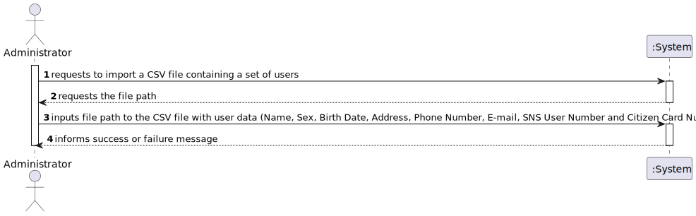
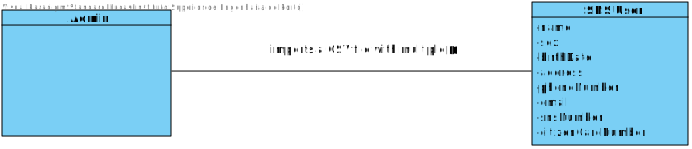
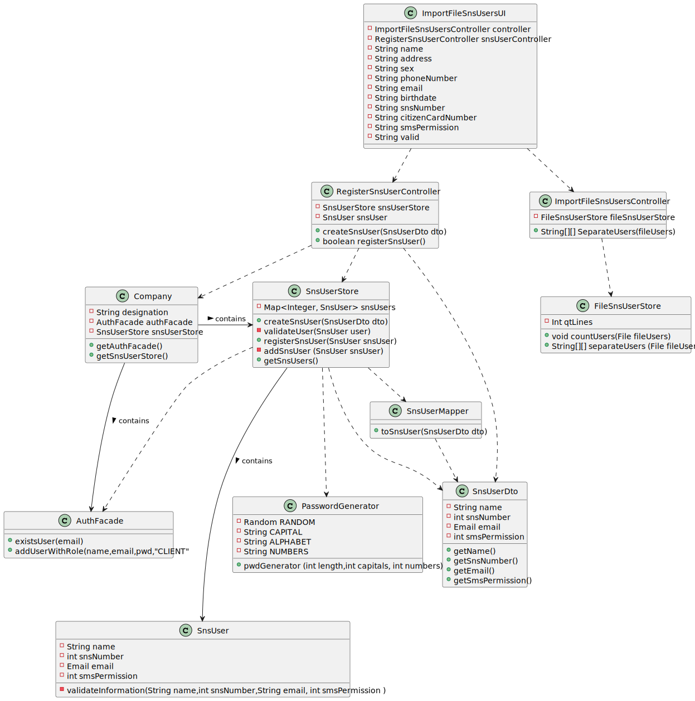

# US 14 - Load a set of users from a CSV file

## 1. Requirements Engineering

### 1.1. User Story Description

*As an administrator, I want to load a set of users from a CSV file.*

### 1.2. Customer Specifications and Clarifications

**From the specifications document:**

> The application must support importing two types of CSV files:
> - One type must have a header, and the column separation is done using ";"
>- The other type does not have a header, and the column separation is done using ","

**From the customer clarifications:**

> - **Question:**
> "What would be the sequence of parameters to be read on the CSV? For example: "Name | User Number"
>- **Answer:**
   >  "Name, Sex, Birth Date, Address, Phone Number, E-mail, SNS User Number and Citizen Card Number"

> - **Question:**
>"Is it possible that the file can contain lines with incomplete information in some fields (e.g. N/A). If so, should we read those lines as well and leave those fields empty or shall we discard that complete line?"
>- **Answer:**
   > " CSV files that have errors should not be loaded. Optional attributes may have a NA value"

> - **Question:**
> "In which format will be given the date of birth (YYYY/MM/DD) or (DD/MM/YYYY)?"
>- **Answer:**
   > "The dates registered in the system should follow the Portuguese format (dd/mm/yyyy)."

> - **Question:**
> "Should we check if the users from the CSV file are already registered in the system? If so, which data should we use, the one already in the system or the one on the file?"
>- **Answer:**
   > "This feature of the system will be used to register a batch users. If the user is already registered in the system, then the information available in the CSV file should not be used to register that user."

> - **Question:**
> "Should our application detect if the CSV file to be loaded contains the header, or should we ask the user if is submitting a file with a header or not?"
>- **Answer:**
>"The application should automatically detect the CSV file type."

> - **Question:**
> "I would like to clarify if the CSV file only contains information about SNS users of if the CSV file may also contain some information about employees from that vaccination center."
>- **Answer:**
   >"The CSV file only contains information about SNS users."

> - **Question:**
> "When the admin wants to upload a CSV file to be read, should the file be stored at a specific location on the computer (e.g. the desktop) or should the admin be able to choose the file he wants to upload in a file explorer?"
>- **Answer:**
   >"The Administrator should write the file path. In Sprint C we do not ask students to develop a graphical user interface."

> - **Question:**
> "What should the system do if the file to be loaded has information that is repeated? For example, if there are 5 lines that have the same information or that have the same attribute, like the phone number, should the whole file be discarded?"
>- **Answer:**
   >"If the file does not have other errors, all records should be used to register users. The business rules will be used to decide if all file records will be used to register a user.
   For instance, if all users in the CSV file are already registered in system, the file should be processed normally but no user will be added to the system (because the users are already in the system)."

> - **Question:**
> "Should we check if the users from the CSV file are already registered in the system? If so, which data should we use, the one already in the system or the one on the file?"
>- **Answer:**
   >"This feature of the system will be used to register a batch users. If the user is already registered in the system, then the information available in the CSV file should not be used to register that user."

> - **Question:**
> "Is there any specific format that should be validated for the address, or we can assume it is just of string type?"
>- **Answer:**
   >"The address contained in the CSV file is a string and should not contain commas or semicolons."

> - **Question:**
> "On the last meeting you said that header contains names of the attributes that are listed in the file. My question is what is the delimiter for the header? Does it have points between words, commas or something else?"
>- **Answer:**
   >"Each type of CSV file has only one delimiter character."

 

### 1.3. Acceptance Criteria

* *The application must support importing two types of CSV files:*  
*a) one type must have a header, column separation is done using “;”
character;*  
*b) the other type does not have a header, column separation is done
using “,” character* 
* *Optional attributes not specified may have an NA value*
* *The dates registered must follow the Portuguese format (dd/mm/yyyy)*
* *If a user is already registered, the information regarding that user will not be registered*
* *The administrator must specify the file path*

### 1.4. Found out Dependencies

- *We can find a dependency with US3, since we will be using the classes created regarding a SnsUsers*

### 1.5 Input and Output Data

> - *Input data:*  
    File path
> - *Output data:*
     
    Message of success or failure

### 1.6. System Sequence Diagram (SSD)

### 1.7 Other Relevant Remarks

*The user does not specify the type of CSV file, the application should automatically detect it. The only information the user provides is the file path*

## 2. OO Analysis

### 2.1. Relevant Domain Model Excerpt
*In this section, it is suggested to present an excerpt of the domain model that is seen as relevant to fulfill this requirement.*

### 2.2. Other Remarks

*We will be using the previously created classes for the SNS User.*

## 3. Design - User Story Realization

### 3.1. Rationale

**The rationale grounds on the SSD interactions and the identified input/output data.**

| Interaction ID | Question: Which class is responsible for... | Answer  | Justification (with patterns)  |
|:-------------  |:--------------------- |:------------|:---------------------------- |
| Step 1: Requests to import a file with Sns Users|	...interacting with the actor ?| ImportFileSnsUserUI|IE: responsible for user interaction|
|Step 2: Requests data (file path)|...requesting the file path|ImportFileSnsUserUI|IE: responsible for user interaction
|Step 3:Inputs the file path|...confirming if the path is valid (exists, and if so, is not blank)|ImportFileSnsUserUI|IE: object created has its own data
| |...coordinating the US?|ImportFileSnsUsersController|Controller
| |...counting the amount of users in the file?|FileSnsUserStore|IE: Stores and reads the information in the file
| |...reading and separating the parameters of a user?|FileSnsUserStore|IE: Reads the data in the file, and can split the information detecting the type of file 
| |...transferring the data stored in the UI to the domain|SnsUserDto|DTO: When there is so much data to transfer, it is better to opt by using a DTO in order to reduce coupling between UI and domain.
| |...assigning, store and compare the data of a user|SnsUserStore|IE: knows all users
| |...registering the users in the file if none of them already exist|SnsUserStore|IE: knows all users
| |...generating the password?|PasswordGenerator|Pure Fabrication
|Step 4:informs success or failure message|...informing operation success?|ImportFileSnsUsersUI|IE: responsible for user interaction

### Systematization ##

According to the taken rationale, the conceptual classes promoted to software classes are:

* SnsUser

Other software classes (i.e. Pure Fabrication) identified:
* ImportFileSnsUserUI
* ImportFileSnsUserController
* FileSnsUserStore
* SnsUser
* SnsUserStore
* SnsUserDto
* SnsUserMapper
* PasswordGenerator
* AuthFacade

## 3.2. Sequence Diagram (SD)

## 3.3. Class Diagram (CD)

# 4. Tests

**Test 1:** Test if it is possible to register the same User twice

    @Test

    public void testCreateSnsUserThrow(){

        SnsUserStore store = new SnsUserStore();
        //same sns number
        SnsUserDto dto = new SnsUserDto("Diogo","Rua de cima","Male","960168874","diogocostat@gmail.com","19/12/2002","167898423","16658688",1);
        //same phone number
        SnsUserDto dto2 = new SnsUserDto("Diogo","Rua de cima","Male","960168874","diogocostat@gmail.com","19/12/2002","167898422","16658688",1);
        //same email
        SnsUserDto dto3 = new SnsUserDto("Diogo","Rua de cima","Male","960168872","diogocostat@gmail.com","19/12/2002","167898422","16658688",1);
        //same citizen card number
        SnsUserDto dto4 = new SnsUserDto("Diogo","Rua de cima","Male","960168872","diogocostat1@gmail.com","19/12/2002","167898422","16658688",1);
        //all different
        SnsUserDto dto5 = new SnsUserDto("Joao","Rua de baixo","Male","960168873","joaozinho@gmail.com","12/12/2002","167198322","16654688",0);
        //original
        SnsUser snsUser = new SnsUser("Diogo","Rua de cima","Male","960168874","diogocostat@gmail.com","19/12/2002","167898423","16658688",1);
        //all different
        SnsUser snsUser2 = new SnsUser("Joao","Rua de baixo","Male","960168873","joaozinho@gmail.com","12/12/2002","167198322","16654688",0);
    }
    }

- *Test 1.1:* Same sns number
  

    assertThrows(IllegalArgumentException.class,() -> {
            store.createSnsUser(dto);
        });

- *Test 1.2:* Same phone number

    assertThrows(IllegalArgumentException.class,() -> {
            store.createSnsUser(dto2);
        });

- *Test 1.3:* Same email

    assertThrows(IllegalArgumentException.class,() -> {
            store.createSnsUser(dto3);
        });

- *Test 1.4:* Same citizen card number

    assertThrows(IllegalArgumentException.class,() -> {
            store.createSnsUser(dto4);
        });

# 5. Construction (Implementation)

## Class ImportFileSnsUsersUI

    private final ImportFileSnsUsersController controller;
    private final RegisterSnsUserController snsUserController;
    public ImportFileSnsUsersUI() {
        this.controller = new ImportFileSnsUsersController();
        this.snsUserController = new RegisterSnsUserController();
    }

    Scanner reader;
    String name;
    String address;
    String sex;
    String phoneNumber;
    String email;
    String birthdate;
    String snsNumber;
    String citizenCardNumber;
    int smsPermission = 0;

    @Override
    public void run() {

        boolean valid = true;
        File fileUsers = null;

        do {

            valid = true;
            try {

                String filePath = Utils.readLineFromConsole("Input path file:");
                fileUsers = new File(filePath);

                if (fileUsers.isFile() && fileUsers.length() == 0) {

                    System.out.println("\nInvalid file. File must not be blank. Please type a valid file");
                    valid = false;
                } else {

                    reader = new Scanner(fileUsers);

                }

            } catch (FileNotFoundException e) {
                System.out.println("\nWrong file path. Please type a valid path");
                valid = false;

            }

        } while (!valid);

        String[][] listUsers = controller.SeparateUsers(fileUsers);

        boolean validFile = true;
        for (int user = 0; user < listUsers.length; user++){

            name = listUsers[user][0];
            sex = listUsers[user][1];
            birthdate = listUsers[user][2];
            address = listUsers[user][3];
            phoneNumber = listUsers[user][4];
            email = listUsers[user][5];
            snsNumber = listUsers[user][6];
            citizenCardNumber = listUsers[user][7];

            SnsUserDto fileDto = new SnsUserDto(name, address, sex, phoneNumber, email, birthdate, snsNumber, citizenCardNumber, smsPermission);

            try {

                snsUserController.createSnsUser(fileDto);

            }catch (IllegalArgumentException e){
                System.out.println(e.getMessage());
                System.out.println("Operation failed");
                validFile = false;
            }
        }
        if (validFile){
            for (int user = 0; user < listUsers.length; user++){
                name = listUsers[user][0];
                sex = listUsers[user][1];
                birthdate = listUsers[user][2];
                address = listUsers[user][3];
                phoneNumber = listUsers[user][4];
                email = listUsers[user][5];
                snsNumber = listUsers[user][6];
                citizenCardNumber = listUsers[user][7];

                SnsUserDto fileDto = new SnsUserDto(name, address, sex, phoneNumber, email, birthdate, snsNumber, citizenCardNumber, smsPermission);
                snsUserController.createSnsUser(fileDto);
                snsUserController.registerSnsUser();
            }
            System.out.println("Users created with success");
        }

    }

## Class FileSnsUserStore

    Scanner reader;
    private int qtLines;

    public void countUsers(File fileUsers){
        try {
            reader = new Scanner(fileUsers);

        } catch (FileNotFoundException e) {
            e.printStackTrace();
        }
        int qtLines = 0;
        String lastReadLine = "";
        while (reader.hasNextLine()) {
            qtLines++;
            lastReadLine = reader.nextLine();
        }
        if (lastReadLine.contains(";")) {
            qtLines--;

        }

        this.qtLines = qtLines;

    }

    public String[][] separateUsers(File fileUsers) {
        countUsers(fileUsers);

        String[][] arrayUsers = new String[qtLines][8];

        try {
            reader = new Scanner(fileUsers);
        } catch (FileNotFoundException e) {
            e.printStackTrace();
        }
        String line = reader.nextLine();

        if (line.contains(";")) {

            for (int linenmr = 0; linenmr < qtLines; linenmr++) {

                line = reader.nextLine();
                arrayUsers[linenmr] = line.split(";");

            }

        } else if (line.contains(",")) {
            for (int linenmr = 0; linenmr < qtLines; linenmr++) {

                arrayUsers[linenmr] = line.split(",");

                if (reader.hasNextLine()){
                    line = reader.nextLine();

                }
            }

        }
        return arrayUsers;
    }

## Class SnsUserDto

	private final String name;
    private final int snsNumber;
    private final String email;
    private final int smsPermission;

    /**
     * Constructor of the class
     *
     * @param name Name of the SNS user
     * @param snsNumber SNS number of the user
     * @param email E-mail of the SNS user
     * @param smsPermission Permission to receive SMS from the company
     */
    public SnsUserDto(String name, int snsNumber, String email, int smsPermission) {
        this.name = name;
        this.snsNumber = snsNumber;
        this.email = email;
        this.smsPermission = smsPermission;
    }

    /**
     * Method to get the SNS user name
     *
     * @return SNS user name
     */

    public String getName() {
        return name;
    }

    /**
     * Method to get the SNS user number
     *
     * @return SNS user number
	     */

    public int getSnsNumber() {
        return snsNumber;
    }

    /**
     * Method to get the SNS user e-mail
     *
     * @return SNS user e-mail
     */

    public String getEmail() {
        return email;
    }

    /**
     * Method to get the SNS user permission of SMS
     *
     * @return SNS user permission of SMS
     */

    public int getSmsPermission() {
        return smsPermission;
    }

## Class RegisterSnsUserController

	private final SnsUserStore snsUserStore;
    private SnsUser snsUser;

    /**
     * Constructor of the class
     */

    public RegisterSnsUserController() {

        this.snsUserStore = App.getInstance().getCompany().getSnsUserStore();
    }

    /**
     * Method to create a new Sns User
     * @param dto Object that contains all the information of a SNS User
     */

    public void createSnsUser(SnsUserDto dto){

        this.snsUser = snsUserStore.createSnsUser(dto);

    }

    /**
     * Method to register the SNS User in the system and in the store
     * @return boolean of success/failure
     */
    public boolean registerSnsUser(){

        return snsUserStore.registerSnsUser(this.snsUser);
    }

# 6. Integration and Demo

* All the class previously implemented (except for the RegisterSnsUserUI) in US03 were used for the development of this user story

# 7. Observations

* The client didn't say the file would contain the data about the permission to notify the Sns User via SMS, so all the users registered through a CSV file will not be contacted via SMS by default (the sms permission will be set to 0-no )

