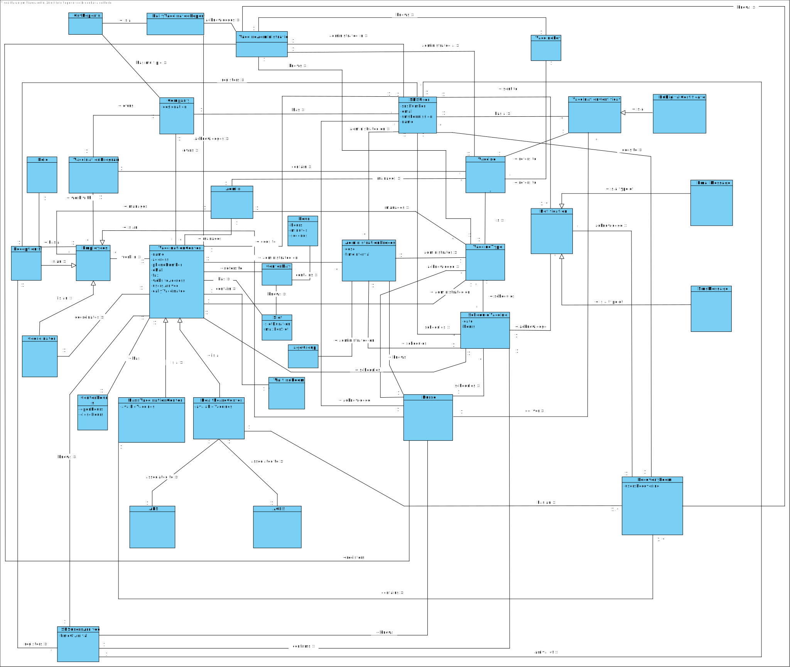

# OO Analysis #

The construction process of the domain model is based on the client specifications, especially the nouns (for _concepts_) and verbs (for _relations_) used. 

## Rationale to identify domain conceptual classes ##
To identify domain conceptual classes, start by making a list of candidate conceptual classes inspired by the list of categories suggested in the book "Applying UML and Patterns: An Introduction to Object-Oriented Analysis and Design and Iterative Development". 

### _Conceptual Class Category List_ ###

**Business Transactions**

* VaccineAdministration

---

**Transaction Line Itemss**

* Vaccine

---

**Product/Service related to a Transaction or Transaction Line Item**

*  VaccineAdministration, Vaccine, ScheduleVaccine, VaccinationProgram

---

**Transaction Records**

*  Message, SmsMessage, EmailMessage, VaccinationCertificate, EuDigitalCertificate 

---  

**Roles of People or Organizations**

* Admin, User, Employees, Receptionist, Coordinator, Nurse, Company, ARS, AGES 

---

**Places**

*  VaccinationCenter, MassVaccinationCenter, HealthcareCenter, RecoveryRoom

---

**Noteworthy Events**

* ScheduleVaccine

---

**Physical Objects**

* Vaccine, VaccinationCertificate

---

**Descriptions of Things**

*  VaccineType

---

**Catalogs**

*  VacinationProgram

---

**Containers**

*  VaccinationCenter, Message

---

**Elements of Containers**

*  MassvaccinationCenter, HealthcareCenter, EmailMessage, SmsMessage

---

**Organizations**

*  Company, ARS, AGES

---

**Other External/Collaborating Systems**

* 

---

**Records of finance, work, contracts, legal matters**

* VaccinationCertificate, EuDigitalCertificate

---

**Financial Instruments**

*  

---

**Documents mentioned/used to perform some work/**

* VaccinationCertificate, EuDigitalCertificate
---

###**Rationale to identify associations between conceptual classes**###

An association is a relationship between instances of objects that indicates a relevant connection and that is worth of remembering, or it is derivable from the List of Common Associations: 

+ **Admin** manages **Employees**
+ **Admin** manages **VaccinationCenter**
+ **Admin** manages **Vaccine**
+ **Admin** manages **VaccineType**
+ **Company** has **User**
+ **Company** owns **VaccinationCenter**
+ **Company** owns **VaccinationProgram**
+ **Coordinator** is an **Employees**
+ **Coordinator** coordinates **VaccinationCenter**
+ **EmailMessage** is a type of **Message**
+ **Employees** work in **VaccinationCenter**
+ **Employees** work with **VaccinationProgram**
+ **EuDigitalCertificate** is a **VaccinationCertificate**
+ **HealthCareCenter** associated to  **AGES**
+ **HealthCareCenter** associated to **ARS**
+ **HealthCareCenter** has an **RecoveryRoom**
+ **HealthCareCenter** is a **VaccinationCenter**
+ **MassVaccinationCenter** is a **RecoveryRoom**
+ **MassVaccinationCenter** is a **VaccinationCenter**
+ **Message** acknowledge **ScheduleVaccine**
+ **Message** sent to **User**
+ **Nurse** is an **Employee**
+ **Nurse** uses **ScheduleVaccine**
+ **Nurse** acknowledge **User**
+ **Nurse** deliver **VaccinationCertificate**
+ **Nurse** acknowledge **VaccineType**
+ **Receptionist** is an **Employee**
+ **Receptionist** knows **ScheduleVaccine**
+ **Receptionist** registers **User**
+ **ScheduleVaccine** schedules **VaccinationAdministration**
+ **ScheduleVaccine** schedules **VaccinationCenter**
+ **ScheduleVaccine** schedules **VaccineType**
+ **SmsMessage** is a type of **Message**
+ **User** goes to **RecoveryRoom**
+ **User** schedules **ScheduleVaccine**
+ **User** goes to **VaccinationCenter**
+ **User** has a **VaccinationCertificate**
+ **VaccinationCertificate** refers to **Vaccine**
+ **VaccinationProgram** contain **Vaccine**
+ **Vaccine** is **VaccineType**
+ **VaccinationAdministration** administrated on **User**
+ **VaccinationAdministration** administrates **VacineType**

| Concept (A) 		|  Association   	|  Concept (B) |
|----------	   		|:-------------:		|------:       |
| Admin  	| manages   		 	| Employees |
| Admin 	| manages    		 	| VaccinationCenter  |
| Admin 	| manages    		 	| Vaccine  |
| Admin 	| manages    		 	| VaccineType  |
| Company 	| has   		 	    | User  |
| Company 	| owns   		 	    | VaccinationCenter  |
| Company 	| owns  		 	    | VaccinationProgram |
| Coordinator 	| is an  		 	| Employees |
| Coordinator 	| coordinates  		| VaccinationCenter |
| EmailMessage	| is a type of 		| Message |
| Employees	| work in 		        | VaccinationCenter |
| Employees	| work with		        | VaccinationProgram |
| EuDigitalCertificate | is a		| VaccinationCenter |
| HealthCareCenter | associated to  | AGES |
| HealthCareCenter | associated to  | ARS |
| HealthCareCenter | associated to  | RecoveryRoom |
| HealthCareCenter | associated to  | VaccinationCenter|
| MassVaccinationCenter | associated to  | RecoveryRoom|
| MassVaccinationCenter | associated to  | VaccinationCenter|
| Message | associated to  | ScheduleVaccine|
| Message | associated to  | User|
| Nurse | is an  | Employee|
| Nurse | uses  | ScheduleVaccine|
| Nurse | acknowledge  | User|
| Nurse | deliver  | VaccinationCertificate|
| Nurse | acknowledge  | VaccineType|
| Receptionist | is an  | Employee|
| Receptionist | knows  | ScheduleVaccine|
| Receptionist | registers  | User|
| ScheduleVaccine | schedules  | VaccinationAdministration|
| ScheduleVaccine | schedules  | VaccinationCenter|
| ScheduleVaccine | schedules  | VaccineType|
| SmsMessage | is a type of  | Message|
| User | goes to  | RecoveryRoom|
| User | schedules  | ScheduleVaccine|
| User | goes to  | VaccinationCenter|
| User | has a  | VaccinationCertificate|
| VaccinationCenter | refers to  | Vaccine|
| VaccinationProgram | contain | Vaccine|
| Vaccine | is | VaccineType|
| VaccinationAdministration | administrated on | User|
| VaccinationAdministration | administrates | VacineType|

## Domain Model

**Do NOT forget to identify concepts atributes too.**

**Insert below the Domain Model Diagram in a SVG format**

