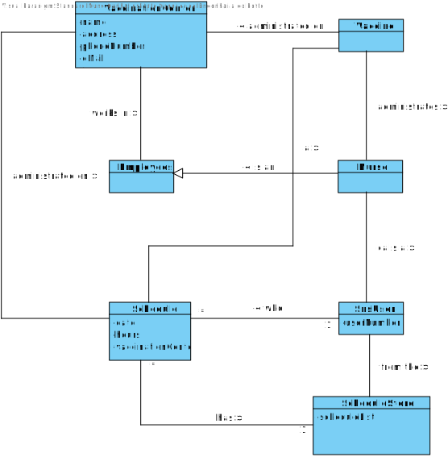
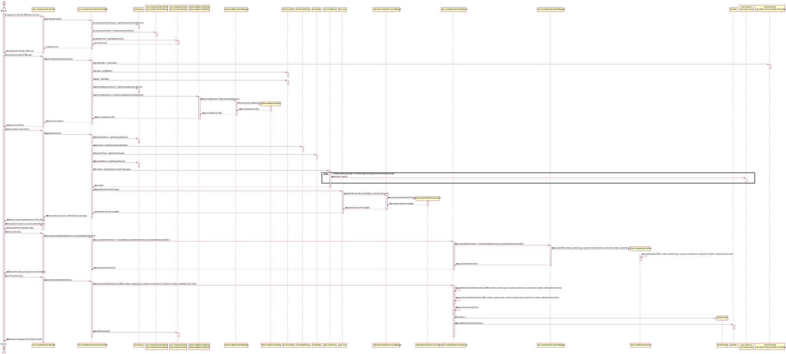

# US 08 - As a nurse I want to record the administration of a vaccine to a SNS user

## 1. Requirements Engineering 

### 1.1 User Storu Description 
*As a nurse I want to record the administration of a vaccine to a SNS user*

### 1.2 Customer Specifications and Clarifications 
**From the specifications document:**
> - A nurse responsible for administering the vaccine will use the application to check the list of SNS users that are present in the vaccination center and call on SNS user to administrate the vaccine. The nurse checks the user info and health conditions in the system and in accordance with the scheduled vaccine type, and the SNS user vaccination history, (s)he gets system instructions regarding the vaccine to be administered (e.g.: vaccine and respective dosage considering the SNS user age group). After giving the vaccine to the user, each nurse registers the event in the system, more precisely, registers the vaccine type (e.g.: Covid-19), vaccine name/brand (e.g.: Astra Zeneca, Moderna, Pfizer), and the lot number used. Afterwards, the nurse sends the user to a recovery room, to stay there for a given recovery period. 

**From the costumer specifications:**
>  - **Question**
     "As we can read in Project Description, the vaccination flow follows these steps: 1. Nurse calls one user that is waiting in the waiting room to be vaccinated; 2. Nurse checks the user's health data as well as which vaccine to administer; 3. Nurse administers the vaccine and registers its information in the system. The doubt is: do you want US08 to cover steps 2 and 3, or just step 3?"
> - **Answer**
    1.The nurse selects a SNS user from a list. 2. Checks user's Name, Age and Adverse Reactions registered in the system. 3. Registers information about the administered vaccine.

 

### 1.3 Acceptance Criteria 
> - *At the end of the recovery period, the user should receive a SMS message informing the SNS user that he can leave the vaccination center.*
> - *The nurse should select a vaccine and the administered dose number.*

### 1.4 Found out Dependencies 
*There are dependencies with US4, because the list of arrivals is necessary. Besides that there are dependencies with US5, for vaccination order purposes.*

### 1.5 Input and Ouput Data
> - *Input data:*
 
    SNS number
 
    Vaccine Type 
 
    Vaccine Brand
 
    Administered dose number

> - *Sent Data:*
 
    SMS message (if authorized)

> - *Output data:*
 
    Message of sucess/failure

### 1.6 System Sequence Diagram (SSD)

### 1.7 Other Relevants Remarks

*The user should receive the SMS confirmation if he/she allowed before*

## 2. OO Analysis 

### 2.1 Relevant Domain Model Excerpt

### 2.2 Other Remarks 

*Company knows all the schedules*

## 3. Design - User Story Realization 

### 3.1. Rationale

**The rationale grounds on the SSD interactions and the identified input/output data.**

| Interaction ID | Question: Which class is responsible for... | Answer  | Justification (with patterns)  |
|:-------------  |:--------------------- |:------------|:---------------------------- |
| Step 1: requests to register an administration |  ... instantiating a new vaccine administration ?| VaccineAdministrationMapper| Creator Patter: Rule 4 ("B has the data used to initialize A).                              | | ... interacting with the actor ? | VaccineAdministrationUi | Pure Fabrication: there is no reason to assign this responsibility to any existing class in the Domain Model. |
| | ... coordinating the US? | VaccineAdministrationController | Controller. | 
| Step 2: shows SNS users in the waiting room 	 |	...knowing the users arrived?		|  VaccinationCenter     | IE: stores all the arrivals at a centers                           |
|| ... showing the information? | VaccineAdministrationUi | IE: knows all the users.
|Step 3: request data...| n/a ||||
|Step 4: inputs the data| ... saving the inputted data? | VaccineAdministration|IE: owns its data.|
||... transfer the data typed in the UI to the Domain| VaccineAdministrationDto | DTO: When there is so much data to transfer, it is better to opt by using a DTO in order to reduce coupling between UI and domain.
||... knows VaccineAdministrationStore? | Company | IE: Company knows the VaccineAdministrationStore to which it is delegating some tasks|
| Step 5: Shows the data and asks for confirmation| ... showing the data?| VaccineAdministrationUI| IE: responsible for user Interaction.|
|Step 6: confirms/deny the information|	... validating all data (local validation)?| VaccineAdministration |IE: owns its data.
|| ... validating all data (global validation)?| VaccineAdministrationStore| 	IE: knows all the users.
||... saving the created vaccine administrations?|VaccineAdministrationStore| 	IE: knows all the vaccine vaccine administration.|
|Step 6: informs success/failure| ... informing operation success?|vaccineAdministrationUI | IE: responsible for user Interaction.

### Systematization ###

According to the taken rationale, the conceptual classes promoted to software classes are: 
* Company
* VaccineAdministration
* AdministrationProcess

Other software classes (i.e. Pure Fabrication) identified:
* VaccineAdministrationController
* VaccineAdministrationUi
* VaccineAdministrationStore
* VaccineAdministrationDto
* VaccineAdministrationMapper
* AdministrationProcessStore
* AdministrationProcessDto
* AdministrationProcessStore
* AdverseReactionsStore
* AdverseReactionsDto
* AdverseReactionsMapper

## 3.2. Sequence Diagram (SD)

## 3.3. Class Diagram (CD)

# 4. Tests

**Test 1:**

class VaccineTypeStoreTest {

    @Test
    public void testCreation(){

        VaccineTypeStore store = new VaccineTypeStore();
        VaccineTypeDto dto = new VaccineTypeDto("AF23P","Covid-19 vaccine", 3);
        VaccineTypeDto dto2 = new VaccineTypeDto("AF23P","Covid-19 vaccine", 3);
        VaccineType type = new VaccineType("AF23P","Covid-19 vaccine", 3);
        //Expected list of vaccine types in the current store
        List<VaccineType> expectedList = new ArrayList<>();
        expectedList.add(type);
        //method to add the vaccine type to the store
        store.createVaccineType(dto);

        //Test to see if the actual list is equal to the expected store
        assertEquals(store.getVaccineTypes(),expectedList);

        //test to see if a vaccine type already exists it fails
        assertThrows(IllegalArgumentException.class,() -> {
            store.createVaccineType(dto2);
        });
    }

**Test 2:** 

class NotificationTest {

    @Test

    public void testNotification(){

        Notification notification = new Notification("diogo@gmail.com","Welcome to the DGS app");

        assertEquals("diogo@gmail.com",notification.getAddress());
        assertEquals("Welcome to the DGS app",notification.getMessage());
    }

}

# 5. Construction (Implementation)

import app.domain.model.data.Vaccine;
import app.domain.model.data.schedule.Schedule;
import app.domain.model.data.snsuser.SnsUser;

public class  AdministrationProcessDto {

    private String snsUserNumber;
    private String age;
    private Vaccine vaccine;
    private Schedule schedule;

    /**
     * constructor of the class
     * @param snsUserNumber sns user number string
     * @param age string age
     * @param vaccine vaccine object
     * @param schedule schedule object
     *
     * @author Nuno Cunha <1211689@isep.ipp.pt>
     */
    public AdministrationProcessDto(String snsUserNumber, String age, Vaccine vaccine, Schedule schedule) {
        this.snsUserNumber = snsUserNumber;
        this.age = age;
        this.vaccine = vaccine;
        this.schedule = schedule;
    }

    /**
     * Method to get the sns user
     * @return sns user
     */
    public String getSnsUserNumber() {
        return snsUserNumber;
    }

    /**
     * Method to get the age
     * @return age string
     */
    public String getAge() {
        return age;
    }

    /**
     * Method to get the vaccine
     * @return vaccine object
     */
    public Vaccine getVaccine() {
        return vaccine;
    }

    /**
     * Method to get the schedule
     * @return schedule object
     */
    public Schedule getSchedule() {
        return schedule;
    }
}

public class VaccineAdministrationMapper {

    /**
     * Class that deals with the dto objects that carry the information
     * of VaccineAdministration objects
     *
     * @author Pedro Campos <1211511@isep.ipp.pt>
     * @author Nuno Cunha <1211689@isep.ipp.pt>
     * @author Lucas Gonçalves <1211601@isep.ipp.pt>
     */

    /**
     * Method to transform an VaccineAdministration into an VaccineAdministrationDto carrying the information of the VaccineAdministration
     *
     * @param vaccineAdministration Object that carries all the information of a Employee
     *
     * @return VaccineAdministrationDto
     */
    public static VaccineAdministrationDto toVaccineAdministrationDto(VaccineAdministration vaccineAdministration){
        return new VaccineAdministrationDto(vaccineAdministration.getSnsUserNumber(), vaccineAdministration.getVaccineName(), vaccineAdministration.getDose(), vaccineAdministration.getLotNumber(), vaccineAdministration.getScheduleDate(), vaccineAdministration.getScheduleHour(), vaccineAdministration.getArrivalDate(), vaccineAdministration.getArrivalHour(), vaccineAdministration.getNurseAdministrationDate(), vaccineAdministration.getNurseAdministrationHour(), vaccineAdministration.getLeavingDate(), vaccineAdministration.getLeavingHour(), vaccineAdministration.getVaccinationCenter());
    }

    /**
     * Method to transform a dto carrying the information of a VaccineAdministrationDto into a VaccineAdministration object
     *
     * @param vaccineAdministrationDto Object that carries all the information of a VaccineAdministration
     *
     * @return vaccineAdministration
     */
    public static VaccineAdministration toVaccineAdministration (VaccineAdministrationDto vaccineAdministrationDto){
        return new VaccineAdministration(vaccineAdministrationDto.getSnsUserNumber(),vaccineAdministrationDto.getVaccineName(),vaccineAdministrationDto.getDose(),vaccineAdministrationDto.getLotNumber(),vaccineAdministrationDto.getScheduleDate(),vaccineAdministrationDto.getScheduleHour(),vaccineAdministrationDto.getArrivalDate(),vaccineAdministrationDto.getArrivalHour(),vaccineAdministrationDto.getNurseAdministrationDate(),vaccineAdministrationDto.getNurseAdministrationHour(),vaccineAdministrationDto.getLeavingDate(),vaccineAdministrationDto.getLeavingHour(), vaccineAdministrationDto.getVaccinationCenter());
    }

# 6. Integration and Demo 
* Some tasks are bootstrapped for demo purposes 

# 7. Observations 