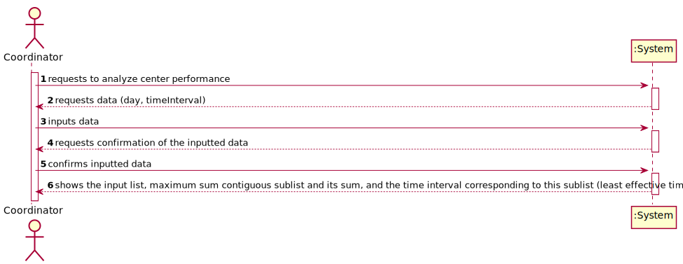
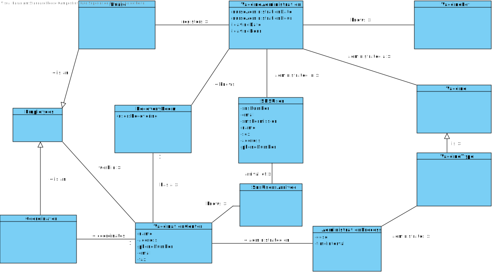
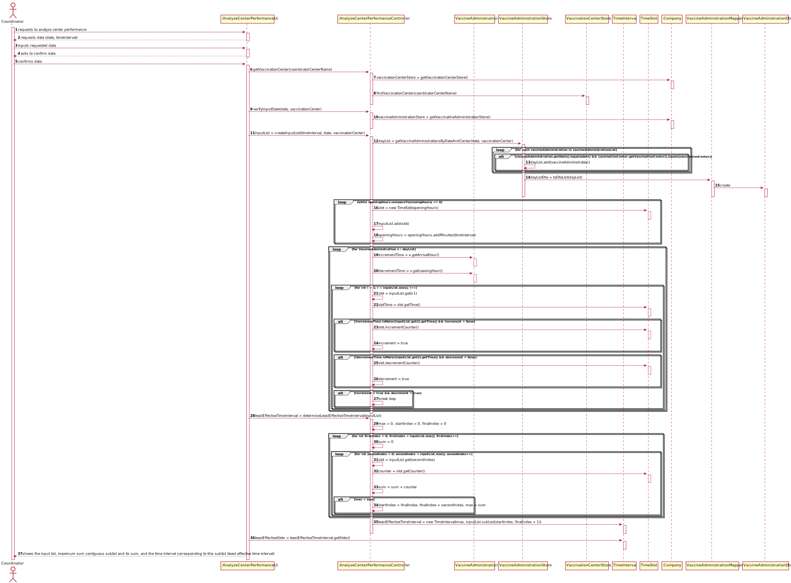
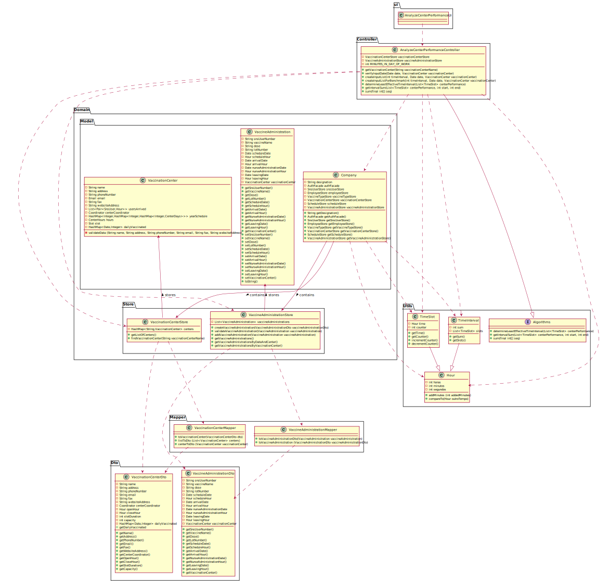

# US 16 - As a center coordinator, I intend to analyze the performance of a center

## 1. Requirements Engineering

### 1.1. User Story Description
*As an center coordinator, I intend to analyze the performance of a center.*

### 1.2. Customer Specifications and Clarifications 
**From the specification document:**

>   Each vaccination center has a Center Coordinator that has the responsibility to manage the Covid19 vaccination process. The Center Coordinator wants to monitor the vaccination process, to see
	statistics and charts, to evaluate the performance of the vaccination process, generate reports and
	analyze data from other centers, including data from legacy systems. The goal of the performance
	analysis is to decrease the number of clients in the center, from the moment they register at the
	arrival, until the moment they receive the SMS informing they can leave the vaccination center. To
	evaluate this, it proceeds as follows: for any time interval on one day, the difference between the
	number of new clients arrival and the number of clients leaving the center every five-minute period
	is computed. In the case of a working day, with a center open from 8 a.m. until 8 p.m., a list with
	144 integers is obtained, where a positive integer means that in such a five-minute slot more clients
	arrive at the center for vaccination than clients leave with the vaccination process completed. A
	negative integer means the opposite.
	Now, the problem consists in determining what the contiguous subsequence of the initial sequence
	is, whose sum of their entries is maximum. This will show the time interval, in such a day, when the
	vaccination center was less effective in responding. So, the application should implement a bruteforce algorithm (an algorithm which examines all the contiguous subsequences) to determine the
	contiguous subsequence with maximum sum. The implemented algorithm should be analyzed in
	terms of its worst-case time complexity, and it should be compared to a benchmark algorithm
	provided. The computational complexity analysis (of the brute-force algorithm and any sorting
	algorithms implemented within this application), must be accompanied by the observation of the
	execution time of the algorithms for inputs of variable size, in order to observe the asymptotic
	behavior. The worst-case time complexity analysis of the algorithms should be properly
	documented in the user manual of

**From the customer clarifications**

> - **Question:**
	"From the Sprint D requirements it is possible to understand that we ought to implement a procedure that creates a list with the differences between the number of new clients arriving and the number of leaving clients for each time interval. My question then is, should this list strictly data from the legacy system (csv file from moodle which is loaded in US17), or should it also include data from our system?"
> - **Answer:**
	US 16 is for all the data that exists in the system.
 

> - **Question:**
	"The file loaded in US17 have only one day to analyse or it could have more than one day(?) and in US16 we need to select the day to analyse from 8:00 to 20:00"
> - **Answer:**
	The file can have data from more than one day. In US16 the center coordinator should select the day for which he wants to analyse the performance of the vaccination center.

 

> - **Question:**
	"Is the time of departure of an SNS user the time he got vaccinated plus the recovery time or do we have another way of knowing it?"
> - **Answer:**
	The time of departure of an SNS user is the time he got vaccinated plus the recovery time.

 

> - **Question:**
	"In US 16, should the coordinator have the option to choose which algorithm to run (e.g. via a configuration file or while running the application) in order to determine the goal sublist, or is the Benchmark Algorithm strictly for drawing comparisons with the Bruteforce one?"
> - **Answer:**
	The algorithm to run should be defined in a configuration file.

 

> - **Question:**
	"I would like to ask that if to analyse the performance of a center, we can assume (as a pre requirement) that the center coordinator was already attributed to a specific vaccination center and proceed with the US as so (like the center coordinator does not have to choose at a certain point where he is working. This is already treated before this US happens). Could you clarify this"
> - **Answer:**
	A center coordinator can only coordinate one vaccination center. The center coordinator can only analyze the performance of the center that he coordinates.

 

> - **Question:**
	"I would like to know if we could strict the user to pick only those intervals (m) (i.e. 1, 5, 10, 20, 30) as options for analyzing the performance of a center, since picking intervals is dependent on the list which is 720/m (which the length is an integer result). If we let the user pick an interval that results in a non-integer result, this will result in an invalid list since some data for the performance analysis will be lost. Can you provide a clarification on this situation?"
> - **Answer:**
	The user can introduce any interval value. The system should validate the interval value introduced by the user.

 

### 1.3. Acceptance Criteria

* **Acceptance Criteria 1:** Date format is dd/mm/yyyy
* **Acceptance Criteria 2:** The possible time intervals are 30, 20, 10, 5 and 1 minutes.

### 1.4. Found out Dependencies

- *We can find a dependency with US08 since we need to know when the sns user has left the vaccination center in order to analyze the performance of the center*
- *We can find a dependency with US04 since we need to know when users arrive to the vaccination center in order to analyze the performance of the center.*
- *We can find a dependency with US10 since you need to be registered as Coordinator in order to monitor the vaccination process.*
- *We can find a dependency with US09 since the vaccination center that the coordinator is going to monitor and analyze data must be registered in the system.*
-

### 1.5 Input and Output Data

**Input data:**

* Selected data:
    * Time interval

* Typed data:
	* Day to analyze

**Output data:**

* input list
* maximum sum contiguous sublist and its sum
* time interval corresponding to this contiguous sublist
* (In)Success of the operation

### 1.6. System Sequence Diagram (SSD)

### 1.7 Other Relevant Remarks

*This user story is mostly going to analyze data from a legacy system that was used in the past to manage centers.*

## 2. OO Analysis

### 2.1. Relevant Domain Model Excerpt 

## 3. Design - User Story Realization 

### 3.1. Rationale
bn
**The rationale grounds on the SSD interactions and the identified input/output data.**

| Interaction ID | Question: Which class is responsible for... | Answer      | Justification (with patterns)|
|:-------------  |:--------------------------------------------|:------------|:-----------------------------|
| Step 1: requests to analyze center performance 		 | ... interacting with the actor?| AnalyzeCenterPerformanceUi  |Pure Fabrication: there is no reason to assign this responsibility to any existing class in the Domain Model.|
| | ... coordinating the US? | AnalyzeCenterPerformanceController | Controller. |
| Step 2: requests data (day, timeInterval)|  n/a|             |                              |
| Step 3: inputs data | ...verifying the inputted date?| VaccineAdministrationStore| IE: knows all the VaccineAdministrations and their dates.|
| | ...knowing VaccineAdministrationStore?| Company |IE: Company knows the VaccineAdministrationStore to which it is delegating some tasks|
| Step 4: requests confirmation of the inputted data| ...showing the data?|RegisterSNSUserArrivalUi| IE: responsible for user Interaction.|
| Step 5: confirms inputted data| ...getting the VaccineAdministrations of the date?|VaccineAdministrationStore| IE: knows all the VaccineAdministrations|
| | ...creating the input list?| AnalyzeCenterPerformanceController |Controller|
| | ...determining the least effective time interval of the vaccination center| AnalyzeCenterPerformanceController |Controller|
| Step 6: shows the input list, maximum sum contiguous sublist and its sum, and the time interval corresponding to this sublist (least effective time interval)| ...Outputting this data? |AnalyzeCenterPerformanceUi| IE: responsible for user Interaction.|

### Systematization ##

* Company
* VaccineAdministration

Other software classes (i.e. Pure Fabrication) identified:

* VaccinationCenterStore
* AnalyzeCenterPerformanceUi
* AnalyzeCenterPerformanceController
* VaccineAdministrationDto
* VaccineAdministrationMapper
* VaccineAdministrationStore
* Algorithms
* TimeInterval
* TimeSlot

## 3.2. Sequence Diagram (SD)

## 3.3. Class Diagram (CD)

# 4. Tests 

**Test 1** Check if verifyInputDate works when there are no valid administrations for the date and center

	@Test
    @DisplayName("Test for verifyInputDateTest when there are no valid administrations for the date and center")
    public void verifyInputDateTestFalse(){

        boolean isValid;

        try {
            isValid = analyzeCenterPerformanceController.verifyInputDate(new Date(10,10,10), vaccinationCenter);
        } catch (IllegalArgumentException e){

            isValid = false;

        }
        Assertions.assertFalse(isValid);

    }

**Test 2** Check if verifyInputDate works when there are valid administrations for the date and center

	@Test
    @DisplayName("Test for verifyInputDateTest when there are valid administrations for the date and center")
    public void verifyInputDateTestTrue(){

        boolean isValid;

        try {
            isValid = analyzeCenterPerformanceController.verifyInputDate(data, vaccinationCenter);
        } catch (IllegalArgumentException e){

            isValid = false;

        }
        Assertions.assertTrue(isValid);

    }

**Test 3:** Check if getVaccinationCenter() correctly gets the right vaccinationCenter by name when the center exists

	@Test
    @DisplayName("Test for getVaccinationCenter when the vaccinationCenter exists")
    public void getVaccinationCenterTrue(){

        VaccinationCenter vaccinationCenterExpected = analyzeCenterPerformanceController.getVaccinationCenter("HealthCare Lisboa");

        assertEquals(vaccinationCenterExpected.getEmail(), vaccinationCenter.getEmail());
        assertEquals(vaccinationCenterExpected.getPhoneNumber(), vaccinationCenter.getPhoneNumber());
        assertEquals(vaccinationCenterExpected.getUsersArrived(), vaccinationCenter.getUsersArrived());
        assertEquals(vaccinationCenterExpected.getWebsiteAddress(), vaccinationCenter.getWebsiteAddress());
        assertEquals(vaccinationCenterExpected.getName(), vaccinationCenter.getName());
        assertEquals(vaccinationCenterExpected.getAddress(), vaccinationCenter.getAddress());

    }

**Test 4:** Check if getVaccinationCenter() works correctly when the center doesn't exist

	@Test
    @DisplayName("Test for getVaccinationCenter when the vaccinationCenter doesn't exist")
    public void getVaccinationCenterFalse(){

        VaccinationCenter vaccinationCenterExpected = analyzeCenterPerformanceController.getVaccinationCenter("HealthCare Aveiro");

        assertNull(vaccinationCenterExpected);

    }

**Test 5:** Check if createInputList() successfully makes the list with the right values

	@Test
    @DisplayName("Test for createInputList method")
    public void createInputListTest(){

        List<TimeSlot> inputList = analyzeCenterPerformanceController.createInputList(30, data,vaccinationCenter);

        /*
        for (int i = 0; i < inputList.size(); i++) {
            int counter = inputList.get(i).getCounter();
            Hour hour = inputList.get(i).getTime();
            System.out.println(hour + ": " + counter);
        }
        */

        Assertions.assertEquals(inputList.get(0).getCounter(), 2);
        Assertions.assertEquals(inputList.get(1).getCounter(), 1);
        Assertions.assertEquals(inputList.get(2).getCounter(), -3);
        Assertions.assertEquals(inputList.get(3).getCounter(), 0);

    }

**Test 6:** Check if getIntervalSum() correctly gets the right value for the sum

	@Test
    @DisplayName("Test for getIntervalSum")
    public void getIntervalSumTest(){

        List<TimeSlot> inputList = analyzeCenterPerformanceController.createInputList(30, data,vaccinationCenter);
        TimeInterval interval = analyzeCenterPerformanceController.getIntervalSum(inputList, 0, 2);

        int sum = interval.getSum();

        Assertions.assertEquals(sum, 3);

    }

**Test 7:** Check if determineLeastEffectiveTimeInterval() correctly gets the interval with the max sum (least effective interval) using our developed brute-force algorithm

	@Test
    @DisplayName("Test for determineLeastEffectiveTimeInterval using brute-force method")
    public void determineLeastEffectiveTimeIntervalTest(){

        List<TimeSlot> inputList = analyzeCenterPerformanceController.createInputList(30, data,vaccinationCenter);
        TimeInterval timeInterval = analyzeCenterPerformanceController.determineLeastEffectiveTimeInterval(inputList);

        /*
        System.out.println(timeInterval.getSum());

        List<TimeSlot> leastEffectiveSlots = timeInterval.getSlots();

        for (int i = 0; i < leastEffectiveSlots.size(); i++) {
            int counter = leastEffectiveSlots.get(i).getCounter();
            Hour hour = leastEffectiveSlots.get(i).getTime();
            System.out.println(hour + ": " + counter);
        }

        System.out.println("The vaccination center was less effective in responding from " + leastEffectiveSlots.get(0).getTime() + " to " + leastEffectiveSlots.get(leastEffectiveSlots.size()-1).getTime());

        */

        Assertions.assertEquals(timeInterval.getSum(), 5);

    }

**Test 8:** Test for get methods of the TimeSlot class

	@Test
    @DisplayName("Test for get methods")
    public void testGet(){

        Hour hour = new Hour(8, 0, 0);
        TimeSlot timeSlot = new TimeSlot(hour);

        Assertions.assertEquals(hour, timeSlot.getTime());
        Assertions.assertEquals(0, timeSlot.getCounter());
        
    }

**Test 9:** Test for incrementCounter method of the TimeSlot class

	@Test
    @DisplayName("Test for incrementCounter method")
    public void incrementCounterTest(){

        TimeSlot timeSlot = new TimeSlot(new Hour(8, 0, 0));
        timeSlot.incrementCounter();

        Assertions.assertEquals(1, timeSlot.getCounter());

    }

**Test 10:** Test for decrementCounter method of the TimeSlot class

	@Test
    @DisplayName("Test for decrementCounter method")
    public void decrementCounterTest(){

        TimeSlot timeSlot = new TimeSlot(new Hour(8, 0, 0));
        timeSlot.decrementCounter();

        Assertions.assertEquals(-1, timeSlot.getCounter());

    }

**Test 11:** Test for get methods of the TimeInterval class

	@Test
    @DisplayName("Test for get methods")
    public void testGetters(){

        List<TimeSlot> slots = new ArrayList<>();
        slots.add(new TimeSlot(new Hour(8, 0, 0)));
        
        TimeInterval timeInterval = new TimeInterval(10, slots);

        Assertions.assertEquals(10, timeInterval.getSum());
        Assertions.assertEquals(slots, timeInterval.getSlots());
        
    }

**Test 12:** Test for the getVaccineAdministrationsByDateAndCenter when there aren't any vaccine administrations for that date and center.

	@Test
    @DisplayName("Test for the getVaccineAdministrationsByDateAndCenter when there aren't any vaccine administrations for that date and center.")
    public void getVaccineAdministrationsByDateAndCenterTestFalse(){

        Date date = new Date(29,5,2022);

        List<VaccineAdministration> list = vaccineAdministrationStore.getVaccineAdministrationsByDateAndCenter(date, vaccinationCenter);

        Assertions.assertEquals(0, list.size());

    }

**Test 13:** Test for the getVaccineAdministrationsByDateAndCenter when there are vaccine administrations for that date and center.

	@Test
    @DisplayName("Test for the getVaccineAdministrationsByDateAndCenter when there are vaccine administrations for that date and center.")
    public void getVaccineAdministrationsByDateAndCenterTestPositive(){

        Date date = new Date(30,5,2022);

        List<VaccineAdministration> list = vaccineAdministrationStore.getVaccineAdministrationsByDateAndCenter(date, vaccinationCenter);

        Assertions.assertEquals(2, list.size());

    }

**Test 14:** Test for the getVaccineAdministrationsByVaccinationCenter there are vaccine administrations for that vaccination center.

	@Test
    @DisplayName("Test for the getVaccineAdministrationsByVaccinationCenter there are vaccine administrations for that vaccination center.")
    public void getVaccineAdministrationsByVaccinationCenterTestPositive(){

        List<VaccineAdministration> list = vaccineAdministrationStore.getVaccineAdministrationsByVaccinationCenter(vaccinationCenter);

        Assertions.assertEquals(2, list.size());

    }

**Test 15:** Test for the getVaccineAdministrationsByVaccinationCenter there aren't any vaccine administrations for that vaccination center.

	@Test
    @DisplayName("Test for the getVaccineAdministrationsByVaccinationCenter there aren't any vaccine administrations for that vaccination center.")
    public void getVaccineAdministrationsByVaccinationCenterTestFalse(){

        List<VaccineAdministration> list = vaccineAdministrationStore.getVaccineAdministrationsByVaccinationCenter(null);

        Assertions.assertEquals(0, list.size());

    }

# 5. Construction (Implementation)

## class AnalyzeCenterPerformanceController

	private final VaccinationCenterStore vaccinationCenterStore;
	private final VaccineAdministrationStore vaccineAdministrationStore;
	private final int MINUTES_IN_DAY_OF_WORK = 720;

    /**
     * Constructor of the class
     */

    public AnalyzeCenterPerformanceController(){

        this.vaccinationCenterStore = App.getInstance().getCompany().getVaccinationCenterStore();
        this.vaccineAdministrationStore = App.getInstance().getCompany().getVaccineAdministrationStore();

    }

    /**
     * Method to get a vaccinationCenterObject by name
     * @param vaccinationCenterName
     * @return vaccinataionCenter Object
     */
    public VaccinationCenter getVaccinationCenter(String vaccinationCenterName){

        VaccinationCenter vaccinationCenter = vaccinationCenterStore.findVaccinationCenter(vaccinationCenterName);

        return vaccinationCenter;

    }

    /**
     * Method to get verify if there are any vaccine administrations on the selected date
     * @param date selected day
     * @return boolean representing if there are any administrations or not
     */
    public boolean verifyInputDate(Date date, VaccinationCenter vaccinationCenter){
        if (!vaccineAdministrationStore.getVaccineAdministrationsByDateAndCenter(date, vaccinationCenter).isEmpty()){
            return true;
        } else {
            throw new IllegalArgumentException("There are no vaccine administrations for that date.");
        }

    }

    /**
     * Method to get the list where each value represents the difference between the number of new clients arriving and clients leaving for that time interval
     * @param timeInterval selected timeInterval
     * @param date selected date
     * @return list
     */
    public List<TimeSlot> createInputList(int timeInterval, Date date, VaccinationCenter vaccinationCenter){
        List<VaccineAdministration> dayList = vaccineAdministrationStore.getVaccineAdministrationsByDateAndCenter(date, vaccinationCenter);
        List<TimeSlot> inputList = new LinkedList<>();
        Hour start = new Hour(8,0);
        Hour end = new Hour(20,00);

        inputList.add(new TimeSlot(start));
        while (start.compareTo(end) < 0  ){
            start = start.addMinutes(timeInterval);
            inputList.add(new TimeSlot(start));
        }

        for (VaccineAdministration v : dayList){
            boolean increment = false;
            boolean decrement = false;
            Hour incrementTime = v.getArrivalHour();
            Hour decrementTime = v.getLeavingHour();

            for (int i = 1; i < inputList.size(); i++) {
                if (!incrementTime.isMaior(inputList.get(i).getTime()) && !increment){
                    inputList.get(i-1).incrementCounter();
                    increment = true;
                }

                if (!decrementTime.isMaior(inputList.get(i).getTime()) && !decrement){
                    inputList.get(i-1).decrementCounter();
                    decrement = true;
                }

                if (increment && decrement){
                    break;
                }
            }

        }
        return inputList;
    }

    /**
     * Method to get the list where each value represents the difference between the number of new clients arriving and clients leaving for that time interval
     * @param timeInterval selected timeInterval
     * @param date selected date
     * @return list
     */
    public int[] createInputListForBenchmark(int timeInterval, Date date, VaccinationCenter vaccinationCenter){
        List<VaccineAdministration> dayList = vaccineAdministrationStore.getVaccineAdministrationsByDateAndCenter(date, vaccinationCenter);
        List<TimeSlot> inputList = new LinkedList<>();
        Hour start = new Hour(8,0);
        Hour end = new Hour(20,0);

        while (start.compareTo(end) < 0){
            start = start.addMinutes(timeInterval);
            inputList.add(new TimeSlot(start));
        }

        for (VaccineAdministration v : dayList){
            boolean increment = false;
            boolean decrement = false;
            Hour incrementTime = v.getArrivalHour();
            Hour decrementTime = v.getLeavingHour();

            for (int i = 1; i < inputList.size(); i++) {
                if (!incrementTime.isMaior(inputList.get(i).getTime()) && !increment){
                    inputList.get(i-1).incrementCounter();
                    increment = true;
                }

                if (!decrementTime.isMaior(inputList.get(i).getTime()) && !decrement){
                    inputList.get(i-1).decrementCounter();
                    decrement = true;
                }

                if (increment && decrement){
                    break;
                }
            }
        }
        int[] returnList = new int[inputList.size()];

        for (int i = 0; i < inputList.size(); i++) {
            int value = inputList.get(i).getCounter();
            returnList[i] = value;
        }

        return returnList;
    }

    /**
     * Method to get the least effective time interval of the vaccination center, using a brute-force algorithm to calculate the sublist with the maximum sum
     * @param centerPerformance list of the time slots of the vaccination center
     * @return least effective time interval object
     */
    public TimeInterval determineLeastEffectiveTimeInterval(List<TimeSlot> centerPerformance){

        int max = 0;
        int startIndex = 0;
        int finalIndex = 0;

        for (int firstIndex = 0; firstIndex < centerPerformance.size(); firstIndex++) {

            int sum = 0;

            for (int secondIndex = 0; secondIndex < centerPerformance.size(); secondIndex++) {

                sum += centerPerformance.get(secondIndex).getCounter();

                if (max < sum){

                    startIndex = firstIndex;
                    finalIndex = secondIndex;
                    max = sum;
                }

            }
        }

        return new TimeInterval(max,centerPerformance.subList(startIndex ,finalIndex + 1));
    }

    /**
     * Method to get the sum of a interval within the center performance list
     * @param centerPerformance list of the time slots of the vaccination center
     * @param start starting index of the time interval to be analyzed
     * @param end last index of the time interval to be analyzed
     * @return list
     */

    public TimeInterval getIntervalSum(List<TimeSlot> centerPerformance, int start, int end){
        int sum = 0;
        List<TimeSlot> observedInterval = centerPerformance.subList(start, end);
        for (TimeSlot t : observedInterval){
            sum += t.getCounter();
        }
        return new TimeInterval(sum, observedInterval);
    }

    /**
     * Benchmark algorithm provived
     */
    public int[] sum(final int[] seq) {
        int maxSoFar = 0;
        int maxEndingHere = 0;
        int startMaxSoFar = 0;
        int endMaxSoFar = 0;
        int startMaxEndingHere = 0;
        for (int i = 0; i < seq.length; ++i) {
            final int elem = seq[i];
            final int endMaxEndingHere = i + 1;
            if (maxEndingHere + elem < 0) {
                maxEndingHere = 0;
                startMaxEndingHere = i + 1;
            }
            else {
                maxEndingHere += elem;
            }
            if (maxSoFar < maxEndingHere) {
                maxSoFar = maxEndingHere;
                startMaxSoFar = startMaxEndingHere;
                endMaxSoFar = endMaxEndingHere;
            }
        }
        return Arrays.copyOfRange(seq, startMaxSoFar, endMaxSoFar);
    }

## class TimeSlot

	private Hour time;
	private int counter;

    /**
     * Constructor for the TimeSlot class
     * @param time
     */
    public TimeSlot(Hour time){

        this.time = time;
        this.counter = 0;
    }

    /**
     * Method to get the TimeSlot time
     * @return time
     */
    public Hour getTime() {
        return time;
    }

    /**
     * Method to get the TimeSlot counter
     * @return counter
     */
    public int getCounter() {
        return counter;
    }

    /**
     * Method to get increment the TimeSlot counter
     */
    public void incrementCounter(){
        counter++;

    }

    /**
     * Method to get decrement the TimeSlot counter
     */
    public void decrementCounter(){
        counter--;
    }

## Class TimeInterval
    private int sum;
    private List<TimeSlot> slots;

    /**
     * Constructor for the TimeInterval class
     * @param sum
     * @param slots
     */
    public TimeInterval(int sum, List<TimeSlot> slots){
        this.sum = sum;
        this.slots = slots;

    }

    /**
     * Method to get the TimeInterval sum
     * @return sum
     */
    public int getSum() {
        return sum;
    }

    /**
     * Method to get the TimeInterval list of slots
     * @return slots
     */
    public List<TimeSlot> getSlots() {
        return slots;
    }

# 6. Integration and Demo 

* A new option on the Coordinator menu options was added.
* For demo purposes some tasks are bootstrapped while system starts.

# 7. Observations

* The desired brute-force algorithm to be used must be specified in the config file.

