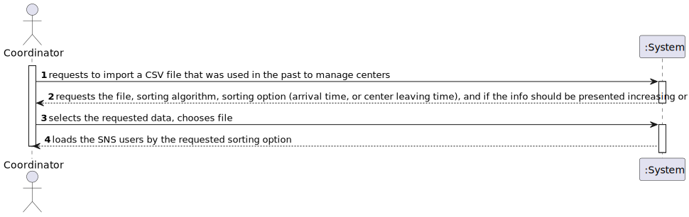
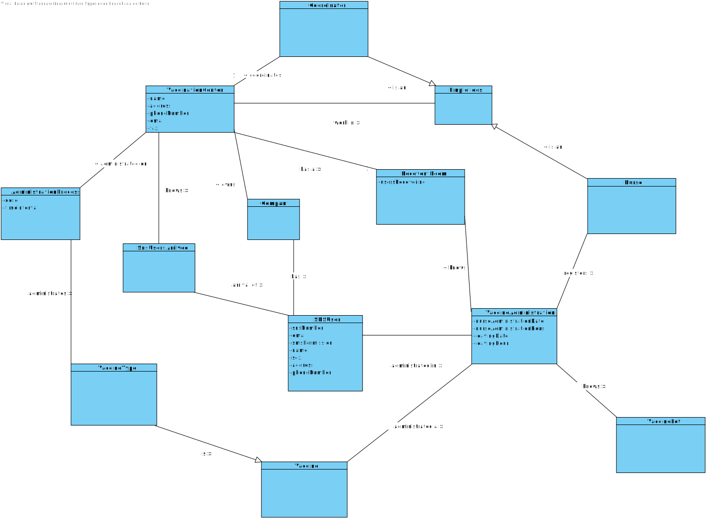
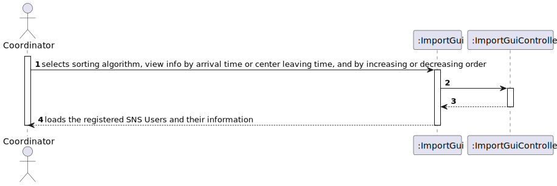
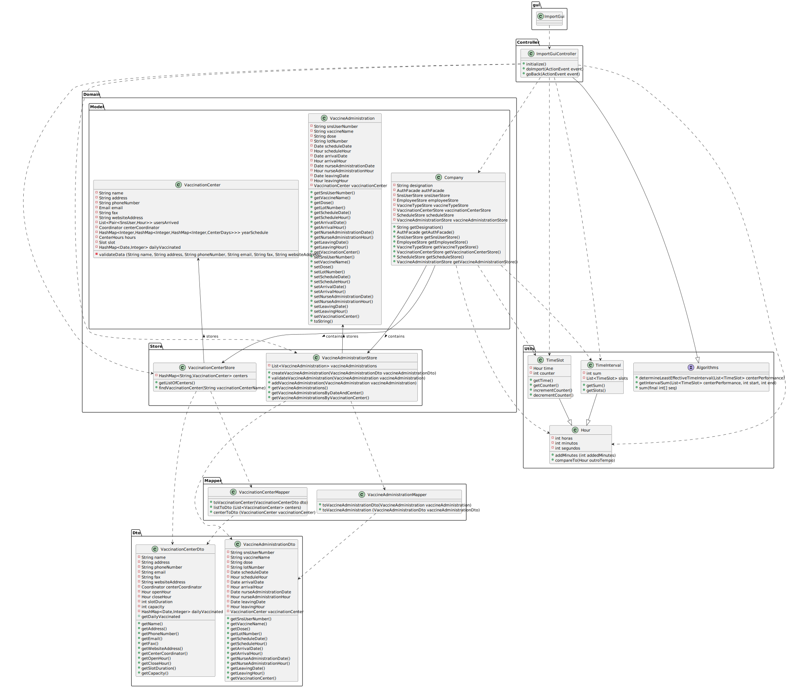

# US 17 - Import Data from a Legacy System

## 1. Requirements Engineering

### 1.1. User Story Description

*As a center coordinator, I want to import data from a legacy system that was used
in the past to manage centers. The imported data should be presented to the user sorted by
arrival time or by the center leaving time. The name of the SNS user and the vaccine type
**Short Description** attribute should also be presented to the user.*

### 1.2. Customer Specifications and Clarifications

**From the specifications document:**

>- Two sorting algorithms should be implemented (to be chosen
manually by the coordinator).
>- and worst-case time complexity of each algorithm should be documented in the application user manual (in the annexes) that must be
delivered with the application. 
>- The center coordinator must be able to choose the file that is to be uploaded.

**From the customer clarifications:**

> - **Question:**
> "In a meeting you already clarified that when uploading a file from a legacy system the application should check if the SNS Users are already registered and if not US 014 should be put to use. My question is now if only one or two SNS Users are not registered, should the whole legacy file be discarded?"
>- **Answer:**
>  "SNS users that are not registered should be loaded/registered. The other SNS users should not be registered again and should be ignored"

> - **Question:**
> "I noticed that some postal codes in the address does not follow the format of XXXX-YYY. For example some of them are XXXX-Y. Are we supposed to be able to load those users as well?"
>- **Answer:**
>  "Yes"

> - **Question:**
> "I was analysing the csv file that should be imported for US17 (the one that is in moodle), I noticed that the date attributes are written like this 5/30/2022 I thought that the date format should be DD/MM/YYYY. I also noticed, that the time is written like this, 9:43, I also thought that the time format should be written like this HH:MM, (in this case it would be 09:43). Are the date and time formats different for US17?"
>- **Answer:**
>  "That file is from a legacy system, that uses a different date and time format. The date and time should be converted when loading the data into the application that we are developing."

>- **Question:**
> "It should be an option to choose to either sort by arrival time or by the center leaving time?"
>- **Answer:**
> "The user can choose to sort by arrival time or by the center leaving time."

>- **Question:**
> "In the Sprint D requirements is stated that two sorting algorithms should be implemented and that the imported data should be sorted by arrival time or center leaving time. Should each algorithm be capable of both sortings or is one of the algorithms supposed to do one (e.g. arrival time) and the other the remaining sorting criteria (e.g. leaving time)?"
>- **Answer:**
> "Each algorithm should be capable of doing both sortings. The application should be prepared to run both algorithms. The algorithm that will be used to sort data should be defined in a configuration file."

>- **Question:**
> "You already have clarified that when uploading a file from a legacy system the application should check if the SNS Users are already registered and if not, we should register them using US 014. How exactly do you want this to proceed, in case there aren't registered users, should the application ask the center coordinator to select the file with the users data to be uploaded?"
>- **Answer:**
   > "US14 and US17 are two different features of the system. In US17, if the SNS user does not exist in the system, the vaccination of this SNS user should not be loaded. The system should continue processing the CSV file until all vaccinations are processed."

>- **Question:**
>  "Is there any correct format for the lot number? Should we simply assume that the lot number will always appear like this 21C16-05 ,like it's written in the file, and not validate it?"
>- **Answer:**
   > "The lot number has five alphanumeric characters an hyphen and two numerical characters (examples: 21C16-05 and A1C16-22 )"

>- **Question:**
>  "Regarding the validation of the data in the performance data csv, in case the dose is the not the first one, should we check if the user age and the date when the user took the other vaccine dose, are valid for the new dose to be administered? (This question popped up whith the project description: "The vaccine administration process comprises (i) one or more age groups (e.g.: 5 to 12 years old, 13 to 18 years old, greater than 18 years old), and (ii) per age group, the doses to be administered (e.g.: 1, 2, 3), the vaccine dosage (e.g.: 30 ml), and the time interval regarding the previously administered dose. Regarding this, it is important to notice that between doses (e.g.: between the 1st and 2nd doses) the dosage to be administered might vary as well as the time interval elapsing between two consecutive doses (e.g.: between the 1st and 2nd doses 21 days might be required, while between the 2nd and the 3 rd doses 6 months might be required).")"
>- **Answer:**
   > "The data from the legacy system (CSV file) should be validated before being loaded.
   Even so, each team should create a Spikevax vaccine that allows loading all vaccinations from the example CSV file that is available in moodle. This is required for developing MDISC tasks and assessment."

>- **Question:**
>  "Should the vaccine named Spikevax, (the one in the given CSV file for US17), be registered before loading the CSV file?"
>- **Answer:**
   >  "Yes."

>- **Question:**
>  "1 - When sorting data by arrival time or central leaving time, should we sort from greater to smallest or from smallest to greater?  2 - Also, should we consider only time or date also? So, for example, if we sort from smaller to greater and consider a date also, 20/11/2020 11:00 would go before 20/12/2020 08:00. Without considering the date (only time) it would be 20/12/2020 08:00 before 20/11/2020 11:00."
>- **Answer:**
   >  "1. The user must be able to sort in ascending and descending order.   2. Date and time should be used to sort the data. Sort the data by date and then by time."

>- **Question:**
> "You answered to a previous question saying that the user should be able to sort by ascending or descending order. Should the user choose in the UI, the order in which the information should be presented? Or should this feature be defined in the configuration file?"
>- **Answer:**
>"The center coordinator must use the GUI to select the sorting type (ascending or descending)."

>- **Question:**
>"Should the configuration file be defined , manually, before starting the program? Or Should an administrator or another DGS entity be able to alter the file in a user interface? This question is also important for US06 and US16 since these US also use configuration files, will the same process be applied to them?"
>- **Answer:**
>"The configuration file should be edited manually."

>- **Question:**
> "The file loaded in US17 have only one day to analyse, or it could have more than one day(?) and in US16 we need to select the day to analyse from 8:00 to 20:00"
>- **Answer:**
>"The file can have data from more than one day. In US16 the center coordinator should select the day for which he wants to analyse the performance of the vaccination center."

>- **Question:**
>"We'd like to know if the second column in the US17 file really is the NAME of the Vaccine or if it's the short description of the VaccineType." 
>- **Answer:**
>"It is the name of the vaccine. The header of the CSV file includes the attribute name, which is called "VaccineName". Moreover, if you search the internet you will see what is Spikevax."

>- **Question:**
> "Should we show the sorted list in the GUI or in an exported file?"
>- **Answer:**
> "Should show the sorted list in the GUI. In this US the application does not export data..."

 

### 1.3. Acceptance Criteria

* *Two sorting algorithms should be implemented, and to be chosen manually by the coordinator. Each sorting algorithm should be capable of either sorting by **arrival time**, or **center leaving time***.  
* *If an SNS user does not exist in the system, their vaccination should not be loaded*  
* *The date should be converted from MM/DD/YYYY to DD/MM/YYYY*  
* *The time, if needed, should be converted from H:MM to HH:MM*  
* *Lot numbers will always be made of 5 alphanumeric figures, and two numbers*  
* *The vaccine **Spikevax** should be registered before running the program*  
* *The imported file must only be read, altering should be done manually*  
* *The vaccine information should be loaded in the GUI*  
  

### 1.4. Found out Dependencies

- *We can find dependencies from US08 since a Nurse will record the administration of a vaccine to an SNS User, and from US04 because a receptionist will register the arrival time of an SNS User  
We will also find indirect Dependencies found within the previously mentioned User Stories, such as from US12 (specification of vaccine type), US13 (specification of new vaccine and its administration process), US09 (correspond a certain vaccination center to a certain pandemic), US01 (schedule a vaccine), US02 (receptionist schedules a vaccine), US04 (receptionist registers arrival of SNS User).*

### 1.5 Input and Output Data

> - *Input data:*  
    File
    Choose Sorting Algorithm
    Choose arrival time or center leaving time
    Choose information be displayed increasing or decreasing
> - *Output data:*
     
    SNS Users vaccination data (Sns User Number, Vaccine name, Dose, Lot Number, Scheduled Date, Arrival Date/time, Vaccine administration date, Leaving date/time)

### 1.6. System Sequence Diagram (SSD)

### 1.7 Other Relevant Remarks

* *The vaccine Spikevax should be registered before running the program. *
* *Postal codes can either be XXXX-YYY or XXXX-Y.*
* *Information on the file should be verified in accordance to the guidelines from US12, US13 and beyond.*

## 2. OO Analysis

### 2.1. Relevant Domain Model Excerpt
*In this section, it is suggested to present an excerpt of the domain model that is seen as relevant to fulfill this requirement.*

### 2.2. Other Remarks

*We will be using classes previously created in US04, US04, US12, US13, US09, US01, US02 and US04*

## 3. Design - User Story Realization

### 3.1. Rationale

**The rationale grounds on the SSD interactions and the identified input/output data.**

| Interaction ID | Question: Which class is responsible for... | Answer  | Justification (with patterns)  |
|:-------------  |:--------------------- |:------------|:---------------------------- |
| Step 1: Requests to import a legacy file|	...interacting with the actor ?| CoordinatorGui|IE: responsible for interaction with Coordinator|
|Step 2: Requests data (file path)|...requesting the file path?|ImportGui|IE: responsible for user interaction
|Step 3: Inputs the file path|...confirming if the path is valid (exists, and if so, is not blank)|ImportGui|IE: object created has its own data
| |...coordinating the US?|ImportGuiController|Controller
| |...separating the Users and their information?|ImportGuiStore|IE: Has the information, can split the users
| |...verifying if the information is correct|VaccineTypeStore, ScheduleStore|IE: Has the methods
|Step 4: Loading the Users|...showing the registered Users and their information|ImportGui|IE: responsible for user interaction

### Systematization ##

According to the taken rationale, the conceptual classes promoted to software classes are:

* Vaccine
* VaccineType
* VaccineAdministration
* SnsUser
* Schedule
* Coordinator
* Slot
* VaccinationCenter
* HealthCareCenter
* CommunityMassVaccinationCenter
* CenterHours
* CenterDays

Other software classes (i.e. Pure Fabrication) identified:
* ImportGui
* CoordinatorGui
* ImportGuiController
* ImportGuiStore
* VaccineStore
* VaccineTypeStore
* VaccineAdministrationStore
* ScheduleStore
* EmployeeStore
* VaccinationCenterStore
* RegisterVaccineController
* ChooseVaccinationCenterController
* RegisterVaccineTypeController
* ImportFileSnsUsersController
* RegisterSnsUserArrivalController
* RegisterSnsUserController
* ScheduleVaccineController
* VaccineAdministrationController

## 3.2. Sequence Diagram (SD)

## 3.3. Class Diagram (CD)

# 4. Tests

**Test 1:** Validate date

    @Test
    public void validateDataTest(){

        assertThrows(Exception.class,() -> {
            Date date1 = new Date(32,1,2022);
        });

        assertThrows(Exception.class,() -> {
            Date date2 = new Date(31,13,2022);
        });
    }

    @Test
    public void testGet(){

        Date date = new Date(31,1,2022);
        assertEquals(31,date.getDay());
        assertEquals(1,date.getMonth());
        assertEquals(2022,date.getYear());

    }

- **Test 1.1:** Test Center Date

    @Test
    public void testConstruction (){

        CenterDays days = new CenterDays(new Slot(30,5), new CenterHours(new Hour(9,0,0), new Hour(18,0,0)));

        Map<Hour,Slot> expectedMap = new HashMap<>();

        Hour fakeHour = new Hour(9,0,0);

        while (fakeHour.compareTo(new Hour(18,0,0)) <= 0){

            expectedMap.put(fakeHour, new Slot(30,5));
            fakeHour = fakeHour.addMinutes(30);
        }

        for (Hour h : expectedMap.keySet()){

            assertTrue(days.getAvaiability().containsKey(h));
        }

    }

    @Test

    public void testSetSchedule (){

        CenterDays days = new CenterDays(new Slot(30,5), new CenterHours(new Hour(9,0,0), new Hour(18,0,0)));

        try{
            days.setSchedule(new Hour(9,30,0));
            assertEquals(4,days.getAvaiability().get(new Hour(9,30,0)).getCapacity());
        }catch (Exception e){
            e.printStackTrace();
        }

        assertThrows(Exception.class,() -> {
            days.setSchedule(new Hour(9,30,0));
            days.setSchedule(new Hour(9,30,0));
            days.setSchedule(new Hour(9,30,0));
            days.setSchedule(new Hour(9,30,0));
            days.setSchedule(new Hour(9,30,0));

        });

    }

**Test 2:** Test Hours/Time

    @Test 
    void testAddMinutes() {
    Hour startHour = new Hour(19,40,0);
    Hour startHour2 = new Hour(23,40,0);
    Hour aftersum = new Hour(20,0,0);
    Hour aftersum2 = new Hour(21,30,0);
    Hour aftersum3 = new Hour(0,10,0);
    assertEquals(aftersum,startHour.addMinutes(20));
    assertEquals(aftersum2,startHour.addMinutes(110));
    assertEquals(aftersum3,startHour2.addMinutes(30));

    }

- **Test 2.1: Test Center Hours**

    @Test
    public void testCenterHours (){

        CenterHours hours = new CenterHours(new Hour(9,0,0),new Hour(18,0,0));

        assertEquals(new Hour(9,0,0),hours.getOpeningHour());
        assertEquals(new Hour(18,0,0),hours.getClosingHour());

    }

    @Test

    public void testCenterhoursToString (){

        CenterHours hours = new CenterHours(new Hour(9,0,0),new Hour(18,0,0));
        assertEquals("CenterHours:\n" +
                "Opening Hour: 09:00:00 AM\n" +
                "Closing Hour: 06:00:00 PM" + "\n",hours.toString());
    }

    @Test

    public void testEquals(){
        CenterHours hours = new CenterHours(new Hour(9,0,0),new Hour(18,0,0));
        CenterHours hours2 = hours;
        CenterHours hours3 = new CenterHours(new Hour(9,0,0),new Hour(18,0,0));

        assertEquals(hours,hours2);
        assertNotEquals(hours,null);
        assertNotEquals(hours,"hours");
        assertEquals(hours3,hours);

    }

    @Test

    public void testHash(){

        CenterHours hours = new CenterHours(new Hour(9,0,0),new Hour(18,0,0));

        assertEquals(Objects.hash(hours.getOpeningHour(),hours.getClosingHour()),hours.hashCode());
    }

# 5. Construction (Implementation)

## Class ImportGui

    public class ImportGui extends Application implements Runnable {

        public static void main(String[] args) {
            launch(args);
        }
    
        @Override
        public void start(Stage primaryStage) throws Exception {
            Parent root = FXMLLoader.load(getClass().getClassLoader().getResource("Import.fxml"));
            Scene scene = new Scene(root);
            primaryStage.setTitle("Import Data");
            primaryStage.setScene(scene);
            primaryStage.show();
            primaryStage.setAlwaysOnTop(true);
        }
    
        @Override
        public void run() {
            launch();
        }

    }

## Class ImportGuiController

    public class ImportGuiController {

        @FXML
        private Text centerLabel;
    
        String vaccinationCenterName = "";
        String algorithmToRun = "";
    
        @FXML
        public void initialize() {
    
    
            Properties props = new Properties();
            // Read configured values
            try
            {
                InputStream in = new FileInputStream(Constants.PARAMS_FILENAME);
                props.load(in);
                vaccinationCenterName = (String)(props.get(Constants.VACCINATION_CENTER));
                algorithmToRun = (String)(props.get(Constants.ALGORITHM_TO_RUN));
                in.close();
            }
            catch(IOException ex) {
                ex.printStackTrace();
            }
    
            centerLabel.setText(vaccinationCenterName);
    
        }
    
        @FXML
        private Button backButton;
    
    
        @FXML
        private TextField fileField;
    
        @FXML
        private Button importButton;
    
        @FXML
        void doImport(ActionEvent event) {
            try{
                ReadCsvPerformance.readCsv(fileField.getText());
    
            }catch (Exception e){
                e.printStackTrace();
            }
    
        }
    
        @FXML
        void goBack(ActionEvent event) throws IOException {
    
            FXMLLoader loader = new FXMLLoader(getClass().getResource("/Coordinator.fxml"));
            Parent root = loader.load();
            Stage stage = (Stage) backButton.getScene().getWindow();
            stage.hide();
    
            Scene scene = new Scene(root);
            Stage login = new Stage();
            login.setScene(scene);
            login.setTitle("Login");
            login.setAlwaysOnTop(true);
            login.show();
        }

    }

# 6. Integration and Demo

# 7. Observations
