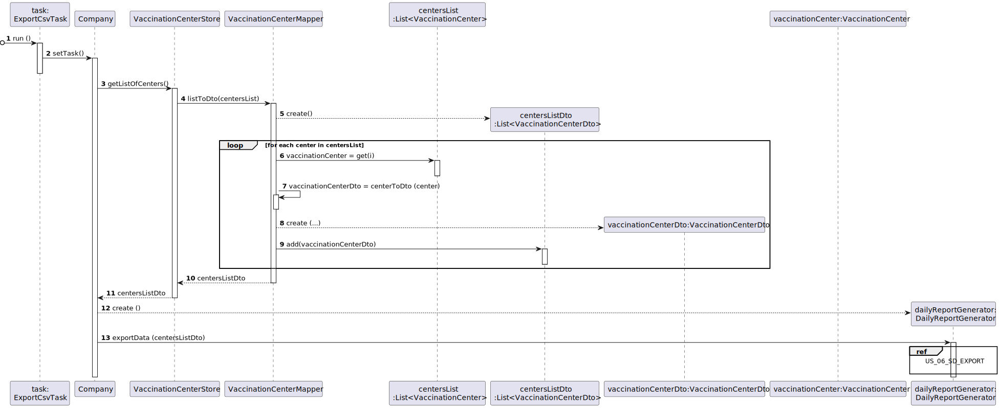

# US 06 - Record the daily total number of vaccinated people in each vaccination center

## 1. Requirements Engineering

### 1.1. User Story Description

*DGS wants to record daily the total number of people vaccinated in each vaccination center*

### 1.2. Customer Specifications and Clarifications 

**From the specifications document:**

> - n/a

**From the customer clarifications:**

> - **Question:**
	"In the acceptance criteria, "the algorithm should run automatically at a time defined in a configuration file and should register a date, the name of the vaccination center and the total number of vaccinated users." How it is supposed to register this information? Should it be recorded in a file (ex: txt,..) or recorded in the system (ex: in a store) ?"
>- **Answer:**
	"The data should be written to a CSV file (field delimiter should be a semicolon).”
 

> - **Question:**
	"As per the acceptance criteria, can the job be deployed manualy by a specific actor like Receptionist, Administrator,...? Who does the initial configuration for the automatic job?"
>- **Answer:**
	"The algorithm should run automatically at a time defined in a configuration file and should register the date, the name of the vaccination center and the total number of vaccinated users.”
 

> - **Question:**
	" We would like to know which kind of user (Administrator, Nurse...) is supposed to have access to the file generated by the system."
>- **Answer:**
	"Someone from DGS.”
 

> - **Question:**
	"Also, is it supposed to have the possibility to change the information on the configuration file? If so, who can do it?"
>- **Answer:**
	"Yes. Please discuss this question with ESOFT teachers”
 

> - **Question:**
	"Regarding this answer we group 62 would like to know if the user should insert a certain path were the civ file is saved to."
>- **Answer:**
	"Please discuss this issue with ESOFT teachers.”
 

> - **Question:**
	"Does the report contain the count of vaccinations of the current day (which depending on the time of day can be incomplete) or the day before?"
>- **Answer:**
   "Should record vaccinations of the current day”
    

### 1.3. Acceptance Criteria

- *The algortihm should run automatically at a time defined in a configuration file and should register the date, the name of the vaccination center and the total number of vaccinated users.*
- *The data should be saved into a csv*
- *The csv delimitation should be a semicolon*
- *The file can be accessed by someone from DGS*
- *The data saved must be relative to the current day*

### 1.4. Found out Dependencies

- *There is a dependency with the US09 since we need to have the vaccination centers registered*
- *Other dependency that we can found is with US08 since we need to administrate the vaccine and register 
that process in order to know how many people were vacinated*

### 1.5 Saved Data

> - *Saved data:*    
    Csv with the desired data 

### 1.6. System Sequence Diagram (SSD)

### 1.7 Other Relevant Remarks

*The folder path where the daily records are saved is in the config file* 

## 2. OO Analysis

### 2.1. Relevant Domain Model Excerpt 

### 2.2. Other Remarks

*DailyVaccinatedReport acknowledges the administartion since in the report will be registered the total of vaccinated sns users*

## 3. Design - User Story Realization 

### 3.1. Rationale

**The rationale grounds on the SSD interactions and the identified input/output data.**

| Interaction ID | Question: Which class is responsible for... | Answer  | Justification (with patterns)  |
|:-------------  |:--------------------- |:------------|:---------------------------- |
| Step 1: starts the exportation of the data| ... trigerring the event? | Timer | Pure Fabrication : there is no reason to assign this responsibility to any existing class in the Domain Model |
| | ... instantiating the timer? | App | Singleton: There will be only one instance of Timer and it will be running in the background the whole time |
| | ... running the exportation when event is triggered ? | ExportCsvTask | Pure Fabrication |
| | ... knowing the current date? | Date | IE: Date knows its own data | 
| | ... knowing vaccinationCenterStore ? | Company | IE: Company knows the VaccinationCenterStore to which it is delegating some tasks | 
| | ... knowing each one of the vaccination centers? | VaccinationCenterStore | IE: stores all the vaccination centers | 
| | ... knowing the number of people vaccinated ? | VaccinationCenter | IE: VaccinationCenter knows its own data |
| | ... knowing the name of the vaccination center ? | VaccinationCenter | IE: VaccinationCenter knows its own data |
| |... converting the list of vaccination centers into a list of dto's | VaccinationCenterMapper | Creator Patter: Rule 4 ("B has the data used to initialize A) |
| | ... acessing the vaccinationCenter information ? | VaccinationCenterDto | DTO: When there is so much data to transfer, it is better to opt by using a DTO in order to reduce coupling between domain and external modules|
| Step 2: exports the data | ... writing to the csv file? | FileWriter | Pure Fabrication| 
| | ... exporting the data to a csv file ? | DailyReportGenerator | Adapter: Class with the functionalities to export but adapted to the daily vaccinated report |

### Systematization ##

According to the taken rationale, the conceptual classes promoted to software classes are: 

 * Company
 * VaccinationCenter
 

Other software classes (i.e. Pure Fabrication) identified: 
 
 * App
 * Timer
 * ExportCsvTask
 * Date
 * VaccinationCenterStore
 * DailyReportGenerator
 * VaccinationCenterDto
 * VaccinationCenterMapper
 * FileWriter

## 3.2. Sequence Diagram (SD)

## 3.3. Class Diagram (CD)

## 3.4. Package Diagram (PD)

# 4. Tests 

**Test 1:** Test the correct generation of the csv . 

	@Test

    public void testDailyReport(){

        App.getInstance().getCompany().setTask();

        File dailyReport = new File ("out/DailyReport(" + LocalDateTime.now().getDayOfMonth() + "-" + LocalDateTime.now().getMonth() + "-" + LocalDateTime.now().getYear() + ").csv" ) ;

        assertTrue(dailyReport.exists());

    }

  

**Test 2:** Test the conversion of a VaccinationCenter into a VaccinationCenterDto

    @Test

    public void testlistToDto(){
        List<VaccineType> avaiableTypes = new ArrayList<>(){{
            add(new VaccineType("AF23P","Covid-19 vaccine",3));

        }};
        Coordinator coordinator = new Coordinator("coordinator@gmail.com","Anthony Liberty","COORDINATOR",960000400,14665868,"Sesame Street", "C.V.Margem Sul");
        HealthCareCenter center = new HealthCareCenter("HealthCare Boavista","Margem Sul 23","123456789","vamargemsul@gmail.com","900-300-5555","vamargemsul.com.pt",coordinator,new Hour(9,0,0),new Hour(18,0,0),30,5,avaiableTypes,1);
        CommunityMassVaccinationCenter center1 = new CommunityMassVaccinationCenter("HealthCare Lisboa","Margem Sul 23","123456789","lisboa@gmail.com","900-300-5555","vamargemsul.com.pt",coordinator,new Hour(9,0,0),new Hour(18,0,0),30,5,avaiableTypes);
        HealthCareCenterDto dto = new HealthCareCenterDto("HealthCare Boavista","Margem Sul 23","123456789","vamargemsul@gmail.com","900-300-5555","vamargemsul.com.pt",new Hour(9,0,0),new Hour(18,0,0),30,5,avaiableTypes,1);
        dto.setCenterCoordinator(coordinator);
        CommunityMassVaccinationCenterDto dto1 = new CommunityMassVaccinationCenterDto("HealthCare Lisboa","Margem Sul 23","123456789","lisboa@gmail.com","900-300-5555","vamargemsul.com.pt",new Hour(9,0,0),new Hour(18,0,0),30,5,avaiableTypes);
        dto1.setCenterCoordinator(coordinator);

        List<VaccinationCenter> original = new ArrayList<>(){{
           add(center);
           add(center1);

        }};

        List<VaccinationCenterDto> expected = new ArrayList<>(){{
           add(dto);
           add(dto1);

        }};

        assertEquals(expected.get(0).getName(),VaccinationCenterMapper.listToDto(original).get(0).getName());
        assertEquals(expected.get(1).getName(),VaccinationCenterMapper.listToDto(original).get(1).getName());
    }

# 5. Construction (Implementation)

## Class DailyReportGenerator

	
    private static final String DELIMITER = ";";
    private static final String HEADER = "Date;Name;Total Number of Vaccinated\n";

    @Override
    public void exportData(List<VaccinationCenterDto> centersListDto) {

        try{

            FileWriter file = new FileWriter("out/DailyReport(" + LocalDateTime.now().getDayOfMonth() + "-" +  LocalDateTime.now().getMonth() + "-" + LocalDateTime.now().getYear() + ").csv" ) ;

            file.append(HEADER);

            for (VaccinationCenterDto vaccinationCenterDto : centersListDto){

                Date date = Date.getCurrentDate();

                file.append(String.valueOf(date.getDay())).append("/").append(String.valueOf(date.getMonth())).append("/").append(String.valueOf(date.getYear())).append(DELIMITER);

                String vaccinationCenterName = vaccinationCenterDto.getName();

                file.append(vaccinationCenterName).append(DELIMITER);

                int totalVaccinated = 0;

                try {
                    totalVaccinated = vaccinationCenterDto.getDailyVaccinated().get(date);
                }catch (NullPointerException e){
                    e.printStackTrace();
                }
                
                file.append(String.valueOf(totalVaccinated));

                file.append("\n");
            }

            file.close();

        }catch (IOException e){
            e.printStackTrace();
        }

    }

## Interface CsvExport 

	public void exportData(List<T> list);

## Class 

		
	

# 6. Integration and Demo 

* This function will run in the background of the application
* No user input is necessary
* No user interface is required

# 7. Observations

* The desired hour to generate the daily report must be specified in the config file 

